# Arachne C++ Code Documentation v3

이 문서는 현재 `cpp/` tree를 직접 읽어 확인한 Arachne C++ 구현의 snapshot이다.
설계 제안서가 아니라, 현재 코드가 실제로 소유하는 상태와 실제 함수 호출 순서,
thread/stream 관계, GPU memory 관리 방식, 테스트가 표현하는 보장을 설명한다.

분석 범위는 다음과 같다.

- `cpp/include/`, `cpp/src/`의 Arachne 구현
- `cpp/test/`의 unit/stress test와 standalone workload
- `cpp/CMakeLists.txt`, `cpp/test/**/CMakeLists.txt`
- `cpp/doc/`의 기존 설계 및 compaction 문서
- `cpp/thirdparty/hnswlib.patch`와 Arachne가 사용하는 vendored hnswlib 경계

`cpp/build*` 아래 생성물은 source가 아니므로 분석 대상에서 제외했다. 또한
`cpp/thirdparty/hnswlib/`의 upstream example/test를 Arachne 모듈로 취급하지 않고,
Arachne가 호출하는 API와 local patch가 추가한 기능만 integration 관점에서 설명한다.

이 문서를 작성하면서 코드를 빌드하거나 테스트를 실행하지 않았다. 아래의 테스트 절은
실행 결과가 아니라 test source가 명시한 contract를 요약한 것이다.

---

## 1. 한눈에 보는 현재 상태

Arachne는 구체 ANNS index의 내부 알고리즘을 모르는 control plane이다. Application
operation을 다음 두 primitive로 분해한다.

```text
SEARCH = Traverse
INSERT = Traverse -> Modify
DELETE = Modify
```

현재 구현은 이 primitive 위에 다음 기능을 제공한다.

- Anchor 기반 query routing: `Hybrid` 또는 `GpuOnly`
- Traverse/Modify queueing, reordering, batching
- planner thread와 여러 execution worker의 분리
- worker별 독립 CUDA stream
- Anchor와 Region 사이의 many-to-many dependency 관리
- Coordinator thread 기반 비동기 promotion/eviction
- logical write lease와 physical device-memory lease
- dirty bitmap 기반 selective Region write-back
- `Normal` 직접 할당과 `Pooled` unit arena 할당
- Pooled external fragmentation을 위한 policy-driven compaction
- FIFO/LRU/LFU/Clock/2Q Anchor replacement policy
- HNSW 기반 Active/Shadow Routing Cache
- 선택적 latency/lock-wait CSV tracing

현재 완성되지 않은 핵심 integration은 다음과 같다.

- 실제 GPU-native ANNS adapter와 kernel은 없다.
- 실제 adapter가 `Controller::acquireRegion()`을 호출할 공식 역방향 주입 seam이 없다.
- dirty bitmap을 실제 kernel에서 mark하는 공용 device-side integration이 없다.
- `IRegion::applyLocalModification()`과 `reconcileBoundary()`는 호출되지 않는다.
- `Controller::verify()`는 구현됐지만 normal search flow에 연결되지 않았다.
- multi-GPU placement/sharding은 없다. device id는 Controller 내부에서 0으로 고정된다.

---

## 2. 전체 architecture

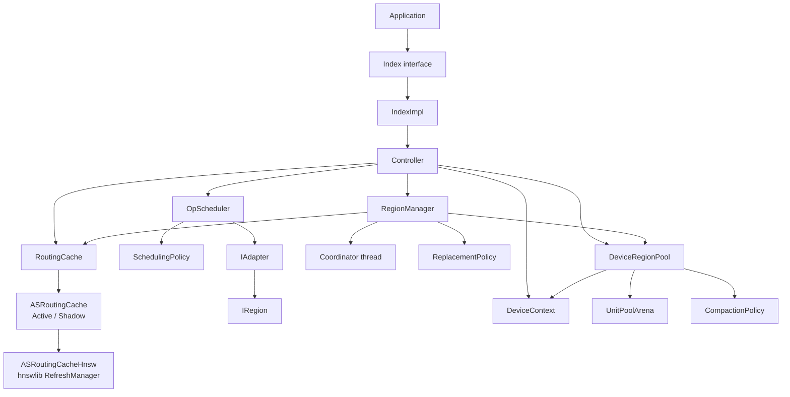

핵심은 operation execution과 residency management가 분리되어 있다는 점이다.

```text
Operation data path
  Controller -> OpScheduler -> IAdapter

Residency control path
  Scheduler completion callback -> RegionManager queue
  -> Coordinator -> DeviceRegionPool / RoutingCache
```

Public operation은 synchronous API처럼 보이지만, GPU residency 변경은 기본적으로
asynchronous다. `search/insert/remove`가 반환됐다고 promotion이나 reclaim까지 끝난 것은
아니다. 그 checkpoint가 `Controller::waitIdle()`이다.

---

## 3. 파일과 모듈 지도

| 영역 | 주요 파일 | 역할 |
| --- | --- | --- |
| Public API | `include/interface/index.hpp` | `search/insert/remove` 추상 interface |
| Default facade | `include/interface/index_impl.hpp`, `src/interface/index_impl.cpp` | adapter/cache 소유, Controller forwarding |
| Control plane | `include/core/controller.hpp`, `src/core/controller.cpp` | route, dispatch, commit |
| Operation scheduler | `include/core/op_scheduler.hpp`, `src/core/op_scheduler.cpp` | queue, batch, planner, worker pool |
| Scheduling policy | `include/core/scheduling_policy.hpp`, `src/core/scheduling_policy.cpp` | batch kind와 candidate 선택 |
| Region control | `include/core/region_manager.hpp`, `src/core/region_manager.cpp` | Region registry, dependency, Coordinator, residency |
| Replacement policy | `include/core/replacement_policy.hpp`, `src/core/replacement_policy.cpp` | promotion backlog와 eviction 순서 |
| Routing abstraction | `include/core/routing_cache.hpp` | nearest/ensure/erase와 hit/miss stats |
| Routing lifecycle | `include/core/as_routing_cache.hpp`, `src/core/as_routing_cache.cpp` | Active/Shadow rebuild와 swap |
| HNSW routing | `include/core/as_routing_cache_hnsw.hpp`, `src/core/as_routing_cache_hnsw.cpp` | dtype/metric별 hnswlib backend |
| Adapter contract | `include/adapter/index_adapter.hpp` | batched Host/Device Traverse/Modify |
| Region contract | `include/adapter/region.hpp` | Host view, logical write lease, reconciliation |
| GPU context | `include/gpu/device_context.hpp`, `src/gpu/device_context.cpp` | CUDA device, RAFT resource, streams, allocation mode |
| GPU allocation | `include/gpu/device_region_pool.hpp`, `src/gpu/device_region_pool.cpp` | opaque handle, physical Lease, copy/free/compact |
| Pooled arena | `include/gpu/unit_pool_arena.hpp`, `src/gpu/unit_pool_arena.cpp` | fixed-unit best-fit allocator와 free extent index |
| Compaction strategy | `include/gpu/compaction_policy.hpp`, `src/gpu/compaction_policy.cpp` | relocation plan 생성 |
| Dirty tracking | `include/gpu/dirty_header.hpp` | bitmap 크기와 bit 위치 계산 |
| Telemetry | `include/telemetry/*.hpp`, `src/telemetry/trace.cpp` | opt-in scope/lock-wait CSV tracing |
| CPU math | `include/util/distance.hpp`, `src/util/distance.cpp` | Highway runtime-dispatched SIMD |
| Stress adapter | `test/stress/stress_index.*` | brute-force test-only IAdapter/IRegion |
| Unit tests | `test/unittest/` | module contract와 concurrency/GPU behavior |
| Direct runner | `test/bin/full_suite_app.cpp` | GTest 없는 Controller workload executable |

`include/core/routing_cache_hnsw.hpp`는 기존 include path를 유지하는 compatibility
header이며 실제 선언은 `as_routing_cache_hnsw.hpp`에 있다.

---

## 4. Ownership과 lifetime

### 4.1 Top-level ownership

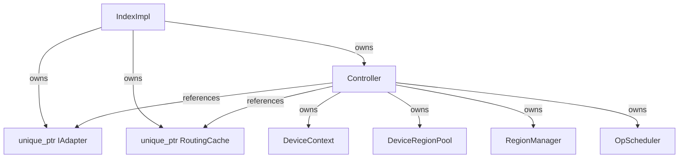

`IndexImpl`은 policy가 없는 thin forwarding layer다.

```cpp
SearchResult IndexImpl::search(const Query& query) {
  return controller_.search(query);
}

InsertResult IndexImpl::insert(const Record& record) {
  return controller_.insert(record);
}

DeleteResult IndexImpl::remove(VectorId id) {
  return controller_.remove(id);
}
```

현재 `IndexImpl` constructor는 `SchedulingConfig`만 외부에 노출한다. Replacement,
compaction, memory budget, unit size, allocation policy, Coordinator interval을 조절하려면
현재는 `Controller`를 직접 생성해야 한다.

### 4.2 Controller construction

현재 constructor의 실제 wiring은 다음과 같다.

```cpp
Controller::Controller(...,
                       std::size_t gpu_unit_bytes,
                       std::unique_ptr<gpu::CompactionPolicy> compaction_policy,
                       CoordinatorConfig coordinator_config,
                       gpu::AllocationPolicy allocation_policy)
  : adapter_(adapter),
    routing_cache_(routing_cache),
    scheduler_(scheduling_config),
    device_(0, allocation_policy,
            gpu_data_budget_bytes,
            gpu_metadata_budget_bytes,
            scheduling_config.max_execution_threads,
            gpu_unit_bytes),
    device_region_pool_(device_, std::move(compaction_policy)),
    region_manager_(std::move(replacement_policy)) {
  scheduler_.start(adapter_, [this](std::size_t worker_index) {
    g_worker_stream = device_.workerStream(worker_index);
  });
  region_manager_.start(adapter_, device_region_pool_,
                        routing_cache_, coordinator_config);
}
```

중요한 최신 변경은 기본 `allocation_policy`가 `Normal`이라는 점이다.

```cpp
gpu::AllocationPolicy allocation_policy =
    gpu::AllocationPolicy::Normal
```

따라서 Pooled arena와 Arachne compaction은 명시적으로 `Pooled`를 전달했을 때만
활성화된다.

### 4.3 Destruction order

Controller member declaration 순서는 다음과 같다.

```text
DeviceContext
DeviceRegionPool
RegionManager
OpScheduler
```

파괴는 역순이다.

```text
OpScheduler destructor/shutdown
  -> planner와 execution worker 종료
RegionManager destructor/shutdown
  -> Coordinator 종료
DeviceRegionPool destructor
DeviceContext destructor
```

Scheduler worker가 GPU state를 사용한 뒤 종료되고, Coordinator가
`DeviceRegionPool`을 더 이상 사용하지 않게 된 뒤 pool/context가 파괴되는 순서다.

---

## 5. 공통 data structure

### 5.1 Vector와 public result

```cpp
enum class VectorDType {
  Int8, UInt8, Float16, Float32
};

struct VectorView {
  const void* data = nullptr;
  std::uint32_t dim = 0;
  VectorDType dtype = VectorDType::Float32;
};

struct Query {
  VectorView vector;
  std::uint32_t top_k = 0;
};

struct Record {
  VectorId id = 0;
  VectorView vector;
};
```

`VectorView`는 non-owning이다. Scheduler task도 pointer를 복사할 뿐 backing bytes를
소유하지 않는다. Public Controller call이 `future.get()`으로 execution 완료를 기다리므로
일반 operation에서는 caller buffer가 call 동안 살아 있다는 전제를 사용한다.

예외는 promotion candidate다. Coordinator가 나중에 사용하므로
`requestPromotion()`이 bytes를 소유 복사한다.

```cpp
candidate.vector_bytes.assign(
    bytes,
    bytes + vector.dim * VectorElementSize(vector.dtype));
```

`Float16`은 native half object가 아니라 raw IEEE-754 binary16 `uint16_t` layout이다.

### 5.2 Traverse

```cpp
struct TraverseRequest {
  Query query;
  ExecutionMode mode = ExecutionMode::Hybrid;
  RegionFootprint scope;
};

struct TraverseResult {
  SearchResult result;
  RegionFootprint touched;
  bool completed_within_scope = false;
  OpaqueData hint;
};
```

| Field | 의미 |
| --- | --- |
| `mode` | `Hybrid`는 Host entry point, `GpuOnly`는 Device entry point |
| `scope` | GpuOnly execution에 예측된 resident Region |
| `touched` | adapter가 실제 접근했다고 보고한 Region |
| `completed_within_scope` | 제한된 scope로 traversal이 완결됐는지 |
| `hint` | 다음 Modify가 해석할 index-specific payload |

### 5.3 Modify

```cpp
struct ModifyRequest {
  ModifyOp op = ModifyOp::Insert;
  Record record;
  VectorId target = 0;
  ExecutionMode mode = ExecutionMode::Hybrid;
  RegionFootprint scope;
  LeaseHandle lease;
  OpaqueData hint;
};

struct ModifyResult {
  bool ok = false;
  RegionFootprint touched;
  RegionFootprint modified;
};
```

Insert는 선행 Traverse의 `touched`와 `hint`를 전달한다. Delete는 target ID만 사용하고
현재 항상 Hybrid다. `ModifyResult::modified`는 현재 Controller/RegionManager의
residency decision에는 사용되지 않는다.

### 5.4 RegionFootprint의 여러 의미

```cpp
struct RegionFootprint {
  std::vector<RegionId> regions;
};
```

| 위치 | 의미 |
| --- | --- |
| `TraverseRequest::scope` | traversal의 predicted/allowed scope |
| `TraverseResult::touched` | traversal의 actual footprint |
| `ModifyRequest::scope` | modification scope |
| `ModifyResult::touched` | modification 중 읽은 Region |
| `ModifyResult::modified` | 실제 변경한 Region |
| `PromotionCandidate::footprint` | Anchor dependency 후보 Region |

---

## 6. Thread와 CUDA stream model

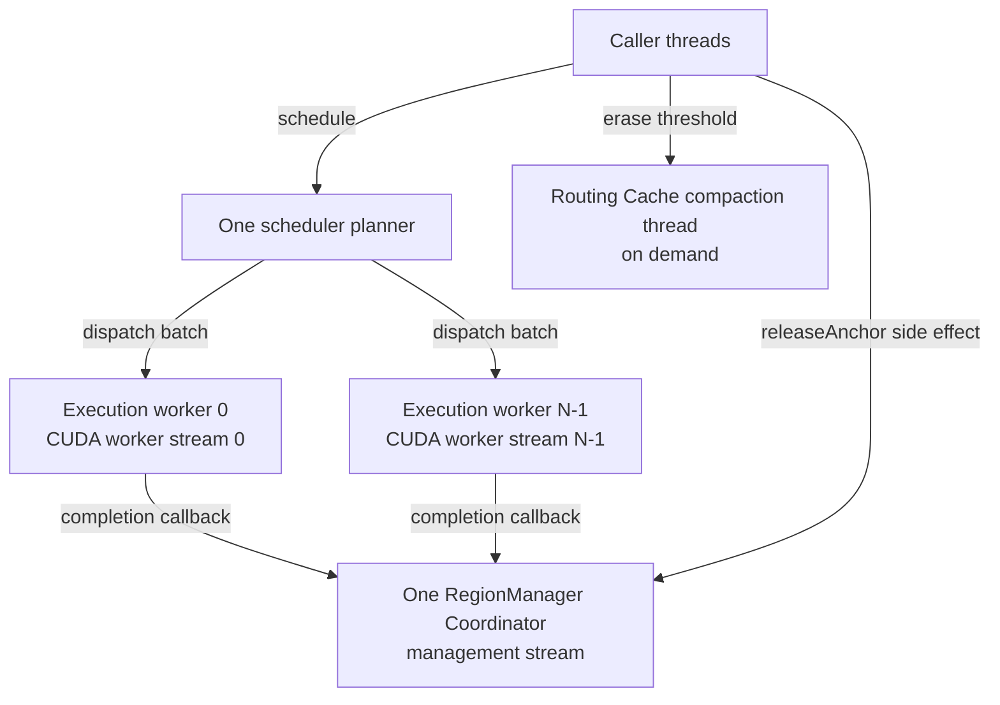

| 실행 주체 | 역할 |
| --- | --- |
| Caller | route, 단계 연결, `future.get()`, commit |
| Planner | incoming queue에서 homogeneous batch 구성 |
| Execution worker | adapter batch 호출, callback, promise completion |
| Coordinator | promotion, eviction, H2D/D2H, explicit compaction |
| Routing compaction thread | shadow HNSW rebuild와 active swap |

`DeviceContext`는 worker 수만큼 `cudaStreamCreate()`로 stream을 만들고, RAFT
`device_resources`의 stream을 management stream으로 사용한다.

```cpp
cudaStream_t managementStream() const;
cudaStream_t workerStream(std::size_t index) const;
```

Scheduler worker 시작 시 thread-local stream이 한 번 설정된다.

```cpp
thread_local cudaStream_t g_worker_stream = nullptr;

scheduler_.start(adapter_, [this](std::size_t worker_index) {
  g_worker_stream = device_.workerStream(worker_index);
});
```

`Controller::acquireRegion()`은 worker에서 호출되면 해당 worker stream, 다른 thread에서
호출되면 management stream을 사용한다.

---

## 7. OpScheduler

### 7.1 Configuration

```cpp
struct SchedulingConfig {
  std::size_t traverse_batch_size = 1;
  std::size_t modify_batch_size = 1;
  std::size_t max_execution_threads = 1;
  std::chrono::microseconds batch_wait_timeout{0};
};
```

- batch size 0은 1로 보정된다.
- worker count 0은 1로 보정된다.
- Traverse/Modify batch size는 실행 중 변경 가능하다.
- worker count는 `start()` 전에만 변경 가능하다.
- timeout이 0보다 크면 첫 task를 확보한 뒤 추가 eligible task를 잠시 기다린다.

### 7.2 Task와 queue

```cpp
struct TraverseTask {
  std::uint64_t id;
  steady_clock::time_point enqueued_at;
  TraverseRequest request;
  std::promise<TraverseResult> promise;
  std::function<void(const TraverseResult&)> on_complete;
};

struct ModifyTask {
  std::uint64_t id;
  steady_clock::time_point enqueued_at;
  ModifyRequest request;
  std::promise<ModifyResult> promise;
};

using ScheduledOperation =
    std::variant<TraverseTask, ModifyTask>;
```

`enqueued_at`은 저장되지만 현재 FIFO policy나 tracing에서 사용하지 않는다.

### 7.3 Scheduling sequence

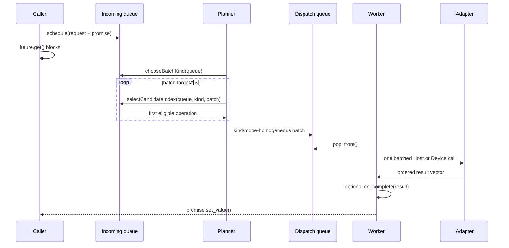

### 7.4 FIFO policy의 실제 ordering

현재 `FifoSchedulingPolicy`는 queue front의 kind를 다음 batch kind로 고른다. 그 뒤
queue 전체를 앞에서부터 훑어 같은 kind와 같은 `ExecutionMode`인 task를 찾는다.

```cpp
return current_batch.empty() ||
       ModeOf(candidate) == ModeOf(current_batch.front());
```

따라서 batch는 다음 네 class 중 하나다.

```text
Traverse + Hybrid
Traverse + GpuOnly
Modify   + Hybrid
Modify   + GpuOnly
```

이것은 strict global FIFO가 아니다.

```text
queue: T-Hybrid(1), M-Hybrid(2), T-Hybrid(3)
batch: T-Hybrid(1), T-Hybrid(3)
```

다른 kind/mode task를 건너뛰어 batch를 채울 수 있다. 다만 같은 eligible class 안에서는
앞에 있는 task가 먼저 선택된다.

### 7.5 Execution과 exception

Worker는 task별이 아니라 batch별로 adapter를 한 번 호출한다.

```cpp
auto results = device
    ? adapter_->traverseDevice(requests)
    : adapter_->traverseHost(requests);
```

Adapter는 request 수와 같은 result 수를 같은 순서로 반환해야 한다. 수가 다르거나
adapter/callback이 throw하면 아직 완료되지 않은 promise에 exception이 전달된다.

Traverse callback은 promise보다 먼저 실행된다.

```cpp
if (task.on_complete) task.on_complete(results[i]);
task.promise.set_value(std::move(results[i]));
```

따라서 caller의 `future.get()`이 풀릴 때 `recordTraversal()`과
`requestPromotion()` enqueue는 이미 끝난 상태다.

Controller는 Insert의 Traverse future를 기다린 뒤 Modify를 schedule하므로 그 두 단계의
causal order는 보장된다. 서로 다른 public operation 사이의 order는 보장되지 않는다.

---

## 8. Search call flow

### 8.1 Function call reference

```text
IndexImpl::search
  -> Controller::search
     -> routeSearch
        -> route
           -> RoutingCache::nearest
           -> RegionManager::regionsOf(anchor)
     -> optional search Anchor id mint
     -> dispatch(TraverseRequest, promotion_anchor_id)
        -> OpScheduler::schedule
        -> plannerLoop / workerLoop
        -> IAdapter::traverseHost or traverseDevice
        -> completion callback
           -> RegionManager::recordTraversal
           -> optional RegionManager::requestPromotion
     -> optional Hybrid fallback
     -> commitSearch
```

### 8.2 Sequence

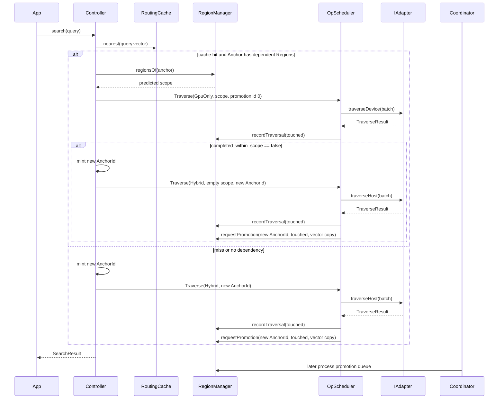

### 8.3 Route condition

GpuOnly는 cache hit만으로 선택되지 않는다. hit Anchor가 현재 Region dependency를
가져야 한다.

```cpp
if (auto anchor_id = routing_cache_.nearest(query.vector)) {
  auto regions = region_manager_.regionsOf(*anchor_id);
  if (!regions.empty()) {
    decision.gpu_only = true;
    decision.predicted_scope.regions = std::move(regions);
  }
}
```

Cache에 ID가 남아 있지만 dependency가 없으면 Hybrid가 선택된다. 현재 이 stale-looking
cache entry를 route 단계에서 erase하지는 않는다.

### 8.4 Anchor 생성 규칙

- 최초 plan이 Hybrid면 dispatch 전에 새 search Anchor ID를 발급한다.
- 최초 plan이 GpuOnly면 promotion ID는 0이다. 기존 residency를 사용하므로 새 후보를
  만들지 않는다.
- GpuOnly가 scope 안에서 완결되지 않으면 Hybrid fallback용 새 Anchor ID를 발급한다.

`commitSearch()`는 최종 실행이 Hybrid였는지만 보고 public flag를 설정한다.

```cpp
output.served_gpu_only = !final_was_hybrid;
```

---

## 9. Insert call flow

### 9.1 Function call reference

```text
IndexImpl::insert
  -> Controller::insert
     -> claim record.id in live_ids_
     -> route(lookup query, top_k=1)
     -> dispatch(TraverseRequest, promotion_anchor_id=record.id)
        -> IAdapter::traverseHost or traverseDevice
        -> recordTraversal(candidates.touched)
        -> requestPromotion(record.id, candidates.touched, record.vector)
     -> routeInsert(record, candidates)
        -> move candidates.hint
        -> scope = candidates.touched
        -> optionally choose one already-resident Region + Lease
     -> dispatch(ModifyRequest::Insert)
        -> IAdapter::modifyHost or modifyDevice
     -> commitInsert
     -> failure/exception이면 live_ids_ claim rollback
```

### 9.2 Sequence

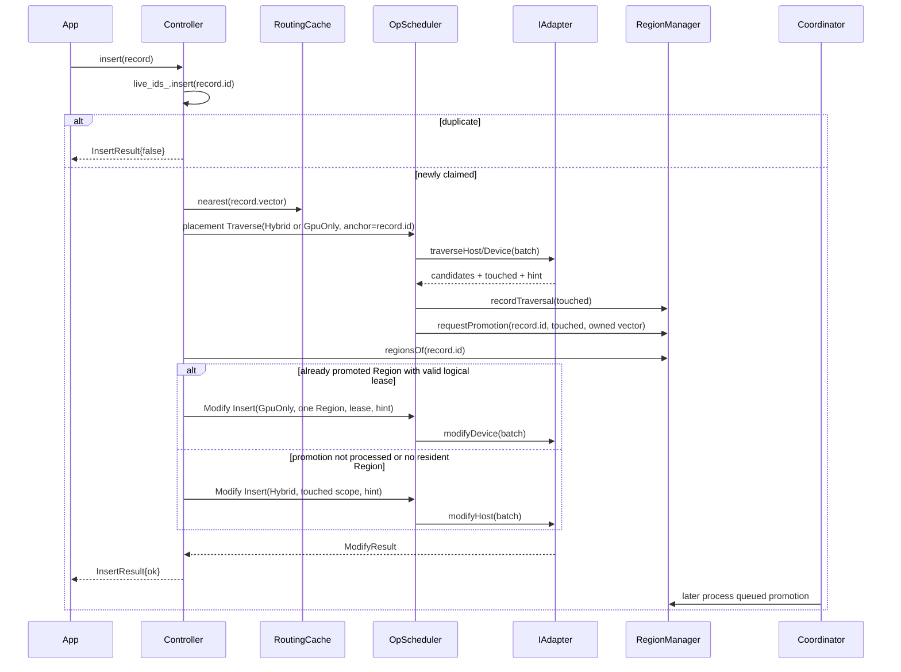

### 9.3 중요한 현재 semantics

Insert placement lookup의 `top_k`는 Controller 내부 상수 1이다.

```cpp
constexpr std::uint32_t kInsertionLookupTopK = 1;
```

Insert는 traversal mode와 관계없이 `record.id`를 promotion candidate Anchor로 전달한다.
즉 “GpuOnly lookup이면 promotion request가 없다”는 Search 규칙과 다르다.

```cpp
TraverseResult candidates = dispatch(lookup, record.id);
```

`requestPromotion()`은 worker callback에서 Modify 실행 전에 enqueue된다. Coordinator가
매우 빨리 처리했다면 `routeInsert()`가 이미 resident인 Region과 logical lease를 발견해
GpuOnly Modify를 선택할 수 있다. 보통은 비동기 promotion이 아직 처리되지 않아 Hybrid다.

현재는 첫 valid resident Region 하나만 사용한다.

```cpp
for (RegionId region_id : region_manager_.regionsOf(record.id)) {
  Region region = region_manager_.regionOf(region_id);
  if (!region.lease.valid()) continue;
  plan.request.mode = ExecutionMode::GpuOnly;
  plan.request.scope.regions = {region_id};
  plan.request.lease = region.lease;
  break;
}
```

`regionsOf()`의 내부 container가 unordered set이므로 여러 Region 중 무엇이 첫 번째가
되는지는 안정된 순서 계약이 아니다.

GpuOnly placement Traverse가 `completed_within_scope == false`여도 Search와 달리 Hybrid
retry를 하지 않는다.

Modify가 실패하거나 throw하면 `live_ids_` claim은 rollback된다. 그러나 이미 enqueue된
promotion candidate를 취소하거나 `releaseAnchor(record.id)`를 호출하지는 않는다.

---

## 10. Remove call flow

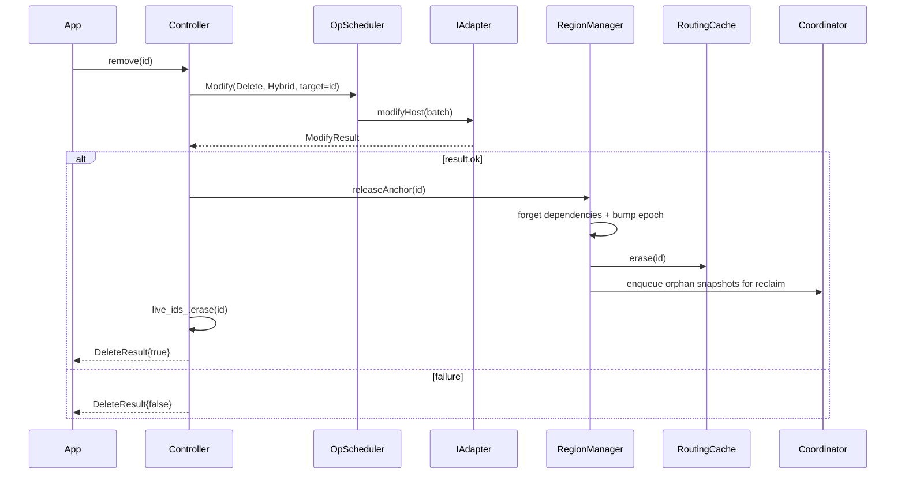

현재 `routeRemove()`는 항상 Hybrid다.

```cpp
plan.request.op = ModifyOp::Delete;
plan.request.target = id;
plan.request.mode = ExecutionMode::Hybrid;
```

Controller는 remove 전에 `live_ids_` membership을 검사하지 않는다. Unknown ID를
adapter에 전달하며, 최종 성공 여부는 adapter의 `ModifyResult::ok`에 달려 있다.

성공한 `releaseAnchor()`에서 dependency와 live residency 표시는 즉시 지워지지만 physical
D2H/free는 Coordinator queue에서 나중에 처리된다.

---

## 11. Adapter와 Region contract

### 11.1 IAdapter

모든 concrete index adapter가 반드시 구현할 Host entry point는 다음과 같다.

```cpp
virtual std::vector<TraverseResult>
traverseHost(const std::vector<TraverseRequest>& requests) = 0;

virtual std::vector<ModifyResult>
modifyHost(const std::vector<ModifyRequest>& requests) = 0;
```

Device methods의 default는 Host fallback이 아니라 `std::logic_error`다.

```cpp
virtual std::vector<TraverseResult> traverseDevice(...);
virtual std::vector<ModifyResult> modifyDevice(...);
```

따라서 GpuOnly route가 가능한 adapter는 두 Device method를 실제로 override해야 한다.
Adapter는 Scheduler worker 수만큼 동시에 호출될 수 있으므로 자체 thread safety를
제공해야 한다.

Structural accessor:

```cpp
virtual IRegion* resolveRegion(RegionId id) = 0;
virtual std::vector<RegionId> allRegions() const = 0;
```

### 11.2 IRegion

```cpp
class IRegion {
 public:
  virtual RegionId id() const = 0;
  virtual RegionFootprint footprint() const = 0;
  virtual HostRegionView hostView() const = 0;
  virtual LeaseHandle acquireWriteLease() = 0;
  virtual void releaseWriteLease(LeaseHandle) = 0;
  virtual void applyLocalModification(
      LeaseHandle, const ModificationDelta&) = 0;
  virtual ReconciliationReport reconcileBoundary() = 0;
};
```

현재 production path에서 실제 호출되는 것은 `acquireWriteLease()`와
`releaseWriteLease()`다. `footprint()`, `applyLocalModification()`,
`reconcileBoundary()`는 interface에만 존재한다.

### 11.3 HostRegionView

```cpp
struct HostRegionView {
  void* ptr = nullptr;
  std::size_t bytes = 0;
  std::size_t subregion_bytes = 0;
};
```

Host memory는 adapter/index 소유다. Arachne는 pointer를 저장하고 H2D/D2H copy에
사용하지만 allocate/free하지 않는다. `subregion_bytes`는 dirty bit 하나가 담당할
payload granularity다. 0이면 fine-grained tracking을 끈다.

---

## 12. RegionManager data model

### 12.1 Region

```cpp
struct Region {
  RegionId id = 0;
  HostRegionView host;
  gpu::DeviceRegionHandle device;
  LeaseHandle lease;
};
```

한 Region은 세 종류의 상태를 묶는다.

```text
Host mapping         adapter/index owned
Device allocation    Arachne owned
Logical write lease  IRegion issued
```

### 12.2 Anchor-Region dependency graph

```text
regions_:       RegionId -> Region
dependents_:    RegionId -> set<AnchorId>
dependencies_:  AnchorId -> set<RegionId>
anchor_epoch_:  AnchorId -> generation
```

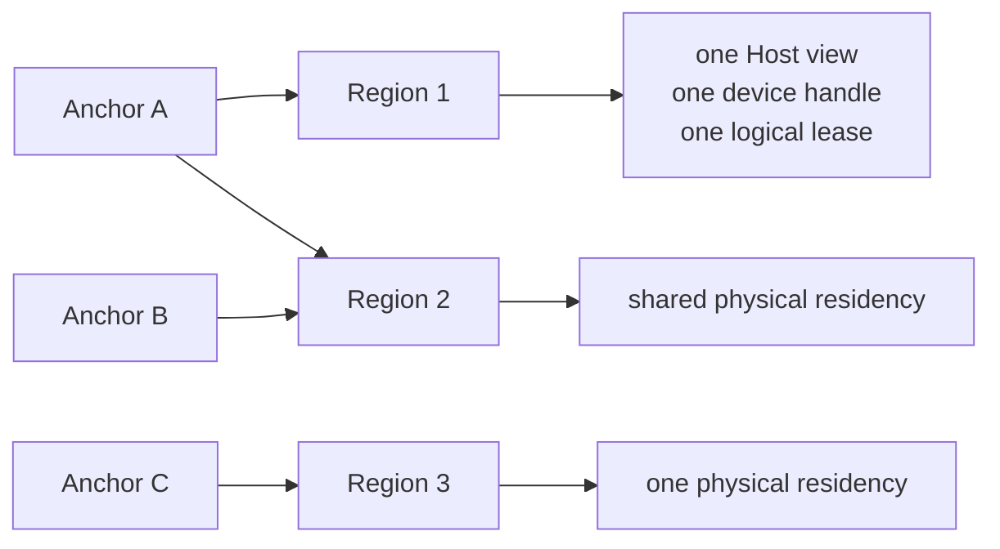

여러 Anchor가 같은 Region에 의존해도 physical GPU copy와 logical lease는 하나다.
`forget(anchor)`는 해당 Anchor edge를 모두 지우고 dependent count가 0이 된 Region만
orphan으로 반환한다.

### 12.3 PromotionCandidate

```cpp
struct PromotionCandidate {
  VectorId anchor_id;
  RegionFootprint footprint;
  std::uint64_t epoch;
  std::vector<std::byte> vector_bytes;
  std::uint32_t vector_dim;
  VectorDType vector_dtype;
};
```

`epoch`는 enqueue 뒤 처리 전에 같은 Anchor ID가 release/reuse되는 race를 막는다.
`releaseAnchor()`가 generation을 증가시키고, Coordinator가 candidate epoch와 현재 epoch를
비교한다. 불일치 candidate는 버린다.

### 12.4 recordTraversal의 정확한 역할

`recordTraversal(touched)`은 Anchor를 새로 만들거나 Routing Cache에 등록하지 않는다.
이미 dependency graph에 존재하는 Anchor 중 touched Region에 의존하는 Anchor를 찾아
replacement policy에 hotness signal을 보낸다.

```cpp
for (RegionId region_id : touched.regions) {
  auto it = dependents_.find(region_id);
  if (it == dependents_.end()) continue;
  anchors.insert(it->second.begin(), it->second.end());
}
for (VectorId anchor_id : anchors) {
  replacement_policy_->onAnchorTouched(anchor_id);
}
```

한 Anchor가 touched Region 여러 개에 의존해도 한 call 안에서는 deduplicate된다.
GpuOnly/Hybrid 여부와 무관하게 every Traverse completion callback에서 호출된다.

Routing Cache 등록은 `recordTraversal()`이 아니라 실제 promotion이 하나라도 성공한 뒤
`processPromotions()`이 수행한다.

---

## 13. Coordinator와 promotion

### 13.1 Intake와 wakeup

`CoordinatorConfig`의 기본 interval은 100ms다.

```cpp
struct CoordinatorConfig {
  std::chrono::milliseconds trigger_interval{100};
};
```

`requestPromotion()`은 queue에 넣지만 Coordinator를 즉시 notify하지 않는다. Periodic
wakeup, `waitIdle()` force wake, shutdown wake에서 처리된다.

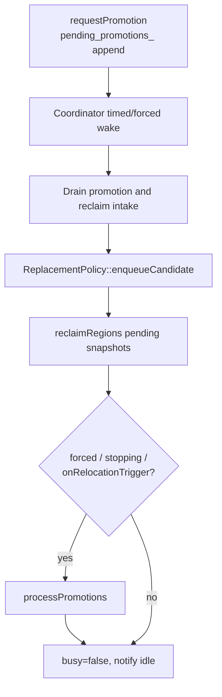

### 13.2 Promotion sequence

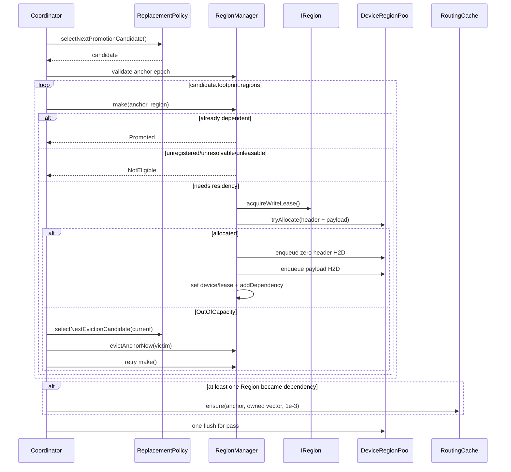

### 13.3 RegionManager::make

`make()`은 무조건 promote하지 않는다. 결과는 세 종류다.

```cpp
enum class MakeResult {
  Promoted,
  NotEligible,
  OutOfCapacity,
};
```

실제 순서:

```text
1. 이미 anchor -> region dependency인가?
2. Region이 register됐는가?
3. Region이 host-only라면 adapter가 resolve할 수 있는가?
4. IRegion이 valid write lease를 발급하는가?
5. dirty header + payload allocation이 가능한가?
6. zero header와 payload H2D를 enqueue
7. Region에 device handle과 logical lease 기록
8. Anchor dependency 추가
```

이미 다른 Anchor 때문에 Region이 resident라면 새 allocation/copy 없이 dependency만
추가한다.

### 13.4 Routing Cache 등록 시점

Candidate footprint 중 하나라도 `Promoted` 결과를 얻었을 때만 ensure한다.

```cpp
if (any_promoted && routing_cache_ != nullptr) {
  routing_cache_->ensure(candidate->anchor_id,
                         candidate->vectorView(),
                         kDefaultAnchorMaxDistance);
}
```

현재 `ensure()` 반환값은 무시한다. Cache가 가까운 기존 Anchor ID를 반환한 경우에도
RegionManager dependency key는 candidate의 원래 ID로 남는다.

---

## 14. ReplacementPolicy

Replacement policy는 GPU allocation을 직접 만지지 않는다. Candidate를 언제 내놓고 어떤
Anchor를 victim으로 추천할지만 결정한다. RegionManager가 추천 결과를 실제 dependency와
capacity 상태에 대입해 실행한다.

```cpp
virtual void enqueueCandidate(PromotionCandidate) = 0;
virtual void onAnchorEvicted(VectorId) = 0;
virtual void onAnchorTouched(VectorId) = 0;
virtual bool onRelocationTrigger() = 0;
virtual bool hasPendingCandidates() const = 0;
virtual optional<PromotionCandidate>
    selectNextPromotionCandidate() = 0;
virtual optional<VectorId>
    selectNextEvictionCandidate(VectorId excluded) = 0;
```

모든 현재 policy는 promotion candidate admission은 FIFO로 처리하고, eviction ordering만
다르게 한다.

| Policy | Eviction 기준 | `onAnchorTouched()` |
| --- | --- | --- |
| `FifoReplacementPolicy` | 먼저 selection된 Anchor | 무시 |
| `LruReplacementPolicy` | 가장 오래 touch되지 않은 Anchor | list의 MRU end로 이동 |
| `LfuReplacementPolicy` | 가장 낮은 touch frequency | 다음 frequency bucket으로 이동 |
| `ClockReplacementPolicy` | second-chance reference bit sweep | reference bit set |
| `TwoQReplacementPolicy` | first-timer `a1in` 우선, proven-hot `am` 다음 | `a1in -> am`, `am` 내부 LRU |

2Q는 bounded ghost queue `a1out`을 사용한다. `a1in`에서 evicted된 ID가 다시 promotion되면
바로 protected `am`으로 들어간다.

현재 모든 policy의 `onRelocationTrigger()`는 pending candidate가 있는지만 본다. 즉
구체 policy 사이에 timed admission throttling 차이는 아직 없다.

주의할 점은 candidate가 실제 Region promotion에 성공하기 전,
`selectNextPromotionCandidate()` 시점에 eviction-order structure에 등록된다는 것이다.
모든 Region이 NotEligible여도 이후 한 번 victim으로 선택될 수 있다. 그 경우
`onAnchorEvicted()`가 policy state를 정리하며 correctness 문제는 아니지만 wasted victim
selection이 될 수 있다.

`recordTraversal()`은 touched Region을 공유하는 모든 dependent Anchor를 touch한다. 따라서
hotness는 “route에서 직접 선택된 Anchor 하나”가 아니라 “실제 접근 Region을 공유하는
Anchor 집합”에 전파된다.

---

## 15. Eviction과 reclaim

### 15.1 Capacity-driven eviction

`make()`가 `OutOfCapacity`이면 현재 promotion Anchor를 제외하고 victim을 반복 선택한다.

```text
OutOfCapacity
  -> selectNextEvictionCandidate(current anchor excluded)
  -> pending H2D Leases가 있으면 flush + clear
  -> evictAnchorNow(victim)
  -> make() retry
  -> 성공하거나 victim이 없을 때까지 반복
```

한 victim이 충분한 공간을 만들지 못하면 여러 Anchor를 연속 evict할 수 있다.

### 15.2 releaseAnchor와 evictAnchorNow 차이

`releaseAnchor()`는 public remove/verification 같은 caller path에서 호출된다.

```text
forget dependency immediately
replacement_policy.onAnchorEvicted
anchor epoch increment
RoutingCache.erase
IRegion.releaseWriteLease
clear live residency immediately
enqueue old Region snapshot for later reclaim
```

`evictAnchorNow()`는 Coordinator의 capacity retry에서 호출된다.

```text
forget dependency
replacement_policy.onAnchorEvicted
RoutingCache.erase
IRegion.releaseWriteLease
reclaimRegions synchronously on Coordinator
clear live residency
```

### 15.3 Reclaim flow

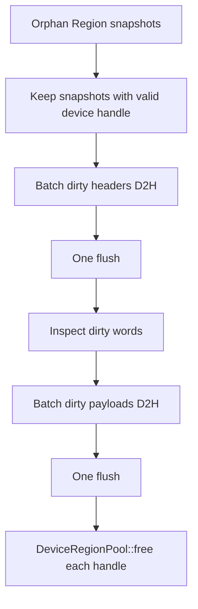

Logical write lease는 write-back 전에 release된다. Arachne 자체에는 이 시점부터 Host
writer를 막는 memory protection이 없다. Adapter가 logical lease contract로 Host access를
어떻게 제한할지는 아직 외부 책임이다.

---

## 16. Dirty bitmap과 write-back

GPU allocation layout은 Region별로 다음과 같다.

```text
+----------------------+---------------------------+
| dirty bitmap header  | Region payload            |
+----------------------+---------------------------+
0                 header_bytes             total bytes
```

Header word는 `uint64_t`이며 subregion 하나당 bit 하나다.

```cpp
DirtyHeaderWords(region_bytes, subregion_bytes);
DirtyHeaderBytes(region_bytes, subregion_bytes);
LocateDirtyBit(offset_in_region, subregion_bytes);
```

Promotion 때 header는 zero-filled되고 payload가 그 뒤에 복사된다.

```cpp
enqueueCopyFromHost(device, zero_header,
                    header_bytes, 0, pending);
enqueueCopyFromHost(device, host.ptr,
                    host.bytes, header_bytes, pending);
```

Eviction 판정:

```text
header 없음 -> 전체 Region을 보수적으로 dirty로 간주
header 있음 + any word nonzero -> dirty
header 있음 + all words zero -> clean
```

현재 bitmap은 subregion granularity지만 write-back payload는 dirty subregion만이 아니라
Region 전체다. 실제 kernel-side `atomicOr` helper는 codebase에 없다. Adapter kernel이
header 위치와 payload offset을 알고 bit를 mark해야 이 최적화가 의미를 가진다.

---

## 17. DeviceContext와 allocation policy

### 17.1 공통 physical state

`DeviceContext`는 다음을 소유한다.

- CUDA device selection (`cudaSetDevice`)
- `raft::device_resources`
- raw `rmm::mr::cuda_memory_resource`
- Data/Metadata resource wrappers
- Pooled일 때 Data/Metadata `UnitPoolArena`
- execution worker 수만큼 CUDA stream

`MemoryKind`는 두 accounting domain을 구분한다.

```cpp
enum class MemoryKind { Data, Metadata };
```

Data는 Anchor-driven promote/evict 대상이고, Metadata는 별도 budget으로 추적되지만 현재
RegionManager promotion은 Data만 사용한다.

### 17.2 Normal

```text
DeviceRegionPool::allocateNormal
  -> dataResource()/metadataResource().allocate
  -> allocation별 cudaMalloc 계열 allocation

DeviceRegionPool::freeNormal
  -> quiescence wait
  -> resource.deallocate
```

Normal은 pre-reservation과 Arachne arena compaction이 없다. `compact()`는 no-op이다.

Data와 Metadata는 별도 logical budget으로 계산되지만 두 resource wrapper 모두 같은 raw
`cuda_memory_resource` upstream을 사용한다. 따라서 Pooled처럼 물리적으로 예약된 별도
arena 두 개가 있는 것은 아니다.

### 17.3 Pooled

```text
DeviceContext construction
  -> Data UnitPoolArena: one large preallocation
  -> Metadata UnitPoolArena: one large preallocation

DeviceRegionPool::allocatePooled
  -> UnitPoolArena::allocateBestFit

DeviceRegionPool::freePooled
  -> UnitPoolArena::free + coalesce
```

Pooled는 `ceil(configured_bytes / unit_bytes) * unit_bytes`를 실제 예약한다. 따라서
`budgetBytes()`는 unit rounding 때문에 configured bytes보다 클 수 있다.

기본 unit size는 2MiB다.

```cpp
inline constexpr std::size_t kDefaultUnitBytes = 1 << 21;
```

작은 Region이 많으면 allocation마다 최대 `unit_bytes - 1`의 internal fragmentation이
생길 수 있다.

---

## 18. UnitPoolArena

### 18.1 Layout

```text
base_ptr_
  |
  v
+------+------+------+------+------+------+------+
| u0   | u1   | u2   | u3   | u4   | u5   | u6   |
+------+------+------+------+------+------+------+
|< allocation A >| free |< allocation B         >|
```

Allocation은 항상 contiguous `UnitRange`다.

```cpp
struct UnitRange {
  std::uint64_t start_unit;
  std::uint64_t unit_count;
  std::uint64_t end() const;
};
```

### 18.2 두 free index

```text
free_by_address_: start_unit -> unit_count
free_by_size_:    unit_count -> start_unit
```

- Address index는 양쪽 neighbor coalescing에 사용한다.
- Size multimap은 `lower_bound(required_units)` best-fit에 사용한다.
- `free_by_size_.rbegin()`으로 largest free extent를 O(1)에 얻는다.

### 18.3 Allocation/free primitives

```text
allocateBestFit(required)
  -> smallest extent >= required
  -> claim its prefix
  -> remainder를 free index에 유지

claim(range)
  -> containing free extent 제거
  -> optional prefix/suffix 재삽입

free(range)
  -> immediate left/right free neighbor 흡수
  -> merged extent 삽입
```

Arena 자체는 thread-safe하지 않다. 모든 호출은 `DeviceRegionPool::mutex_` 아래에서
수행된다는 전제다.

`relocate(from, to, stream)`은 D2D `cudaMemcpyAsync`만 enqueue하며 free index나 allocation
map을 바꾸지 않는다. 그 bookkeeping은 DeviceRegionPool executor가 수행한다.

---

## 19. Pooled allocation과 compaction

### 19.1 Allocation self-heal

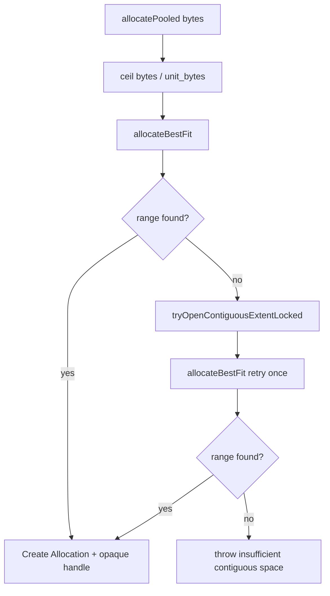

Compaction policy는 다음 정확한 external-fragmentation window에서만 호출된다.

```text
largestFreeExtent < required_units
totalFreeUnits    >= required_units
```

Largest extent가 이미 충분하면 이동이 필요 없고, total free가 부족하면 relocation으로도
해결할 수 없다.

### 19.2 Compaction policy/executor 분리

```text
CompactionPolicy
  input: free extent snapshot + movable blocks + required units
  output: Plan { Move[], feasible }
  GPU memory와 pool state를 직접 변경하지 않음

DeviceRegionPool
  movable snapshot 생성
  plan 실행
  arena/allocation map/device pointer 갱신
```

현재 policy:

| Policy | 동작 |
| --- | --- |
| `NoCompactionPolicy` | 항상 infeasible |
| `TargetedCompactionPolicy` | 한 free extent를 오른쪽의 연속 movable run으로 확장 |

### 19.3 Targeted policy algorithm

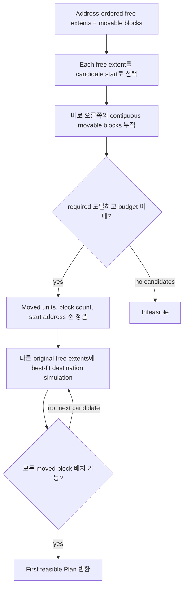

기본 budget:

```cpp
struct CompactionBudget {
  double max_moved_ratio = 2.0;
  std::uint64_t max_moved_blocks = 8;
};
```

이 알고리즘은 arbitrary global packing이나 full sliding compaction이 아니다.

- free extent 하나를 오른쪽으로만 확장한다.
- pinned/non-offered block은 hard wall이다.
- displaced block destination은 target extent를 제외한 original free extents에서 찾는다.
- earlier move가 만든 source hole을 later move destination으로 재활용하지 않는다.
- feasible 후보 중 moved units가 가장 작은 것을 우선한다.

### 19.4 Executor

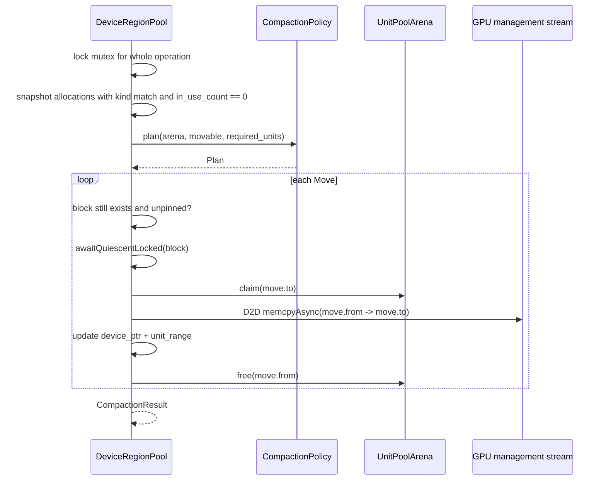

Pinned allocation은 기다렸다가 이동하는 것이 아니라 snapshot에서 제외한다. Policy가
다른 movable block으로 해결할 수 있으면 pinned block을 우회하고, 아니면 infeasible다.

### 19.5 RegionManager의 추가 retry

Pooled `tryAllocate()` 자체가 internal self-heal을 시도한다. 그래도 실패했고 logical
budget상 capacity가 남아 있으면 RegionManager가 현재 promotion batch의 pending Lease를
flush/release한 뒤 explicit `compact()`를 한 번 더 호출한다.

```text
tryAllocate
  -> success: return
  -> hasCapacity == false: OutOfCapacity
  -> hasCapacity == true:
       flush pending H2D Leases
       compact(Data, bytes)
       tryAllocate again
```

`ControllerStats::compactions_total`은 이 RegionManager explicit fallback 호출 횟수다.
`allocatePooled()` 내부 self-heal에서 실제 block이 이동한 횟수는 포함하지 않으며,
explicit `compact()`가 0개를 이동해도 counter는 증가한다.

---

## 20. Opaque handle과 physical Lease

### 20.1 Handle

```cpp
struct DeviceRegionHandle {
  std::uint64_t id = 0;
  bool valid() const { return id != 0; }
};
```

RegionManager는 raw device pointer 대신 handle만 저장한다. Compaction으로 pointer가
바뀌어도 handle ID는 유지된다.

Allocation map entry:

```cpp
struct Allocation {
  void* device_ptr;
  std::size_t bytes;
  MemoryKind kind;
  UnitPoolArena::UnitRange unit_range;
  std::size_t in_use_count;
  unordered_map<cudaStream_t, cudaEvent_t> last_used_events;
};
```

### 20.2 Lease

Raw pointer는 `acquire(handle, stream)`이 반환한 move-only RAII Lease를 통해서만 얻는다.

```cpp
class Lease {
 public:
  void* ptr() const;
  cudaStream_t stream() const;
};
```

Lease lifetime 동안 `in_use_count > 0`이므로 free/compaction 대상이 되지 않는다.

이 physical Lease는 exclusive read/write lock이 아니다. 같은 handle에 여러 Lease가 동시에
존재할 수 있다. 따라서 동시 kernel의 read/write data race를 막는 책임은 adapter와
logical operation protocol에 남아 있다.

### 20.3 Cross-stream handoff

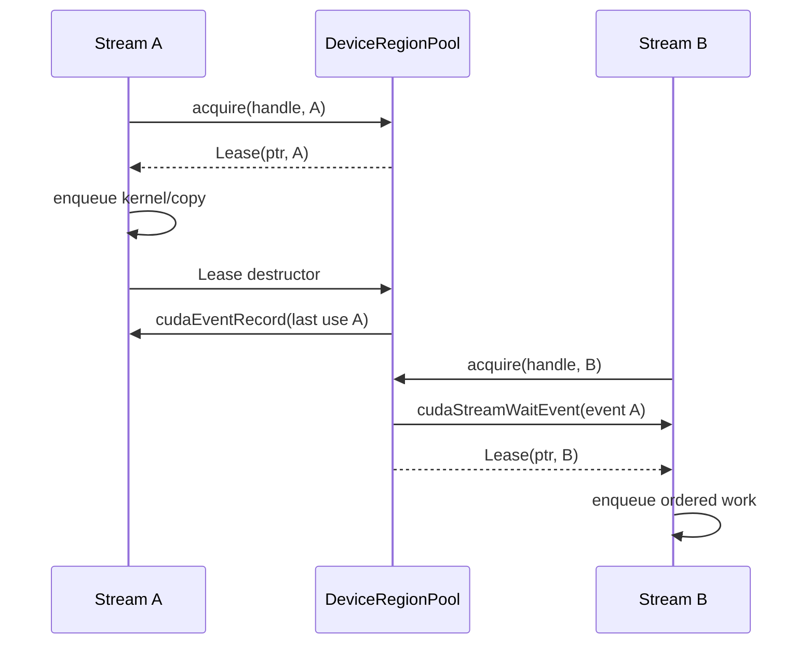

Release는 host sync를 하지 않고 stream에 event를 기록한다. 다른 stream의 acquire는
그 event를 GPU-side wait하고 event를 소비한다. 같은 stream은 CUDA FIFO ordering을
사용한다.

`free()`는 host-side로 `in_use_count == 0`을 기다린 뒤 management stream에 남은 event
wait를 enqueue한다.

### 20.4 Controller::acquireRegion

```cpp
RegionAccess Controller::acquireRegion(RegionId id) {
  Region snapshot = region_manager_.regionOf(id);
  RegionAccess result{id, snapshot.host};
  if (snapshot.device.valid()) {
    result.on_device = true;
    cudaStream_t stream = g_worker_stream != nullptr
        ? g_worker_stream
        : device_.managementStream();
    result.device_lease.emplace(
        device_region_pool_.acquire(snapshot.device, stream));
  }
  return result;
}
```

`on_device == false`면 Host view만 사용한다. `on_device == true`면
`device_lease->ptr()`를 반드시 Lease lifetime 안에서 사용해야 한다.

현재 `IAdapter`에는 Controller reference나 acquire callback이 전달되지 않는다. 따라서
real adapter의 `traverseDevice()/modifyDevice()`가 이 API에 도달하는 public integration
seam은 아직 완성되지 않았다.

---

## 21. 현재 GPU ordering에서 주의할 구현 경계

아래는 의도 설명이 아니라 현재 source에서 직접 관찰되는 경계다.

### 21.1 Relocation completion handoff

Compaction D2D copy는 management stream에 async enqueue되지만, relocation 완료 event를
allocation의 `last_used_events`에 기록하지 않는다. 함수는 pointer/range를 즉시 갱신하고
return한다.

```cpp
arena.relocate(move.from, move.to, management_stream);
allocation.device_ptr = arena.pointerFor(move.to);
allocation.unit_range = move.to;
arena.free(move.from);
```

그 직후 worker stream이 새 pointer를 acquire하면 기존 Lease release event는 기다리지만
방금 management stream에 enqueue된 relocation copy 자체를 기다릴 event는 없다. 따라서
management stream과 worker stream 사이에 별도 외부 ordering이 없다면 새 위치의 copy
완료 전 kernel access가 시작될 수 있다.

### 21.2 Pooled free 이후 range reuse

`freePooled()`도 prior Lease event waits를 management stream에 enqueue한 뒤 host-side arena
range를 즉시 free/coalesce한다. 새 allocation이 같은 range를 받고 다른 worker stream에서
사용될 때 management stream의 prior-use wait와 직접 연결되는 event가 없다.

즉 현재 Lease/event 구현은 “released work를 다음 acquire stream에 연결”하는 일반
handoff는 구현하지만, management stream의 relocation/free barrier를 future worker
acquire에 전달하는 완전한 chain은 아직 명시적으로 구현하지 않는다.

### 21.3 CompactionPolicy trust boundary

Executor는 block ID 존재와 `in_use_count == 0`을 재검사하지만, policy가 반환한 `from`이
현재 allocation range와 정확히 같은지는 비교하지 않는다. `to`는 `arena.claim()`이
free 여부를 검사한다. 현재 built-in policy는 contract를 지키지만 외부 custom policy는
trusted internal strategy로 취급된다.

### 21.4 Host protection

Arachne는 `HostRegionView::ptr`에 OS memory protection이나 reader/writer lock을 걸지
않는다. Logical write lease가 active인 동안 Host read를 stale/lazy로 허용할지, Host write를
막을지는 `IRegion` 구현 contract에 달려 있다.

---

## 22. Routing Cache

### 22.1 Interface와 stats

```cpp
class RoutingCache {
 public:
  optional<VectorId> nearest(const VectorView& query);
  virtual VectorId ensure(VectorId id,
                          const VectorView& vector,
                          float max_distance) = 0;
  virtual void erase(VectorId id) = 0;
  Stats stats() const;
};
```

`nearest()`는 nonvirtual wrapper이고 concrete lookup은 `nearestImpl()`이다. Wrapper가
relaxed atomic hit/miss를 증가시킨다. Lookup이 throw하면 hit/miss 어느 쪽에도
포함되지 않는다.

```cpp
struct Stats {
  std::uint64_t hits;
  std::uint64_t misses;
};
```

이 stats는 `ControllerStats`에 합쳐지지 않는다. Caller가 RoutingCache instance에서 직접
읽어야 한다.

### 22.2 Per-Anchor radius

Cache는 raw nearest Anchor 하나만 찾고 그 Anchor 자신의 radius를 적용한다.

```text
top-1 nearest candidate
  -> distance <= that candidate.max_distance: hit
  -> otherwise: miss
```

가장 가까운 Anchor의 radius 밖이면 더 멀지만 radius가 큰 다른 Anchor를 탐색하지 않는다.

### 22.3 Active/Shadow compaction

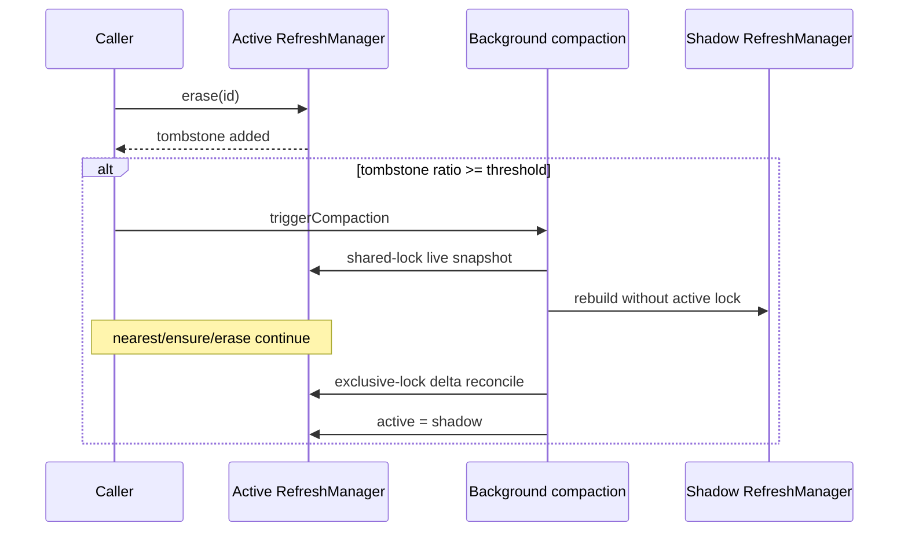

Lock mode:

| Operation | Lock |
| --- | --- |
| nearest | shared |
| ensure | exclusive |
| erase | exclusive |
| initial snapshot | shared |
| final reconcile/swap | exclusive |

Derived `ASRoutingCacheHnsw` destructor가 먼저 `waitForCompaction()`을 호출한다. Background
thread가 derived virtual `makeRefreshManager()`를 호출하는 동안 derived state가 파괴되는
것을 막기 위한 순서다.

### 22.4 HNSW backend

`ASRoutingCacheHnsw`는 `(DistanceMetric, VectorDType)`에 맞는 hnswlib Space와
`HierarchicalNSW<DistT>`를 만든다.

| Metric | Float32 | Float16 | UInt8 | Int8 |
| --- | --- | --- | --- | --- |
| L2 | 지원 | 지원 | 지원 | 지원 |
| Inner Product | 지원 | 지원 | 지원 | 지원 |
| Cosine | 지원 | 미지원 | 미지원 | 미지원 |

Cosine은 Float32를 `util::Normalize()`한 뒤 `InnerProductSpace`에 넣는다.

HNSW RefreshManager 내부 state:

```text
space_
index_
live_ids_
max_distance_[id]
tombstones_
```

`ensure()`와 `nearest()`는 dtype mismatch를 검사하지만 `VectorView::dim`이나 null pointer는
검사하지 않는다. Caller가 cache construction dimension과 일치하는 valid buffer를
전달한다는 contract다.

`ensure()`는 가까운 기존 Anchor가 있으면 제안된 새 ID 대신 기존 ID를 반환한다.
RegionManager는 현재 이 반환값을 사용하지 않는다는 점이 dependency identity와의 중요한
경계다.

### 22.5 Vendored hnswlib patch

Local patch는 upstream hnswlib에 다음 기능을 추가한다.

- portable binary16 conversion
- UInt8/Int8/Float16 L2 space
- UInt8/Int8/Float16 Inner Product space
- scalar residual path
- SSE4.1, AVX2, AVX512/F16C distance path
- dtype distance와 graph self-recall test

hnswlib type은 public Arachne header에 노출되지 않으며 `.cpp` private dependency다.

---

## 23. Telemetry

### 23.1 Compile-time switch

```text
-DARACHNE_ENABLE_TRACING=ON
```

기본값은 OFF다. OFF일 때 `ARACHNE_TRACE_SCOPE`는 empty macro이고
`InstrumentedMutex`는 `std::mutex` alias다. 따라서 runtime branch가 아니라
instrumentation 자체가 compile out된다.

ON일 때 RegionManager와 OpScheduler는 instrumented mutex와
`condition_variable_any`를 사용한다.

### 23.2 Trace record

```cpp
struct TraceRecord {
  std::uint64_t start_ns;
  std::uint64_t duration_ns;
  std::uint64_t thread_id;
};
```

각 `(module, feature)` collector는 destruction 때 다음 CSV를 쓴다.

```text
<ARACHNE_TRACE_DIR>/<module>-<feature>.csv
```

환경변수가 없으면 current working directory를 사용한다. Directory를 생성하지 않으며
file open 실패는 무시한다.

Thread별 buffer는 first use에만 registry mutex로 등록되고 이후 record append는 해당
thread private vector에 수행된다. Collector address 대신 monotonically increasing ID를
thread-local cache key로 사용해 재사용된 object address의 dangling pointer 문제를 피한다.

### 23.3 현재 scope

Controller:

```text
search, insert, remove, route
dispatchTraverse, dispatchModify
commitSearch, commitInsert, commitRemove
```

OpScheduler:

```text
executeTraverseBatch, executeModifyBatch
```

RegionManager:

```text
requestPromotion, releaseAnchor, recordTraversal
make, processPromotions, evictAnchorNow
reclaimRegions, writeBackDirtyRegions
```

DeviceRegionPool:

```text
tryAllocate, acquire, free, flush, compact
tryOpenContiguousExtentLocked
```

Instrumented mutex는 lock acquisition wait time을 별도 `<module>-lockwait.csv`에 기록한다.

### 23.4 현재 telemetry 한계

- queue wait는 `enqueued_at`이 있어도 별도 scope로 기록하지 않는다.
- Routing hit/miss는 atomic stats이고 trace timeline에는 없다.
- transfer bytes, actual relocated bytes, fallback count histogram은 CSV field가 아니다.
- 같은 module/feature collector가 여러 object instance에서 동일 filename을 쓰면 destructor의
  `"w"` open이 이전 file을 덮어쓸 수 있다. 단일 benchmark Controller를 전제한 형태다.

---

## 24. Stats

Controller가 노출하는 stats는 RegionManager stats의 복사다.

```cpp
struct ControllerStats {
  std::size_t gpu_bytes_allocated;
  std::uint64_t regions_promoted_total;
  std::uint64_t regions_evicted_total;
  std::uint64_t regions_written_back_total;
  std::uint64_t anchor_evictions_total;
  std::uint64_t compactions_total;
};
```

| Field | 의미 |
| --- | --- |
| `gpu_bytes_allocated` | live allocation의 요청 bytes 합계 |
| `regions_promoted_total` | 새 logical lease/device allocation을 얻은 Region 수 |
| `regions_evicted_total` | reclaim된 resident Region 누계 |
| `regions_written_back_total` | 실제 payload D2H가 수행된 Region 누계 |
| `anchor_evictions_total` | 하나 이상 Region을 orphan으로 만든 Anchor release/eviction 누계 |
| `compactions_total` | RegionManager explicit compact fallback 호출 누계 |

Pooled의 `gpu_bytes_allocated`는 unit-rounded physical consumption이 아니라 request의 logical
`Allocation::bytes` 합이다. 따라서 작은 allocation이 많은 경우 physical arena usage와
차이가 난다.

Routing stats는 별도다.

```cpp
RoutingCache::Stats { hits, misses }
```

---

## 25. StressIndex와 실제 검증 범위

`StressIndex`는 real ANNS가 아니라 mutex-protected flat byte buffer와 brute-force scan이다.

```text
buffer_:
[ vectors of Region 1 ][ vectors of Region 2 ][ ... ]
```

Region 하나는 `vectors_per_region` slot을 담당하고, `subregion_bytes`는 vector 하나의
byte size다. Delete된 slot은 재사용하지 않고 `next_free_slot_`은 계속 증가한다.

Device methods는 실제 GPU kernel이 아니라 Host method에 위임한다.

```cpp
std::vector<TraverseResult>
StressIndex::traverseDevice(const auto& requests) {
  return traverseHost(requests);
}

std::vector<ModifyResult>
StressIndex::modifyDevice(const auto& requests) {
  return modifyHost(requests);
}
```

따라서 현재 test가 실제로 검증하는 GPU 영역은 다음이다.

- allocation과 copy
- Region promotion/eviction
- dirty write-back
- opaque handle과 Lease
- cross-stream released-work ordering
- UnitPoolArena와 targeted compaction

실제 GPU ANN traversal/modification kernel의 correctness/throughput은 검증하지 않는다.

---

## 26. Test 구조와 source가 표현하는 보장

### 26.1 Build target

```text
cpp/test/unittest
  -> arachne_tests
  -> GTest + gtest_discover_tests

cpp/test/bin
  -> arachne_full_suite_app
  -> 직접 실행, GTest/CTest 대상 아님

cpp/test/stress
  -> 두 target이 공유하는 StressIndex
```

### 26.2 Unit test coverage

| 영역 | Source가 검증하는 내용 |
| --- | --- |
| Scheduler policy | front kind, first eligible candidate, kind rejection |
| Scheduler worker | callback이 worker마다 한 번, distinct index |
| Region graph | registration, shared Region, last dependent, concurrent churn |
| recordTraversal | dependent Anchor notification과 call-local dedupe |
| Coordinator | lazy processing, forced idle, stale epoch, owned vector copy |
| Replacement | FIFO/LRU/LFU/Clock/2Q ordering과 purge/touch semantics |
| Controller | H2D promotion, multi-victim eviction, dirty/clean write-back, duplicate insert ID |
| Dirty header | word sizing, rounding, bit location |
| UnitPoolArena | best-fit, claim split, coalescing, D2D relocate |
| CompactionPolicy | targeted plan, budgets, pinned wall, no-compaction |
| DeviceRegionPool | Normal/Pooled common contract, budget, copy offsets, Lease waits |
| Stream ordering | released work의 cross-stream event handoff |
| Pooled compaction | self-heal, pinned-block 우회, survivor data 보존 |
| Routing Cache | radius, erase, resize, Active/Shadow compaction, concurrency |
| dtype routing | four dtypes, L2/IP, Float32-only Cosine |
| CPU SIMD | L2, dot, normalize, scalar tail, in-place normalize |
| Stress stage 1 | dtype별 insert/search/remove orchestration correctness |
| Stress stage 2 | 작은 logical GPU budget에서 eviction cycling |
| Stress stage 3 | concurrent insert/search/remove와 ID reuse |

### 26.3 Default policy 변경과 test 주석

`DeviceRegionPoolTest`는 default `DeviceContext`가 Normal임을 명시적으로 검사한다.

```cpp
DeviceContext device;
EXPECT_EQ(device.allocationPolicy(), AllocationPolicy::Normal);
```

반면 일부 Stress stage는 `Controller` 마지막 argument를 전달하지 않으면서 주석에서
Pooled unit behavior를 설명한다. 현재 constructor default를 적용하면 그 test의 실제
allocation mode는 Normal이다. Pooled-specific correctness는
`DeviceRegionPoolCompactionTest`와 Pooled를 명시한 Controller tests가 담당한다.

### 26.4 Standalone full suite

`arachne_full_suite_app`은 다음 workload를 직접 실행하고 timing/stats/PASS를 출력한다.

```text
generate vectors
-> insert all
-> sample search vs brute-force ground truth
-> remove leading IDs
-> waitIdle
-> print ControllerStats
```

기본 allocation은 Normal이며 `--pooled` flag로 Pooled를 선택한다.

---

## 27. Build configuration

```text
CMake minimum          3.26
C++ standard           C++20
CUDA standard          CUDA C++20
default architectures  SM100, SM120
tests default           ARACHNE_BUILD_TESTS=ON
tracing default         ARACHNE_ENABLE_TRACING=OFF
```

| Dependency | 용도 |
| --- | --- |
| CUDA / RAFT / RMM | device context, stream, memory resource |
| fmt | logging format |
| Threads | scheduler, Coordinator, routing rebuild |
| Google Highway | CPU runtime SIMD dispatch |
| vendored hnswlib | concrete Routing Cache backend |
| GTest | unit/stress test executable |

GPU/RAFT는 optional backend가 아니라 `arachne_core`의 unconditional dependency다.
기본 CUDA architecture는 Blackwell 계열이므로 다른 GPU에서는
`CMAKE_CUDA_ARCHITECTURES` override가 필요하다.

Tracing이 켜질 때만 `src/telemetry/trace.cpp`가 core source에 추가되고 compile definition은
PUBLIC으로 전달된다. Header member type 자체가 달라지므로 library와 consumer가 같은
definition을 봐야 하기 때문이다.

---

## 28. 동시성 및 consistency 표

| 상태 | 보호 방식 |
| --- | --- |
| Scheduler incoming/dispatch queue, config | `OpScheduler::mutex_` |
| Region registry/dependency/intake queues | `RegionManager::mutex_` |
| Replacement policy internal state | policy별 `std::mutex` |
| Insert live ID set | `Controller::live_ids_mutex_` |
| Search Anchor mint | atomic `next_anchor_id_` |
| Routing active RefreshManager | `std::shared_mutex` |
| Routing hit/miss | relaxed atomics |
| Device allocation map | `DeviceRegionPool::mutex_` |
| Pointer pinning | `in_use_count` + RAII Lease |
| Released CUDA work | per-stream CUDA event |
| Residency counters | relaxed atomics |
| Trace hot-path records | thread-local buffer |

Route 전체는 하나의 transaction이 아니다.

```text
RoutingCache::nearest
-> RegionManager::regionsOf
-> scheduler queue wait
-> adapter execution
-> acquireRegion
```

그 사이 eviction/release가 일어날 수 있다. Adapter는 predicted scope만으로 bare pointer가
유효하다고 가정하지 않고 최종 access 시점에 handle/Lease를 획득해야 한다.

---

## 29. 현재 구현의 미연결점과 위험 요약

### 29.1 Real GPU adapter access seam

`Controller::acquireRegion()`은 존재하지만 `IAdapter`가 Controller나 callback을 받지
않는다. Real adapter가 Arachne-owned handle을 pointer/stream Lease로 바꾸는 API 연결이
필요하다.

### 29.2 Real Region partitioning

StressIndex는 fixed slot slice를 Region으로 사용한다. HNSW/IVF 같은 실제 index state를
locality와 update boundary를 보존하며 Region으로 나누는 구현은 없다.

### 29.3 Insert promotion rollback

Insert Modify 실패/exception은 `live_ids_`만 rollback한다. 선행 Traverse가 enqueue한
promotion candidate와 이미 생긴 residency/dependency는 취소하지 않는다.

### 29.4 Insert GpuOnly fallback

Search는 incomplete GpuOnly에 Hybrid fallback이 있지만 Insert placement Traverse에는 없다.

### 29.5 Verification

`Controller::verify()`는 GPU/Hybrid neighbor ID sequence를 비교하고 mismatch 시
`releaseAnchor()`하도록 구현되어 있으나 `search()`에서 호출하지 않는다.

### 29.6 Dirty marking과 reconciliation

Dirty header allocation/inspection은 구현됐지만 실제 kernel mark가 없다.
`applyLocalModification()`과 `reconcileBoundary()`도 호출되지 않아 byte mirror consistency와
index structural consistency의 연결이 미완성이다.

### 29.7 Anchor ID namespace

Search Anchor는 atomic counter가 1부터 생성하고 Insert Anchor는 application Record ID를
그대로 쓴다. 같은 `VectorId` namespace를 공유하지만 충돌 방지 규칙이 없다.

### 29.8 Routing ensure dedup identity

`ensure(candidate_id, vector, radius)`가 기존 가까운 ID를 반환할 수 있지만
RegionManager는 반환값을 무시한다. Cache key와 dependency key가 달라질 수 있다.

### 29.9 Allocation accounting

Pooled capacity precheck는 logical requested bytes 합을 사용하고 unit-rounded physical
consumption을 사용하지 않는다. 최종 arena allocation 실패는 catch되어 eviction path로
전달되지만 `hasCapacity()` 의미가 physical contiguous capacity와 같지는 않다.

### 29.10 GPU management-to-worker ordering

Relocation/free barrier를 future worker acquire에 연결하는 event가 명시적으로 없다는 점은
21절의 safety gap이다. 실제 GPU-native adapter를 연결하기 전에 정리해야 할 영역이다.

### 29.11 Multi-GPU

Controller는 device 0의 `DeviceContext` 하나만 만든다. Multi-GPU shard, placement,
cross-device transfer는 없다.

---

## 30. 빠른 function call index

### Construction

```text
IndexImpl::IndexImpl
  -> own IAdapter
  -> own RoutingCache
  -> Controller::Controller
     -> DeviceContext(device 0, Normal by default)
        -> RAFT management resource
        -> worker CUDA streams
        -> optional Pooled Data/Metadata arenas
     -> DeviceRegionPool(default TargetedCompactionPolicy)
     -> RegionManager(default FifoReplacementPolicy)
     -> OpScheduler(default FifoSchedulingPolicy)
     -> OpScheduler::start
     -> RegionManager::start
```

### Search

```text
Controller::search
  -> routeSearch -> route
  -> dispatch Traverse
  -> scheduler batch
  -> adapter traverseHost/traverseDevice
  -> recordTraversal
  -> optional requestPromotion
  -> optional Hybrid fallback
  -> commitSearch
```

### Insert

```text
Controller::insert
  -> duplicate ID claim
  -> route placement lookup
  -> dispatch Traverse(record.id as promotion Anchor)
  -> routeInsert(touched + hint)
  -> dispatch Modify Insert
  -> commitInsert
  -> rollback ID claim on failure
```

### Remove

```text
Controller::remove
  -> routeRemove(Hybrid)
  -> dispatch Modify Delete
  -> commitRemove
  -> releaseAnchor on success
  -> erase live ID
```

### Promotion

```text
RegionManager::coordinatorLoop
  -> drain intake
  -> ReplacementPolicy::enqueueCandidate
  -> process reclaims
  -> processPromotions
     -> select candidate
     -> epoch check
     -> make each Region
        -> acquire logical write lease
        -> tryAllocate / optional compact
        -> enqueue dirty header + payload H2D
        -> add dependency
     -> capacity retry via victim eviction
     -> RoutingCache::ensure if any Region promoted
  -> one pool flush
```

### Compaction

```text
DeviceRegionPool::allocatePooled or compact
  -> tryOpenContiguousExtentLocked
     -> capacity/fragmentation classification
     -> snapshot unpinned MovableBlock list
     -> CompactionPolicy::plan
     -> claim destination
     -> D2D relocate
     -> update opaque-handle mapping
     -> free source extent
```

---

## 31. 최종 상태 요약

Arachne C++의 현재 구현은 `Traverse`/`Modify` primitive scheduler와 Anchor-driven
asynchronous GPU residency manager를 실제 CUDA allocation/copy/compaction substrate까지
연결한 상태다. 최신 확장은 Pooled allocator를 generic pool에서 explicit
`UnitPoolArena`로 교체하고, bounded targeted compaction, 여러 Anchor replacement policy,
worker stream 분리, opt-in tracing을 추가한 것이다.

다음 구현 단계의 중심은 control-plane skeleton을 더 늘리는 것이 아니라, real ANNS
adapter가 `RegionAccess`를 안전하게 얻는 seam, 실제 GPU kernel과 dirty marking,
management/worker stream 간 완전한 relocation/free ordering, real Region partitioning과
reconciliation contract를 연결하는 것이다.
