# Arachne C++ Implementation Documentation v3

> Current implementation reference: 2026-08-06  
> Scope: `cpp/include`, `cpp/src`, `cpp/test`

이 문서는 Arachne C++ 구현의 현재 동작을 설명하는 reference다. 설계 변경 이력이나 향후
제안이 아니라, public operation이 어떻게 실행되고 GPU Region이 어떻게 promotion,
eviction, reuse되는지, 각 thread와 CUDA stream이 어떤 상태를 소유하는지, correctness가
어떤 invariant로 유지되는지를 기술한다.

---

## 1. 시스템 개요

Arachne는 특정 ANN 알고리즘을 직접 구현하는 index가 아니라, ANN adapter 위에서 다음을
관리하는 GPU residency control plane이다.

- query/insert/delete의 scheduling과 batching
- Anchor 기반 GPU routing
- Anchor와 Region 사이의 many-to-many dependency
- GPU Region promotion과 eviction
- worker execution과 relocation 사이의 동시성
- Async 또는 Pooled GPU memory allocation
- dirty Region write-back
- replacement와 compaction policy 확장점
- generation, logical pin, physical lease를 이용한 안전한 relocation

Public operation은 다음 두 primitive로 분해된다.

```text
SEARCH = Traverse
INSERT = Traverse -> Modify
DELETE = Modify
```

실제 ANN 탐색과 수정은 `IAdapter`가 수행하고, Arachne는 operation의 실행 위치와 Region
residency를 결정한다.

---

## 2. 전체 architecture

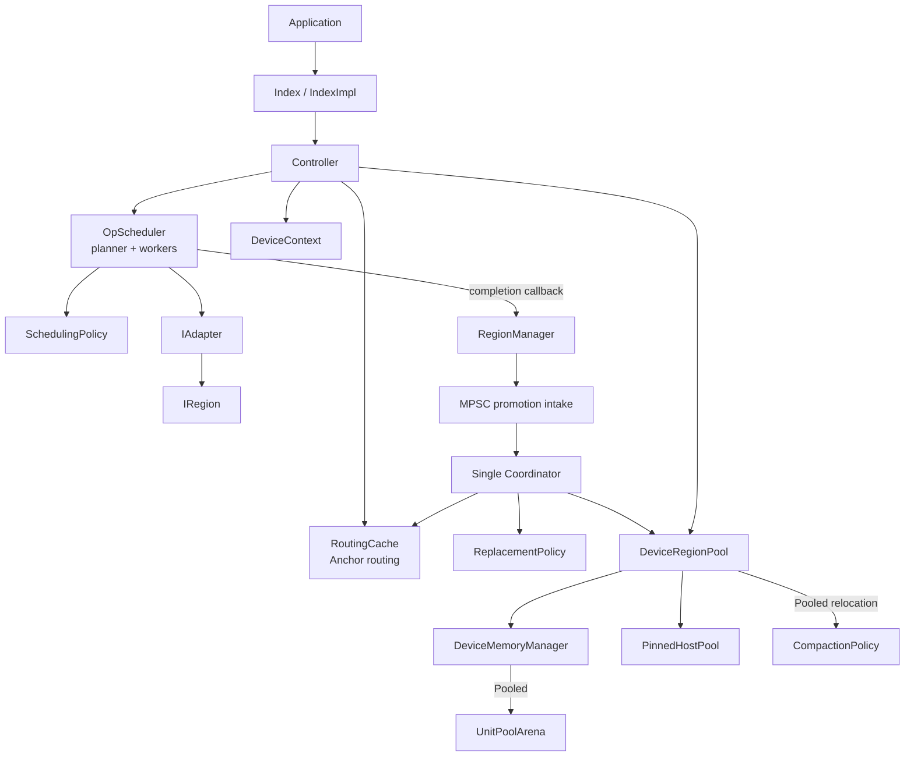

데이터 실행 경로와 residency control 경로는 분리되어 있다.

```text
Execution data path
  Controller -> OpScheduler -> execution worker -> IAdapter

Residency control path
  worker completion -> RegionManager MPSC queue
  -> Coordinator -> ReplacementPolicy
  -> DeviceRegionPool / RoutingCache
```

`search()`, `insert()`, `remove()`는 자신의 adapter operation 완료를 기다리지만, 그
operation이 생성한 promotion request까지 기다리지는 않는다. Residency control의 명시적
barrier는 `Controller::waitIdle()`과 `RegionManager::waitIdle()`이다.

---

## 3. 주요 모듈

| 모듈 | 주요 파일 | 책임 |
| --- | --- | --- |
| Public API | `include/interface/index.hpp` | search/insert/remove interface |
| Facade | `include/interface/index_impl.hpp`, `src/interface/index_impl.cpp` | adapter/cache 소유와 Controller forwarding |
| Controller | `include/core/controller.hpp`, `src/core/controller.cpp` | routing, dispatch, commit, Region access |
| Scheduler | `include/core/op_scheduler.hpp`, `src/core/op_scheduler.cpp` | operation queue, planner, worker pool |
| Scheduling policy | `include/core/scheduling_policy.hpp`, `src/core/scheduling_policy.cpp` | scheduler batch 선택 |
| Region manager | `include/core/region_manager.hpp`, `src/core/region_manager.cpp` | Region registry, dependency graph, Coordinator |
| Replacement policy | `include/core/replacement_policy.hpp`, `src/core/replacement_policy.cpp` | admission, promotion order, eviction order |
| Routing cache | `include/core/routing_cache.hpp` | nearest/ensure/erase |
| Active/Shadow routing | `include/core/as_routing_cache.hpp`, `src/core/as_routing_cache.cpp` | HNSW shadow rebuild와 active swap |
| Adapter | `include/adapter/index_adapter.hpp` | batched Host/Device Traverse/Modify |
| Region contract | `include/adapter/region.hpp` | host view, write lease, reconciliation |
| Device context | `include/gpu/device_context.hpp`, `src/gpu/device_context.cpp` | CUDA device, management/worker streams |
| Device pool | `include/gpu/device_region_pool.hpp`, `src/gpu/device_region_pool.cpp` | opaque handle, physical lease, transfer, reuse |
| Memory backend | `include/gpu/device_memory_manager.hpp`, `src/gpu/device_memory_manager.cpp` | Async/Pooled allocation 구현 |
| Pinned staging | `include/gpu/pinned_host_pool.hpp`, `src/gpu/pinned_host_pool.cpp` | reusable page-locked host buffer |
| Pooled arena | `include/gpu/unit_pool_arena.hpp`, `src/gpu/unit_pool_arena.cpp` | fixed-unit suballocation |
| Compaction | `include/gpu/compaction_policy.hpp`, `src/gpu/compaction_policy.cpp` | bounded D2D relocation plan |
| Dirty tracking | `include/gpu/dirty_header.hpp` | Region dirty bitmap layout |
| Tests | `test/unittest`, `test/stress` | unit, race, excessive churn 검증 |

---

## 4. Ownership과 lifetime

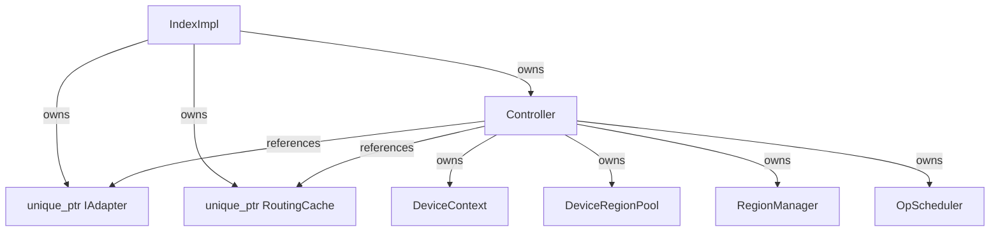

Controller 내부의 파괴 순서는 worker와 Coordinator가 GPU substrate보다 먼저 종료되도록
구성된다.

```text
OpScheduler shutdown
-> planner/worker join

RegionManager shutdown
-> Coordinator join

DeviceRegionPool destruction
-> live allocation/event cleanup

DeviceContext destruction
-> streams/resources cleanup
```

`RegionManager::start()`에 전달되는 adapter, pool, routing cache는 외부 소유이며
RegionManager보다 오래 살아 있어야 한다.

---

## 5. Thread와 CUDA stream 모델

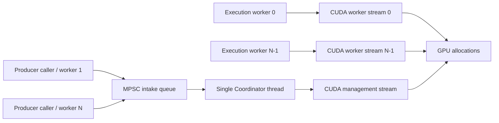

실행 주체별 책임은 다음과 같다.

| 실행 주체 | 책임 |
| --- | --- |
| Caller | route, operation 단계 연결, future 대기, commit |
| Scheduler planner | incoming operation을 homogeneous batch로 구성 |
| Execution worker | adapter batch 호출, completion callback, promise 완료 |
| Coordinator | promotion intake, relocation plan, eviction/promotion 제출, publish |
| Routing compaction thread | Active/Shadow routing index rebuild |
| CUDA worker stream | query/modify kernel ordering |
| CUDA management stream | allocation, H2D/D2H, free, compaction ordering |

Worker stream과 management stream은 전역 synchronize로 연결하지 않는다.
`DeviceRegionPool::Lease`가 기록하는 CUDA event를 이용해 동일 allocation에 필요한
stream 간 dependency만 삽입한다.

---

## 6. Operation scheduling

### 6.1 Scheduler configuration

```cpp
struct SchedulingConfig {
    std::size_t traverse_batch_size = 1;
    std::size_t modify_batch_size = 1;
    std::size_t max_execution_threads = 1;
    std::chrono::microseconds batch_wait_timeout{0};
};
```

Scheduler는 한 planner와 여러 execution worker를 사용한다. 현재 FIFO scheduling policy는
queue에서 같은 operation kind와 같은 execution mode인 요청을 모은다.

```text
Traverse + Hybrid
Traverse + GpuOnly
Modify   + Hybrid
Modify   + GpuOnly
```

같은 class 안에서는 queue order를 유지하지만, 다른 class의 operation을 건너뛰어 batch를
채울 수 있으므로 strict global FIFO는 아니다.

### 6.2 Search

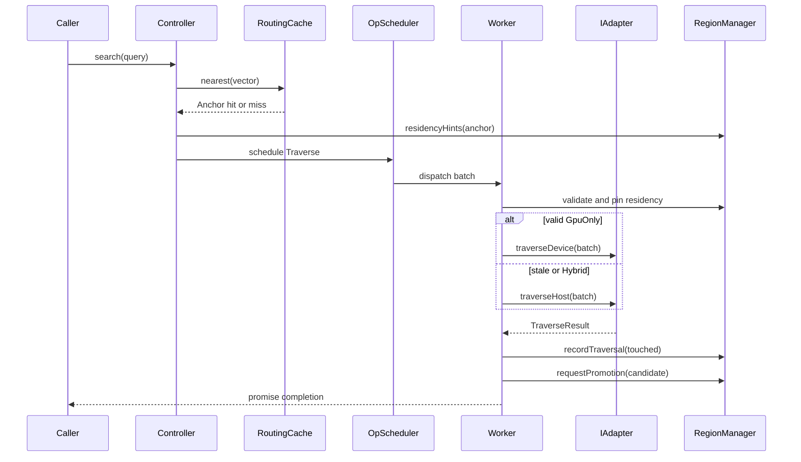

### 6.3 Insert와 remove

```text
Insert
  -> duplicate-ID claim
  -> placement Traverse
  -> Modify Insert
  -> commit or rollback

Remove
  -> Modify Delete
  -> releaseAnchor
  -> dependency/routing removal
```

Promotion candidate는 worker completion callback에서 만들어질 수 있다. Callback은
promise 완료 전에 실행되므로 public operation이 반환될 때 candidate enqueue 자체는 끝나
있지만 relocation 완료는 보장하지 않는다.

---

## 7. Anchor, Region, dependency graph

Arachne residency의 semantic 단위는 address page가 아니라 adapter가 정의한 `RegionId`다.
Anchor는 routing entry이며 하나 이상의 Region에 의존할 수 있다.

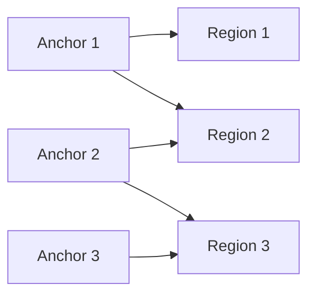

RegionManager는 양방향 graph를 유지한다.

```text
dependencies_[anchor] -> set<RegionId>
dependents_[region]    -> set<VectorId>
```

Anchor eviction이 실제 GPU capacity를 반환하는지는 공유 dependency에 따라 달라진다.

- 마지막 dependent인 Anchor를 제거하면 Region allocation을 reclaim할 수 있다.
- 다른 Anchor가 계속 의존하면 해당 Region은 resident 상태로 남는다.
- 여러 victim을 함께 제거해야 orphan이 되는 Region은 batch victim 집합 전체를 기준으로
  projected reclaim byte를 계산한다.

---

## 8. Region residency 상태 머신

```cpp
enum class RegionResidencyState {
    HostOnly,
    Promoting,
    Resident,
    Retiring,
};
```

Region record는 다음 상태를 가진다.

```cpp
struct Region {
    RegionId id;
    HostRegionView host;
    DeviceRegionHandle device;
    LeaseHandle lease;
    RegionResidencyState residency_state;
    std::uint64_t residency_generation;
    std::size_t residency_pins;
};
```

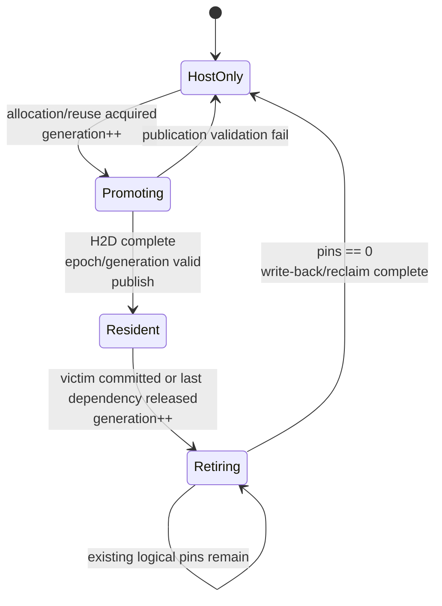

### 8.1 HostOnly

Host mapping만 등록된 상태다. GPU routing hint를 만들 수 없고 device handle과 write lease는
publish되지 않는다.

### 8.2 Promoting

allocation 또는 reused handle을 얻고 H2D copy를 제출했지만 worker에게 공개하지 않은
상태다. Copy가 완료되기 전에는 dependency graph와 RoutingCache에 GPU-resident 대상으로
publish하지 않는다.

### 8.3 Resident

GPU path에서 사용할 수 있는 유일한 상태다. 유효한 device handle과 logical write lease를
가지며 worker가 generation validation 후 logical pin을 획득할 수 있다.

### 8.4 Retiring

Eviction이 commit된 상태다. 새 pin을 허용하지 않고 generation이 증가하므로 queue에 있던
이전 routing hint는 stale이 된다. 기존 pin만 drain한 뒤 reclaim한다.

---

## 9. Routing hint, generation, logical pin

RoutingCache hit는 execution 권한이 아니라 예측이다. Routing 이후 scheduler queue에서
대기하는 동안 Region이 eviction될 수 있으므로 worker가 adapter 호출 직전에 다시 검증한다.

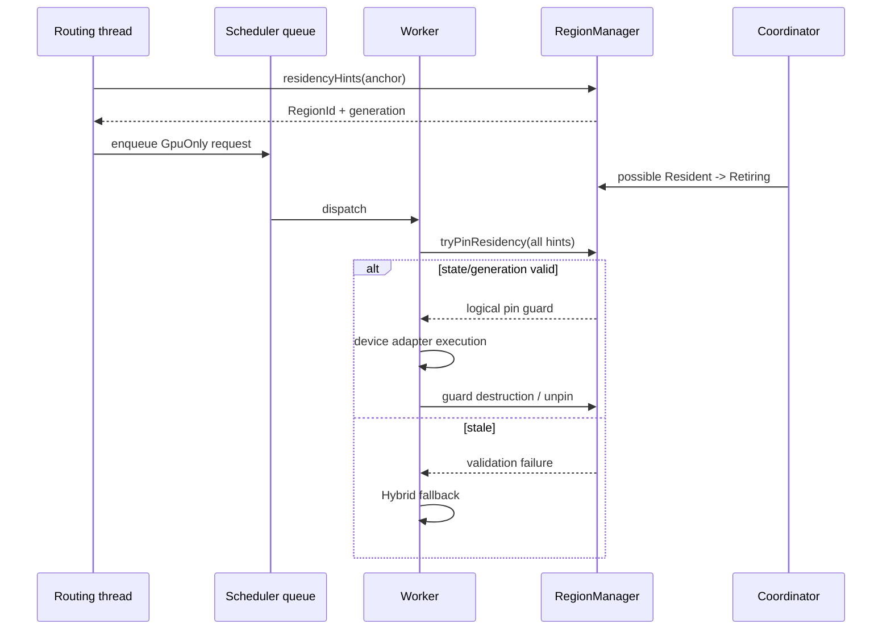

`tryPinResidency()`는 request가 요구하는 모든 Region을 하나의 RegionManager lock 아래에서
검사한다.

- Region이 등록되어 있어야 한다.
- state가 정확히 `Resident`여야 한다.
- generation이 routing hint와 같아야 한다.
- device handle이 유효해야 한다.

하나라도 실패하면 일부만 pin하지 않고 전체를 실패시킨다.

`Resident -> Retiring` 이후에는 새 pin이 금지되므로 지속적인 새 request가 eviction을
starve시키지 않는다. Reclaim 지연은 transition 전에 pin을 얻은 operation의 남은 실행
시간으로 제한된다.

---

## 10. Physical allocation lease와 stream ordering

Logical pin은 routing-to-execution metadata race를 막고,
`DeviceRegionPool::Lease`는 실제 pointer 사용과 relocation/free 사이의 race를 막는다.

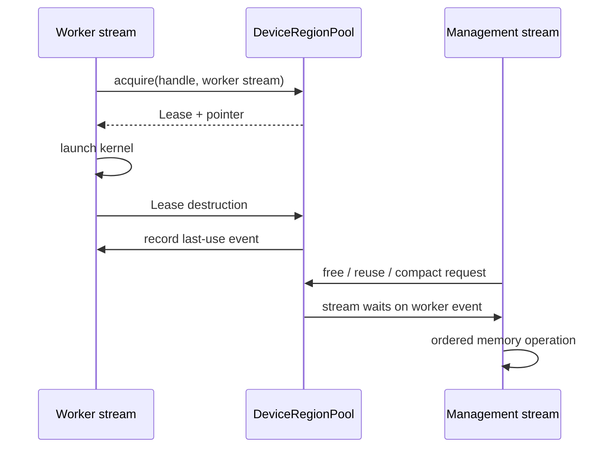

Allocation은 raw pointer로 외부에 전달되지 않고 opaque `DeviceRegionHandle`로 식별된다.
Pointer는 Lease 범위 안에서만 resolve된다.

---

## 11. Promotion candidate lifecycle

```cpp
struct PromotionCandidate {
    VectorId anchor_id;
    RegionFootprint footprint;
    std::uint64_t observations;
    std::uint64_t epoch;

    steady_clock::time_point enqueued_at;
    std::uint64_t enqueue_sequence;
    std::uint64_t first_batch_sequence;
    std::uint64_t last_batch_sequence;
    std::uint64_t planning_attempts;

    std::vector<std::byte> vector_bytes;
    std::uint32_t vector_dim;
    VectorDType vector_dtype;
};
```

Vector bytes는 candidate가 소유한다. Coordinator가 caller buffer lifetime 이후
RoutingCache에 Anchor를 등록할 수 있기 때문이다.

Age 관련 field의 의미는 다음과 같다.

| Field | 의미 |
| --- | --- |
| `enqueued_at` | 최초 request 시간 |
| `enqueue_sequence` | 최초 enqueue에서 한 번만 부여되는 전역 순서 |
| `first_batch_sequence` | 처음 plan 대상으로 검토된 batch |
| `last_batch_sequence` | 가장 최근 plan attempt batch |
| `planning_attempts` | plan 대상으로 검토된 횟수 |
| `observations` | 병합된 동일 Anchor/epoch 관측 수 |

Transient plan 실패로 requeue되어도 이 값은 유지된다. Built-in FIFO 계열 pending queue는
`enqueue_sequence` 순서로 삽입하므로 오래된 candidate가 queue 뒤로 밀리지 않는다.

Anchor가 release되면 `anchor_epoch_[id]`가 증가한다. Candidate epoch와 현재 epoch가 다르면
stale candidate로 폐기한다. HostOnly에서 Promoting으로 전환할 때와 최종 publish할 때 모두
epoch를 확인한다.

---

## 12. Event-driven MPSC Coordinator

### 12.1 Intake

여러 producer는 `requestPromotion()`을 호출한다.

```text
1. candidate 구성과 vector owned copy
2. RegionManager mutex 획득
3. 현재 Anchor epoch stamp
4. pending_promotions_ enqueue
5. mutex 해제
6. coordinator_cv_.notify_one()
```

Queue append가 notify보다 먼저 일어나며 wait predicate가 queue 상태를 검사하므로 lost wake-up
때문에 candidate가 유실되지 않는다.

```cpp
stop_requested
|| force_wake
|| reclaim_ready
|| !pending_promotions_.empty()
```

Coordinator가 sleep 중이면 notify로 깨어난다. 이미 실행 중이면 notify 자체는 누적되지 않을
수 있지만 candidate는 queue에 남는다. Coordinator가 현재 iteration을 끝내고 loop에
재진입하면 predicate가 true이므로 sleep 없이 즉시 drain한다.

### 12.2 Drain 범위

한 번 mutex를 획득하면 그 시점의 `pending_promotions_` 전체를 local vector로 이동하고
queue를 비운다.

```text
pending_promotions_: [A, B, C]
          |
          v
local admitted:      [A, B, C]
pending_promotions_: []
```

Drain 직후 들어온 D는 현재 local vector에는 포함되지 않지만 다음 loop에서 즉시 수집된다.
현재 committed relocation batch에 새로운 candidate를 중간 삽입하지 않는다.

### 12.3 Coalescing deadline

`CoordinatorConfig::trigger_interval`은 polling interval이 아니라 첫 prepared candidate 이후
batch를 모으는 window다.

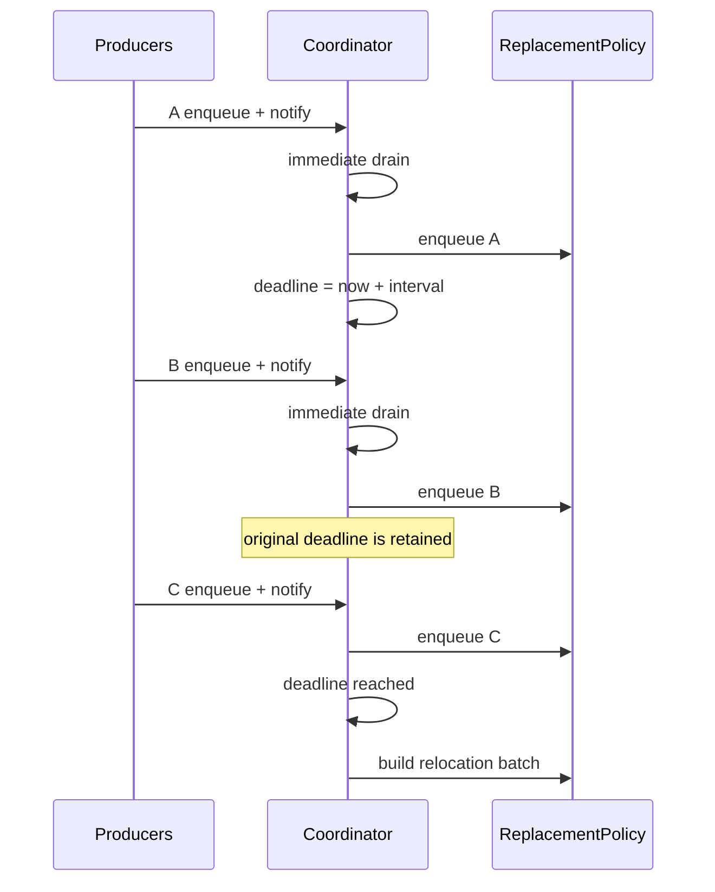

새 request는 deadline을 뒤로 미루지 않는다. 따라서 지속적인 notify가 relocation을
무기한 지연시키지 않는다.

다음 event는 deadline 전에 execution point를 만들 수 있다.

- `waitIdle()`의 force wake
- shutdown
- retiring Region의 reclaim-ready notification

---

## 13. ReplacementPolicy 계약

ReplacementPolicy는 어떤 데이터를 유지할지 결정하며 실제 Region state를 변경하지 않는다.
RegionManager/Coordinator가 유일한 state transition authority다.

주요 hook은 다음과 같다.

```cpp
enqueueCandidate(candidate)
requeueCandidate(candidate)
onRelocationTrigger()
hasPendingCandidates()
selectNextPromotionCandidate()
evaluateBatchAdmission(candidate, admission, batch_context)
selectEvictionCandidate(excluded, required_bytes, candidates)
onPromotionCommitted(anchor, admission)
onAnchorTouched(anchor)
onAnchorEvicted(anchor)
```

### 13.1 Batch admission result

```cpp
enum class BatchAdmissionDecision {
    Admit,
    Defer,
    Reject,
};
```

| 결과 | 의미 |
| --- | --- |
| Admit | 현재 relocation batch에 포함 |
| Defer | age를 유지하고 policy queue로 반환 |
| Reject | policy가 promotion 가치가 없다고 판단하여 폐기 |

Coordinator validation 실패는 policy Reject와 다르다. 정상 background execution에서는
validation 실패 candidate를 requeue한다.

### 13.2 Built-in policy

| Policy | Promotion pending order | Eviction 기준 |
| --- | --- | --- |
| FIFO | original enqueue age | 가장 먼저 tracked된 resident Anchor |
| LRU | original enqueue age | 가장 오래 touch되지 않은 Anchor |
| LFU | original enqueue age | touch 빈도가 가장 낮은 Anchor |
| Clock | original enqueue age | reference bit 기반 second chance |
| 2Q | original enqueue age | first-timer A1in 우선, proven-hot Am 보호 |
| CostAware | 동일 Anchor/epoch 병합 | decayed heat, reclaim/write-back cost density |

RegionManager에 policy를 전달하지 않으면 `CostAwareReplacementPolicy`가 사용된다.

### 13.3 FIFO 예시

```text
Promotion queue:
  A(seq=10), B(seq=11), C(seq=12)

Resident eviction order:
  X(oldest), Y, Z(newest)
```

A와 B가 8 GiB를 필요로 하고 X와 Y가 각각 4 GiB를 즉시 반환한다면 policy selection은
다음과 같다.

```text
Promotion proposal: A, B
Victim 1: X -> projected 4 GiB
Victim 2: Y -> projected 8 GiB
Final victim batch: X, Y
```

A의 plan이 transient하게 실패하면 sequence 10을 유지한 채 requeue된다.

---

## 14. Relocation plan

Coordinator는 policy decision과 live Region snapshot을 이용해 `RelocationPlan`을 만든다.

```cpp
struct RelocationPlan {
    std::uint64_t batch_sequence;
    std::vector<PlannedPromotion> promotions;
    std::vector<VectorId> evictions;
    std::size_t required_incremental_bytes;
    std::size_t immediately_reclaimable_bytes;
};
```

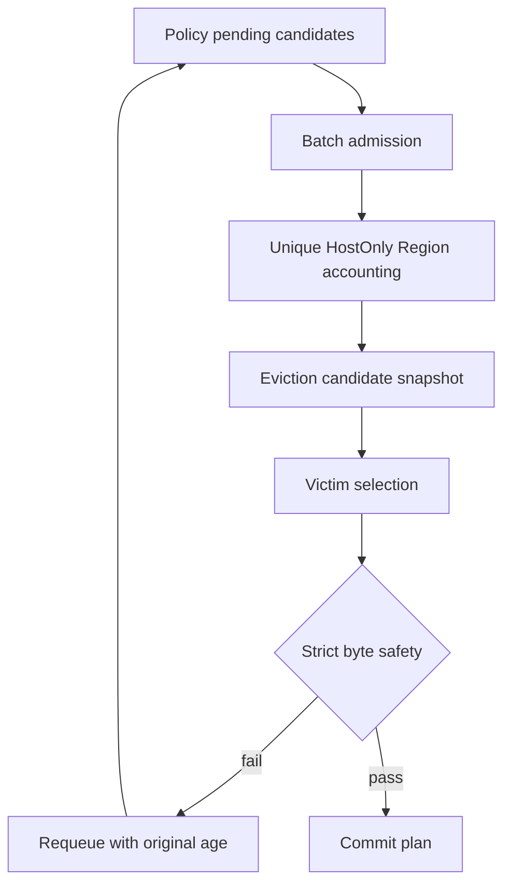

### 14.1 Promotion byte 계산

Candidate별 incremental byte를 단순 합산하지 않는다. Batch 전체 footprint에서 RegionId를
deduplicate하고 현재 `HostOnly`인 Region의 physical reservation만 계산한다.

```text
A -> Region 1, 2
B -> Region 2, 3

Unique target -> Region 1, 2, 3
```

Pooled mode에서는 logical bytes를 arena unit으로 올림한 reservation을 사용하고 Async
mode에서는 logical allocation bytes와 reservation이 같다.

### 14.2 Eviction candidate snapshot

각 resident Anchor에 대해 다음 정보를 제공한다.

```cpp
struct EvictionCandidate {
    VectorId anchor_id;
    std::size_t resident_bytes;
    std::size_t reclaimable_bytes;
    std::size_t reclaimable_now_bytes;
    std::size_t potential_writeback_bytes;
    std::size_t resident_regions;
    std::size_t reclaimable_regions;
};
```

- `reclaimable_bytes`: 해당 Anchor가 마지막 dependent인 Region의 reservation
- `reclaimable_now_bytes`: 그중 logical pin이 0인 reservation
- `potential_writeback_bytes`: dirty 여부를 확인하기 전의 보수적 write-back upper bound

Victim을 여러 개 선택하면 선택 집합의 모든 Anchor를 제거했을 때 orphan이 되는 Region을
다시 계산한다.

### 14.3 Strict byte safety

현재 batch가 실행되려면 다음 조건이 성립해야 한다.

```text
available bytes
+ projected immediately reclaimable bytes
>= unique promotion required bytes
```

```text
available bytes = data budget - currently reserved data bytes
```

Promotion 대상 Anchor는 victim 후보에서 제외된다. Planner가 충분한 victim을 찾지 못하거나
pin 상태가 바뀌어 실행 직전 재검증에 실패하면 eviction state를 변경하기 전에 candidate를
requeue한다.

### 14.4 Per-pass limit

`CoordinatorConfig`의 다음 값은 0일 때 제한이 없다.

```cpp
max_promotion_bytes_per_pass
max_eviction_bytes_per_pass
```

첫 oversized item은 progress를 위해 허용할 수 있지만, 이후 item 때문에 limit를 넘으면 남은
candidate를 다음 batch로 defer한다.

---

## 15. Batch execution

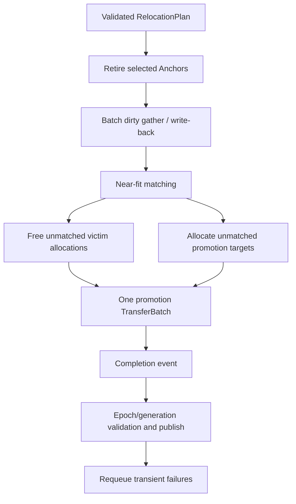

### 15.1 Eviction phase

각 selected Anchor에 대해 다음 순서로 처리한다.

1. dependency graph에서 Anchor 제거
2. `ReplacementPolicy::onAnchorEvicted()`
3. `RoutingCache::erase()`
4. orphan Region을 `Resident -> Retiring`
5. generation 증가
6. unpinned Region을 reclaim-ready set에 추가
7. pinned Region은 `pending_reclaims_`에 보존

Victim 전체에서 reclaim 가능한 Region을 모아 dirty-header gather와 write-back을 batch한다.

### 15.2 Promotion phase

Eviction/reuse 준비 후 promotion batch 전체가 하나의
`DeviceRegionPool::TransferBatch`를 공유한다.

1. adapter write lease 획득
2. reused handle 또는 신규 allocation 선택
3. `HostOnly -> Promoting`, generation 증가
4. dirty header zero staging
5. payload pinned staging
6. management stream에 `cudaMemcpyAsync`
7. batch completion event 대기
8. epoch/generation 재검증
9. device, lease, dependency, `Resident` publish
10. RoutingCache ensure와 policy commit notification

동일 Region을 같은 batch의 여러 candidate가 요구할 경우 먼저 시작한 candidate가
`Promoting`을 소유한다. 다른 candidate는 transient `Deferred`가 되어 다음 batch에서
현재 Resident Region에 dependency를 추가한다.

---

## 16. GPU memory layout

### 16.1 Logical Region allocation

Region allocation의 logical layout은 다음과 같다.

```text
Device allocation
+---------------------------+  offset 0
| Dirty bitmap header       |
+---------------------------+  header_bytes
| Region payload            |
|                           |
+---------------------------+  header_bytes + host.bytes
```

Dirty header가 필요하지 않은 Region은 header size가 0이다. Promotion은 header를 0으로
초기화한 뒤 host payload를 복사한다.

Eviction은 먼저 dirty header를 gather한다. Dirty bit가 없으면 payload D2H를 생략하고, dirty
상태이거나 header가 없는 보수적 경로에서는 host payload로 write-back한다.

### 16.2 Data와 Metadata budget

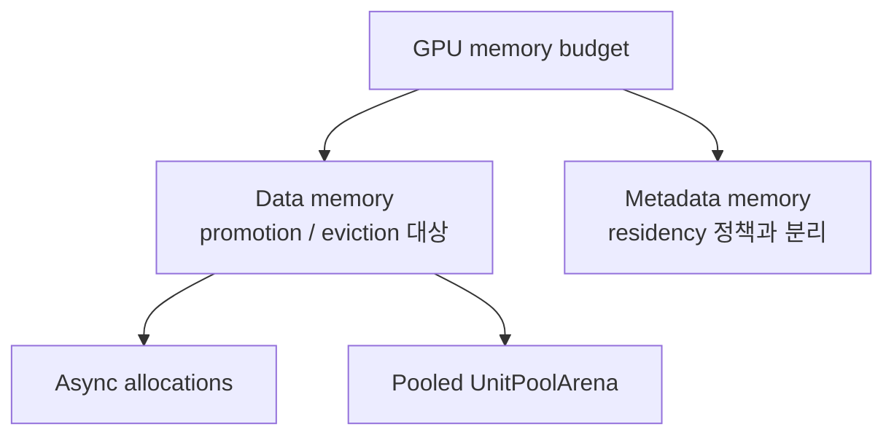

Data와 Metadata는 accounting 및 fragmentation domain이 분리된다.

---

## 17. Async memory mode

기본 allocation mode는 Async다. 각 Region allocation은 management stream에서 독립적인
stream-ordered allocation으로 생성된다.

```text
allocate -> cudaMallocAsync(management stream)
free     -> cudaFreeAsync(management stream)
```

Async mode에는 Arachne-owned fixed-unit arena가 없으며 allocation unit은 1 byte로
보고된다. Compaction은 수행하지 않는다.

Free가 host에서 즉시 GPU operation 완료를 기다리는 것은 아니지만
`DeviceRegionPool` accounting에서는 handle이 제거되고, 같은 management stream의 이후
allocation/copy는 CUDA stream ordering을 따른다.

---

## 18. Pooled memory mode

Pooled mode는 Data와 Metadata 각각에 큰 arena를 미리 할당하고 fixed-size unit으로
suballocate한다.

```text
Pooled Data Arena
+--------+--------+--------+--------+--------+--------+
| alloc A| alloc A| free   | alloc B| free   | free   |
+--------+--------+--------+--------+--------+--------+
  unit 0   unit 1   unit 2   unit 3   unit 4   unit 5
```

Logical request는 다음과 같이 reservation으로 변환된다.

```text
required units = ceil(logical bytes / unit bytes)
reserved bytes = required units * unit bytes
```

Best-fit으로 contiguous extent를 선택한다. Total free unit은 충분하지만 contiguous extent가
부족하면 compaction policy가 unpinned allocation만 대상으로 bounded D2D relocation plan을
만든다.

Compaction 중에도 opaque handle ID는 유지되고 내부 pointer/unit range만 갱신된다.

---

## 19. Pinned host staging

`PinnedHostPool`은 reusable page-locked host buffer를 size-ordered cache로 관리한다.

Pinned host memory는 GPU memory 일부를 host에 매핑한 공간이 아니다. 운영체제가 swap하지
않도록 고정된 host allocation이며 CUDA DMA가 안정적으로 접근할 수 있다.

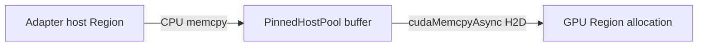

Pinned buffer lifetime은 `TransferBatch`가 소유한다. Completion event가 확인되기 전에는
cache로 반환하지 않는다.

현재 `finishTransfers()`는 management stream에 completion event를 기록하고 Coordinator
thread에서 event 완료를 기다린다. Worker stream의 unrelated kernel은 계속 실행할 수 있지만,
Coordinator 하나가 여러 promotion batch publication을 동시에 pipeline하지는 않는다.

---

## 20. Near-fit allocation reuse

Near-fit은 eviction allocation을 free한 뒤 새 allocation을 만드는 대신, quiescent handle을
새 promotion Region에 넘기는 최적화다.

### 20.1 Matching algorithm

1. Promotion storage request를 reservation 큰 순서로 정렬
2. 아직 사용되지 않은 victim allocation 중 request를 담을 수 있는 slot 검색
3. 최소 utilization threshold를 만족하는지 확인
4. 조건을 만족하는 가장 작은 slot 선택
5. `DeviceRegionPool::tryReuse()`로 quiescence와 capacity 재검증
6. handle을 destination Region에 전달
7. unmatched victim은 free
8. unmatched promotion target은 allocate

```text
slot capacity >= request reservation

그리고

request reservation / slot capacity
>= near_fit_min_utilization_percent / 100
```

판단은 logical payload가 아니라 physical `reserved_bytes`를 사용한다.

### 20.2 기본 threshold

```cpp
std::uint8_t near_fit_min_utilization_percent = 90;
```

| 설정 | 의미 |
| ---: | --- |
| 0 | 크기만 충분하면 재사용 |
| 90 | 기본값, 최소 90% utilization |
| 100 | reservation exact-fit만 재사용 |
| 100 초과 | `start()`에서 100으로 clamp |

예:

| Victim slot | Request | Utilization | 기본 90 결과 |
| ---: | ---: | ---: | --- |
| 10 MiB | 10 MiB | 100% | reuse |
| 10 MiB | 9 MiB | 90% | reuse |
| 10 MiB | 8 MiB | 80% | free + allocate |
| 2 units | 1 unit | 50% | free + allocate |

### 20.3 Reuse semantics

`tryReuse(handle, logical_bytes)`는 다음을 확인한다.

- handle이 live allocation인지
- MemoryKind가 같은지
- 새 reservation이 기존 physical reservation 이하인지
- outstanding physical Lease가 없는지
- 이전 stream의 last-use event 이후로 management stream이 ordering되는지

성공하면 handle ID와 physical reservation은 유지하고 logical `bytes`를 갱신한다. 따라서
utilization threshold가 없으면 작은 Region이 큰 reservation을 장기간 점유할 수 있다.
기본 90% 조건이 이 internal fragmentation을 제한한다.

---

## 21. Reclaim과 failure 처리

### 21.1 Logical pin이 남은 victim

Victim이 `Retiring`으로 전환된 뒤 기존 pin이 남아 있으면 snapshot을
`pending_reclaims_`에 보존한다. 마지막 pin이 해제되면
`coordinator_reclaim_ready_`를 설정하고 Coordinator를 notify한다.

Unrelated Region worker는 영향을 받지 않는다.

### 21.2 Normal background plan 실패

다음은 transient failure로 취급할 수 있다.

- 실행 직전 pin/state snapshot 변화
- 즉시 reclaim capacity 부족
- 다른 transition이 같은 Region을 소유
- strict byte validation 실패
- per-pass limit 도달

유효 candidate는 다음 값을 보존해 policy queue로 돌아간다.

```text
enqueue timestamp
enqueue sequence
first/last batch sequence
planning attempt count
observations
```

### 21.3 Policy Reject

Admission policy가 가치가 없다고 판단한 candidate는 requeue하지 않는다. 이는 mechanical
validation 실패와 구분되는 의도적 admission decision이다.

### 21.4 Force drain

`waitIdle()`과 shutdown은 종료 가능성을 보장해야 한다. Force drain에서는 pending
candidate를 즉시 시도하며 transient failure를 무기한 requeue하지 않고 최종 시도 후
폐기한다.

따라서 background mode의 retry semantics와 operator/test barrier의 drain semantics는
의도적으로 다르다.

---

## 22. Coordinator configuration

```cpp
struct CoordinatorConfig {
    std::chrono::milliseconds trigger_interval{100};
    std::size_t max_promotion_bytes_per_pass = 0;
    std::size_t max_eviction_bytes_per_pass = 0;
    std::uint8_t near_fit_min_utilization_percent = 90;
};
```

예:

```cpp
CoordinatorConfig config;
config.trigger_interval = std::chrono::milliseconds(10);
config.max_promotion_bytes_per_pass = 256_MiB;
config.max_eviction_bytes_per_pass = 512_MiB;
config.near_fit_min_utilization_percent = 95;

RegionManager manager(std::make_unique<CostAwareReplacementPolicy>());
manager.start(adapter, device_region_pool, routing_cache, config);
```

위 예의 `256_MiB` 표기는 설명용이며 실제 코드에서는 `std::size_t` byte 값을 전달한다.

---

## 23. Cost-aware policy configuration

```cpp
struct CostAwareReplacementConfig {
    std::uint64_t minimum_observations = 1;
    std::chrono::milliseconds heat_half_life{5000};
    std::chrono::milliseconds minimum_residency{0};
    double admission_hysteresis = 1.0;
    double potential_writeback_weight = 0.0;
    std::size_t maximum_incremental_bytes = 0;
};
```

CostAware policy는 다음을 고려한다.

- 동일 Anchor/epoch request observations
- lazy exponential heat decay
- incremental reservation unit 수
- victim의 reclaimable byte
- potential write-back cost
- minimum residency
- admission hysteresis

Candidate density와 victim retention density를 비교해 admission을 결정하며, commit된
Anchor만 resident heat table에 기록한다.

---

## 24. Runtime statistics

`RegionManager::Stats`는 다음 counter를 제공한다.

```cpp
struct Stats {
    std::size_t gpu_bytes_allocated;
    std::uint64_t regions_promoted_total;
    std::uint64_t regions_evicted_total;
    std::uint64_t regions_written_back_total;
    std::uint64_t anchor_evictions_total;
    std::uint64_t compactions_total;
    std::uint64_t relocation_batches_total;
    std::uint64_t candidates_requeued_total;
    std::uint64_t near_fit_reuses_total;
};
```

- GPU byte 값은 현재 pool snapshot이다.
- 나머지는 RegionManager lifetime 동안 단조 증가한다.
- `near_fit_reuses_total`은 실제 `tryReuse()`가 성공한 handle 수다.
- `candidates_requeued_total`은 transient plan/execution failure로 policy에 반환된 횟수다.

---

## 25. Correctness invariant

현재 구현의 핵심 invariant는 다음과 같다.

1. `Resident`와 generation이 모두 일치하지 않으면 worker가 GPU path를 사용하지 않는다.
2. `Promoting` Region은 H2D completion 전 publish하지 않는다.
3. `Retiring` Region은 새 logical pin을 허용하지 않는다.
4. Existing logical pin이 남은 Region은 reclaim하지 않는다.
5. Physical Lease가 남은 allocation은 free, reuse, compaction하지 않는다.
6. Worker-stream last-use event보다 management-stream memory operation이 먼저 실행되지 않는다.
7. Dirty write-back 전에 adapter write lease를 해제하지 않는다.
8. Anchor epoch가 달라진 promotion은 publish하지 않는다.
9. Promotion batch byte safety가 성립하기 전에 victim metadata를 변경하지 않는다.
10. Near-fit은 capacity, MemoryKind, quiescence, utilization threshold를 모두 만족해야 한다.
11. Policy는 우선순위를 제안하며 Region state를 직접 변경하지 않는다.
12. Coordinator 하나만 relocation plan과 execution을 소유한다.

---

## 26. 테스트와 검증

### 26.1 Coordinator와 policy focused tests

검증 범위:

- Coordinator start/shutdown
- event-driven immediate intake
- coalescing deadline 전 실행 지연
- `waitIdle()` force drain
- unregistered Region
- owned Anchor vector lifetime
- stale epoch discard
- Anchor ID release/re-admission
- FIFO oldest victim
- strict multi-victim batch
- age-preserving requeue
- near-fit handle identity reuse
- 기본 90% threshold reject
- initialization-time threshold override

### 26.2 Excessive Stage 3 churn

첫 workload:

```text
dimension             = 32
vectors per Region    = 4
GPU-fit Regions       = 8
worker threads        = 12
operations per thread = 250
ID space              = 150
capacity              = 2000
Coordinator interval  = 2 ms
```

두 번째 workload:

```text
dimension             = 16
vectors per Region    = 16
GPU-fit Regions       = 1
worker threads        = 16
operations per thread = 300
ID space              = 8
capacity              = 4096
Coordinator interval  = 1 ms
```

두 테스트 모두 통과했으며 concurrent insert/search/remove, 동일 ID 재사용, 반복
promotion/eviction, routing/data integrity를 검증한다.

### 26.3 Residency concurrency stress

```text
Pooled data pool = 4096 bytes
worker streams   = 4
```

검증된 race:

- 여러 worker가 동일 victim Region을 동시에 pin
- routing hint 생성 직후 worker validation 직전에 deterministic eviction
- 지속적인 repinning 상황에서 eviction starvation 방지

세 테스트 모두 통과했다.

### 26.4 GPU 50% 초과 대형 reservation test

실행된 환경에서 다음 pool을 구성했다.

```text
Pooled data budget = 5,791,989,760 bytes
GPU total 대비     = 51%
allocation units   = 4
worker streams     = 4
```

검증 내용:

- Data reservation이 GPU 총 메모리 50% 초과
- 기존 Region 4개가 budget 전체 점유
- 새 footprint Region 4개를 위해 victim 4개 strict batch 선택
- 기존 대형 handle 4개 exact-fit reuse
- 교체 후 동일 budget 유지

실행 payload는 Region당 4 KiB다. 이 테스트는 5.79 GB H2D bandwidth가 아니라 대형 GPU
reservation, byte planning, multi-victim execution, handle reuse를 검증한다.

### 26.5 실행 결과

확인된 실행 결과:

```text
Coordinator/policy focused set: 13 / 13 passed
Stage 3 excessive churn:         2 / 2 passed
Residency concurrency stress:    3 / 3 passed
Near-fit threshold + 51% GPU:    3 / 3 passed
```

마지막 그룹에는 기본 90%, configurable 50%, 51% GPU large-batch regression이 포함된다.

---

## 27. 성능 특성

### 27.1 Batching으로 줄이는 비용

- MPSC intake 전체 drain
- promotion candidate coalescing
- victim set 사전 계산
- dirty header gather
- dirty Region write-back
- pinned H2D transfer
- near-fit global matching
- CUDA completion 확인

### 27.2 남아 있는 serialized 구간

- Coordinator는 하나다.
- 한 번에 하나의 committed relocation plan을 실행한다.
- `finishTransfers()` 동안 Coordinator thread는 completion event를 기다린다.
- Pooled compaction은 DeviceRegionPool mutex 아래에서 plan을 실행한다.
- RegionManager state transition은 RegionManager mutex로 직렬화된다.

### 27.3 Notify storm

Producer마다 enqueue 후 `notify_one()`을 호출한다. Notification은 누적 token이 아니며 여러
notify가 coalesce될 수 있다. Durable state는 queue에 있으므로 correctness 문제는 없다.

많은 producer가 계속 enqueue하면 다음 overhead는 존재한다.

- RegionManager mutex contention
- 반복 condition-variable wake
- policy ingestion 빈도 증가

새 request는 기존 coalescing deadline을 연장하지 않으므로 notify storm이 relocation
execution을 starve시키지는 않는다. Empty-to-non-empty 전이에서만 notify하는 최적화는 현재
구현되어 있지 않다.

---

## 28. 현재 구현 경계

다음은 현재 코드가 제공하지 않거나 integration이 필요한 영역이다.

- 실제 production GPU-native ANN adapter와 kernel
- Adapter가 RegionAccess를 얻는 표준 dependency-injection surface
- Public `IndexImpl`의 Region registration, waitIdle, stats forwarding
- GPU kernel에서 dirty bitmap을 mark하는 공용 device helper integration
- ModifyResult의 touched/modified feedback을 residency policy에 연결하는 경로
- Multi-GPU placement와 migration
- 여러 relocation batch를 동시에 in-flight로 유지하는 Coordinator pipeline
- Adaptive near-fit threshold
- Notify empty-to-non-empty 최적화
- Policy가 joint shared-dependency victim combination을 전역 최적화하는 solver
- Host adapter가 write lease 계약을 어겼을 때의 강제 보호

이 경계는 correctness 보장이 없는 부분을 의미한다기보다, 현재 Arachne control plane과 실제
ANN implementation 사이에서 추가 wiring이 필요한 부분을 명시한다.

---

## 29. 구현을 읽을 때의 핵심 순서

현재 residency 동작을 추적하려면 다음 순서로 읽는 것이 가장 직접적이다.

```text
Controller::dispatch
-> OpScheduler worker completion callback
-> RegionManager::requestPromotion
-> RegionManager::coordinatorLoop
-> ReplacementPolicy queue/admission/eviction selection
-> RegionManager::buildRelocationPlan
-> RegionManager::processRelocationBatch
-> RegionManager::retireAnchorsNow
-> RegionManager::reclaimRegionsForPlan
-> DeviceRegionPool::tryReuse / tryAllocate
-> RegionManager::make
-> DeviceRegionPool::finishTransfers
-> Region state and RoutingCache publish
```

Worker-side correctness는 다음 순서로 읽는다.

```text
Controller routing
-> RegionManager::residencyHints
-> OpScheduler worker validation
-> RegionManager::tryPinResidency
-> Controller::acquireRegion
-> DeviceRegionPool::acquire
-> worker-stream kernel
-> physical Lease release event
-> logical residency guard release
```

---

## 30. 요약

Arachne C++의 현재 residency manager는 다음 구조다.

```text
Immediate event-driven MPSC intake
-> deadline-based candidate coalescing
-> pluggable policy admission and priority
-> strict batch byte validation
-> eviction batch retirement/write-back
-> default 90% near-fit allocation reuse
-> batched pinned H2D submission
-> completion-event-gated publication
-> generation/pin/lease-protected concurrent execution
```

Coordinator는 replacement 우선순위를 직접 하드코딩하지 않고 policy에 위임하지만, byte
safety, Region state transition, stream ordering, allocation reuse, final publication은 직접
검증한다. Worker는 전역 stop-the-world barrier 없이 unrelated Resident Region에서 계속
실행할 수 있으며, victim Region만 `Retiring`과 pin drain을 통해 국소적으로 보호된다.

