# Arachne C++ Code Documentation v3

이 문서는 현재 `cpp/` tree의 구현을 기준으로 Arachne C++ 프로젝트의 모듈 구성,
소유권, 스레드 모델, operation 수행 흐름, Routing Cache, GPU residency와 memory
consistency 메커니즘을 설명한다.

v2 이후 가장 큰 변화는 GPU residency 관리의 소유권이 `Controller`에서
`RegionManager`로 완전히 이동했다는 점이다. 이제 `Controller`는 route와 operation
dispatch를 담당하고, `RegionManager::Coordinator`가 promotion, eviction, dirty
write-back, compaction, Routing Cache 등록/삭제를 수행한다.

문서화 범위는 다음과 같다.

- Arachne가 직접 구현한 `cpp/include/`, `cpp/src/`, `cpp/test/`
- `cpp/CMakeLists.txt`, `cpp/test/CMakeLists.txt`
- 현재 설계 메모와 기존 문서
- vendored hnswlib와 Arachne 사이의 실제 연결 지점
- `cpp/thirdparty/hnswlib.patch`로 추가된 dtype/SIMD 기능

`cpp/thirdparty/hnswlib/` 아래의 upstream example/test는 Arachne 모듈이 아니라 vendored
dependency다. 이 문서에서는 해당 파일을 Arachne 모듈처럼 파일별로 설명하지 않고,
Arachne가 실제로 호출하는 API, 내부 layout/threading 전제, 로컬 patch의 의미를
설명한다.

이 문서는 코드를 실행하거나 테스트 결과를 새로 생성한 보고서가 아니다. 현재 source와
test가 표현하는 동작을 정리한 code snapshot이다.

---

## 1. 현재 구현의 핵심

Arachne는 구체적인 ANNS index의 알고리즘을 모르는 control plane이다. Application
operation은 다음 두 primitive로 분해된다.

```text
SEARCH = Traverse
INSERT = Traverse -> Modify
DELETE = Modify
```

이 primitive 위에 다음 기능이 결합되어 있다.

- query와 Anchor 사이의 거리 기반 route 선택
- `Traverse`/`Modify` queueing, reordering, batching
- Host/Device adapter entry point 선택
- Anchor와 Region 사이의 many-to-many dependency 관리
- asynchronous Region promotion과 eviction
- dirty bitmap 기반 selective write-back
- pooled GPU allocation과 handle-preserving compaction
- execution worker별 CUDA stream 분리
- Routing Cache tombstone의 Active/Shadow background compaction

현재 구현의 책임 경계는 다음과 같다.

| 책임 | 소유자 |
| --- | --- |
| Public `search/insert/remove` | `Index`, `IndexImpl`, `Controller` |
| Operation decomposition과 routing | `Controller` |
| Primitive batching과 execution | `OpScheduler`, `SchedulingPolicy` |
| 실제 index traversal/modification | `IAdapter` 구현체 |
| Region의 Host mapping과 logical write lease | `IRegion` 구현체 |
| Anchor-Region dependency | `RegionManager` |
| Promotion/eviction 시점과 대상 선택 | `RegionManager`, `ReplacementPolicy` |
| GPU allocation/copy/free/compaction | `DeviceRegionPool` |
| CUDA device와 stream/resource lifetime | `DeviceContext` |
| Anchor vector 검색 | `RoutingCache`, `ASRoutingCacheHnsw` |

중요한 현재 상태는 다음과 같다.

- Control plane과 GPU memory substrate는 구현되어 있다.
- 실제 GPU-native ANNS adapter와 kernel은 아직 구현되어 있지 않다.
- `StressIndex::traverseDevice/modifyDevice`는 test를 위한 Host implementation 위임이다.
- `Controller::verify()`는 구현되어 있지만 normal search path에는 연결되어 있지 않다.
- `Controller::acquireRegion()`은 안전한 device access를 제공하지만, 외부 adapter가 이를
  주입받는 public integration seam은 아직 없다.

---

## 2. 전체 architecture

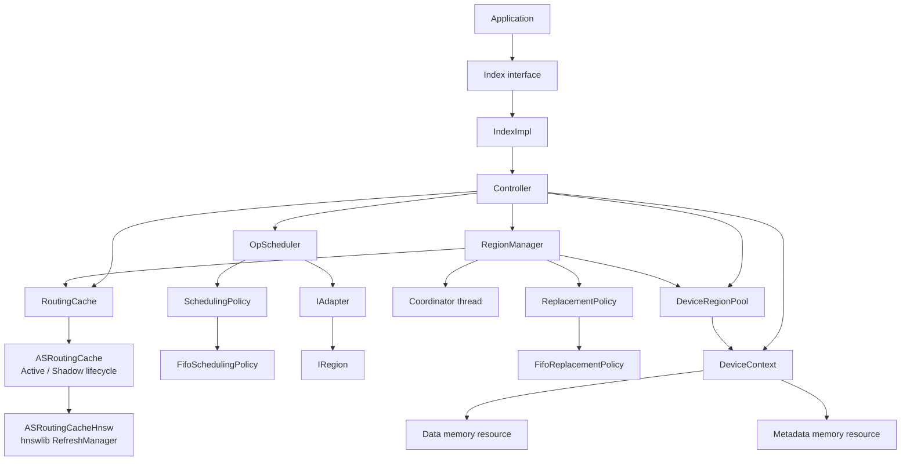

### 2.1 모듈별 역할

| 모듈 | 역할 | 주요 파일 |
| --- | --- | --- |
| Public API | application-facing operation interface | `include/interface/index.hpp` |
| Default facade | adapter/cache 소유와 Controller forwarding | `include/interface/index_impl.hpp`, `src/interface/index_impl.cpp` |
| Control plane | route, dispatch, commit, public lifecycle | `include/core/controller.hpp`, `src/core/controller.cpp` |
| Operation scheduler | queue, batch, execution worker, future | `include/core/op_scheduler.hpp`, `src/core/op_scheduler.cpp` |
| Scheduling strategy | batch kind/candidate 선택 | `include/core/scheduling_policy.hpp`, `src/core/scheduling_policy.cpp` |
| Region control | registry, dependency, Coordinator, residency | `include/core/region_manager.hpp`, `src/core/region_manager.cpp` |
| Replacement strategy | promotion admission과 eviction victim 선택 | `include/core/replacement_policy.hpp`, `src/core/replacement_policy.cpp` |
| Routing abstraction | Anchor nearest/ensure/erase interface | `include/core/routing_cache.hpp` |
| Routing lifecycle | tombstone와 Active/Shadow rebuild | `include/core/as_routing_cache.hpp`, `src/core/as_routing_cache.cpp` |
| HNSW routing | metric/dtype별 hnswlib instance | `include/core/as_routing_cache_hnsw.hpp`, `src/core/as_routing_cache_hnsw.cpp` |
| Adapter contract | batched Host/Device primitive API | `include/adapter/index_adapter.hpp` |
| Region contract | Host mapping, logical lease, reconciliation | `include/adapter/region.hpp` |
| GPU context | device, management/worker stream, RMM resources | `include/gpu/device_context.hpp`, `src/gpu/device_context.cpp` |
| GPU allocation | opaque handle, physical lease, copy/free/compact | `include/gpu/device_region_pool.hpp`, `src/gpu/device_region_pool.cpp` |
| Dirty tracking | bitmap size와 bit 위치 계산 | `include/gpu/dirty_header.hpp` |
| CPU vector math | Highway runtime SIMD | `include/util/distance.hpp`, `src/util/distance.cpp` |

---

## 3. Ownership과 lifetime

### 3.1 Top-level ownership

```text
IndexImpl
  owns unique_ptr<IAdapter>
  owns unique_ptr<RoutingCache>
  owns Controller
       refers to the same IAdapter and RoutingCache

Controller
  refers to IAdapter
  refers to RoutingCache
  owns DeviceContext
  owns DeviceRegionPool
  owns RegionManager
  owns OpScheduler

RegionManager
  owns ReplacementPolicy
  refers to IAdapter after start()
  refers to DeviceRegionPool after start()
  refers to RoutingCache after start()

OpScheduler
  owns SchedulingPolicy
  refers to IAdapter after start()

ASRoutingCache
  owns one active RefreshManager
  temporarily owns a background compaction thread
```

`IndexImpl`은 policy를 추가하지 않는 forwarding layer다.

```cpp
SearchResult IndexImpl::search(const Query& query) {
  return controller_.search(query);
}

InsertResult IndexImpl::insert(const Record& record) {
  return controller_.insert(record);
}

DeleteResult IndexImpl::remove(VectorId id) {
  return controller_.remove(id);
}
```

### 3.2 Controller construction

`Controller` 생성 시 CUDA memory와 두 background subsystem이 즉시 구성된다.

```cpp
Controller::Controller(...)
  : adapter_(adapter),
    routing_cache_(routing_cache),
    scheduler_(scheduling_config),
    device_(0, AllocationPolicy::Pooled,
            gpu_data_budget_bytes,
            gpu_metadata_budget_bytes,
            scheduling_config.max_execution_threads),
    device_region_pool_(device_),
    region_manager_(std::move(replacement_policy)) {
  scheduler_.start(adapter_, [this](std::size_t worker_index) {
    g_worker_stream = device_.workerStream(worker_index);
  });
  region_manager_.start(adapter_, device_region_pool_,
                        routing_cache_, coordinator_config);
}
```

C++ member initialization은 initializer list의 표기 순서가 아니라 header의 declaration
순서로 수행된다. 현재 declaration 순서는 다음 의미를 가진다.

```text
adapter/reference
routing cache/reference
DeviceContext
DeviceRegionPool
RegionManager
OpScheduler
```

파괴는 역순이다.

```text
OpScheduler shutdown
  -> execution worker와 thread_local worker stream 사용 종료
RegionManager shutdown
  -> Coordinator가 GPU pool 사용 종료
DeviceRegionPool destruction
DeviceContext destruction
```

`RegionManager`와 `OpScheduler`는 각 destructor에서 `shutdown()`을 호출한다.

---

## 4. Public operation과 primitive data structure

### 4.1 Vector와 result

```cpp
struct VectorView {
  const void* data = nullptr;
  std::uint32_t dim = 0;
  VectorDType dtype = VectorDType::Float32;
};

struct Query {
  VectorView vector;
  std::uint32_t top_k = 0;
};

struct Record {
  VectorId id = 0;
  VectorView vector;
};
```

`VectorView`는 non-owning view다. 일반 operation에서는 caller가 synchronous call이
끝날 때까지 buffer를 유지한다. Promotion은 나중에 Coordinator가 처리하므로
`RegionManager::requestPromotion()`이 vector bytes를 `PromotionCandidate`에 복사한다.

지원 dtype은 다음 네 가지다.

```text
Int8, UInt8, Float16, Float32
```

`Float16`은 native C++ half type이 아니라 IEEE-754 binary16의 raw `uint16_t` bit
pattern이다.

### 4.2 Traverse

```cpp
struct TraverseRequest {
  Query query;
  ExecutionMode mode = ExecutionMode::Hybrid;
  RegionFootprint scope;
};

struct TraverseResult {
  SearchResult result;
  RegionFootprint touched;
  bool completed_within_scope = false;
  OpaqueData hint;
};
```

| Field | 의미 |
| --- | --- |
| `query` | search query 또는 insert placement lookup |
| `mode` | `Hybrid`이면 Host entry point, `GpuOnly`이면 Device entry point |
| `scope` | GpuOnly traversal이 사용할 predicted Region 집합 |
| `touched` | adapter가 실제 접근했다고 보고한 Region 집합 |
| `completed_within_scope` | 제한된 scope만으로 traversal이 완성되었는지 |
| `hint` | 뒤의 insert Modify가 해석할 index-specific payload |

`OpaqueData`는 Core가 해석하지 않는다. HNSW라면 neighbor/link 후보, IVF라면 cluster
assignment처럼 adapter가 정한 encoding을 사용할 수 있다.

### 4.3 Modify

```cpp
struct ModifyRequest {
  ModifyOp op = ModifyOp::Insert;
  Record record;
  VectorId target = 0;
  ExecutionMode mode = ExecutionMode::Hybrid;
  RegionFootprint scope;
  LeaseHandle lease;
  OpaqueData hint;
};

struct ModifyResult {
  bool ok = false;
  RegionFootprint touched;
  RegionFootprint modified;
};
```

Insert는 `record`, `scope`, `hint`를 사용한다. Delete는 `target`만 설정하며 현재 항상
Hybrid다.

현재 `Controller`는 `ModifyResult::modified`를 residency decision에 사용하지 않는다.
Insert promotion candidate는 선행 Traverse의 `touched`에서 만들어진다.

### 4.4 RegionFootprint

```cpp
struct RegionFootprint {
  std::vector<RegionId> regions;
};
```

같은 타입이 서로 다른 역할로 사용된다.

| 위치 | 의미 |
| --- | --- |
| `TraverseRequest::scope` | predicted/allowed Region |
| `TraverseResult::touched` | 실제 traversal 접근 Region |
| `ModifyRequest::scope` | modify의 대상/제약 Region |
| `ModifyResult::touched` | modify가 읽은 Region |
| `ModifyResult::modified` | modify가 변경한 Region |
| `PromotionCandidate::footprint` | Anchor가 dependency를 얻으려는 Region |

---

## 5. Region, Anchor, 두 종류의 Lease

### 5.1 Region state

```cpp
struct Region {
  RegionId id = 0;
  HostRegionView host;
  gpu::DeviceRegionHandle device;
  LeaseHandle lease;
};
```

한 `RegionId`에는 하나의 physical state만 존재한다.

```text
Host mapping        adapter/index owned
Device allocation   Arachne owned
Logical write lease adapter/IRegion issued
```

여러 Anchor가 같은 Region을 공유해도 device copy와 write lease는 하나다.

### 5.2 Anchor-Region dependency graph

`RegionManager`의 핵심 map은 다음과 같다.

```text
regions_:       RegionId -> Region
dependents_:    RegionId -> set<AnchorId>
dependencies_:  AnchorId -> set<RegionId>
anchor_epoch_:  AnchorId -> generation
```

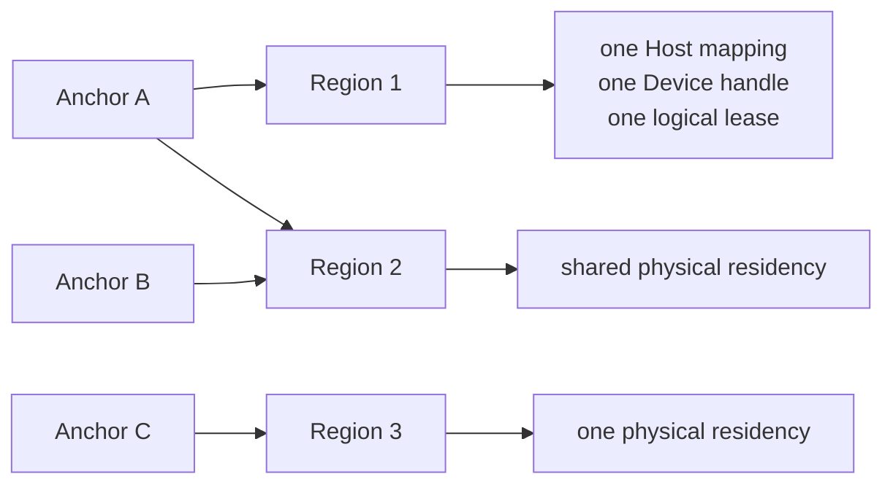

`forget(anchor)`는 그 Anchor의 모든 edge를 제거하고, dependent count가 0이 된 Region만
orphaned result로 반환한다. 따라서 한 Anchor가 삭제되어도 다른 Anchor가 의존하는
Region은 reclaim되지 않는다.

### 5.3 Logical `LeaseHandle`

```cpp
struct LeaseHandle {
  RegionId region = 0;
  std::uint64_t epoch = 0;
  bool valid() const { return epoch != 0; }
};
```

이 lease는 `IRegion::acquireWriteLease()`가 발급하는 index-level GPU write authority다.
Core는 `epoch != 0`만 확인하며 실제 의미는 adapter가 구현한다.

### 5.4 Physical `DeviceRegionPool::Lease`

`DeviceRegionPool::Lease`는 allocation pointer의 lifetime과 CUDA stream ordering을
보호하는 move-only RAII object다.

```cpp
void* ptr() const;
cudaStream_t stream() const;
```

이 Lease가 살아 있는 동안 같은 handle은 `free()` 또는 `compact()`로 회수/이동되지
않는다.

두 lease의 관계는 다음과 같다.

| Lease | 보호 대상 | 발급자 |
| --- | --- | --- |
| `LeaseHandle` | index semantics와 Host/Device write authority | `IRegion` |
| `DeviceRegionPool::Lease` | physical device pointer와 in-flight stream work | `DeviceRegionPool` |

---

## 6. Thread model

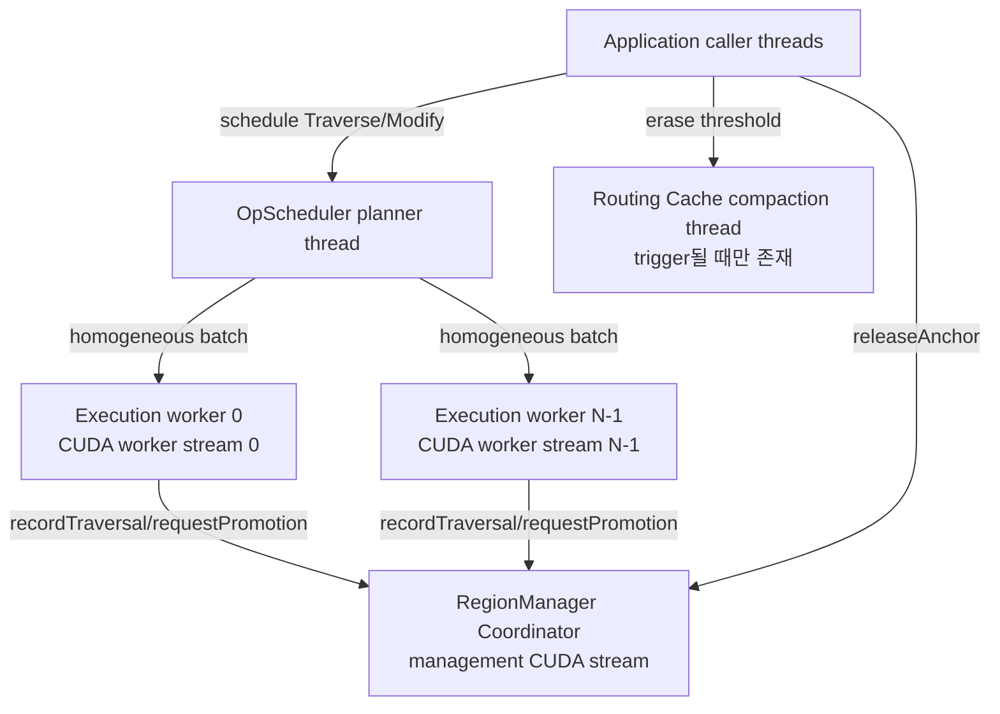

실행 주체별 역할은 다음과 같다.

| Thread | 역할 |
| --- | --- |
| Caller | route, operation 단계 연결, future 대기, commit |
| Scheduler planner | incoming queue에서 batch 구성 |
| Scheduler worker | adapter batch 실행과 promise completion |
| Coordinator | promotion, eviction, H2D/D2H, compaction |
| Routing compaction thread | HNSW shadow rebuild와 Active swap |

`max_execution_threads`가 1보다 크면 여러 worker가 같은 `IAdapter`를 동시에 호출할 수
있다. Adapter 구현은 이에 대한 thread safety를 제공해야 한다.

GPU residency 변경은 Coordinator 하나가 직렬 수행한다. Primitive execution의
parallelism과 residency relocation의 serialization은 의도적으로 분리되어 있다.

---

## 7. OpScheduler

### 7.1 Configuration

```cpp
struct SchedulingConfig {
  std::size_t traverse_batch_size = 1;
  std::size_t modify_batch_size = 1;
  std::size_t max_execution_threads = 1;
  std::chrono::microseconds batch_wait_timeout{0};
};
```

- 0 batch size는 1로 보정된다.
- 0 worker count는 1로 보정된다.
- Traverse/Modify batch size는 실행 중 변경할 수 있다.
- execution thread 수는 `start()` 이후 변경할 수 없다.
- `batch_wait_timeout > 0`이면 첫 task를 얻은 뒤 추가 eligible task를 잠시 기다린다.

### 7.2 Queue에서 completion까지

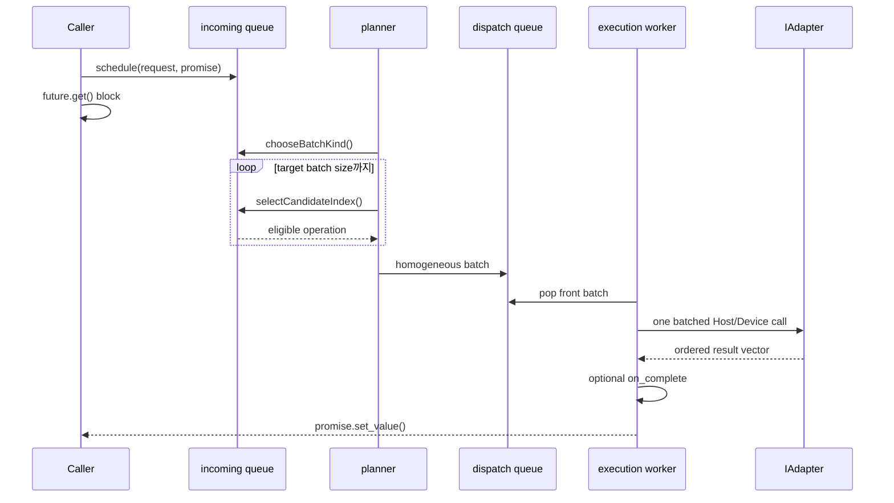

Task는 `std::variant`로 저장된다.

```cpp
using ScheduledOperation =
    std::variant<TraverseTask, ModifyTask>;
```

각 task의 `enqueued_at`은 기록되지만 현재 priority 또는 latency telemetry에는
사용되지 않는다.

### 7.3 FifoSchedulingPolicy

현재 FIFO policy는 다음 batch kind를 queue front의 kind로 정한다.

```cpp
ScheduledKind FifoSchedulingPolicy::chooseBatchKind(
    const ScheduledOperationQueue& queue) const;
```

Batch append 조건은 두 가지다.

```text
same ScheduledKind
same ExecutionMode
```

따라서 실제 batch class는 다음 네 종류다.

```text
Traverse + Hybrid
Traverse + GpuOnly
Modify   + Hybrid
Modify   + GpuOnly
```

이 policy는 strict global FIFO는 아니다.

```text
Queue:
T-Hybrid(1), M-Hybrid(2), T-Hybrid(3)

First batch:
T-Hybrid(1), T-Hybrid(3)
```

현재 batch kind와 mode가 같은 task를 찾기 위해 중간의 다른 kind/mode를 건너뛸 수
있다. 같은 eligible class 안에서는 앞의 task가 먼저 선택된다.

### 7.4 Adapter batch dispatch

Worker는 task마다 adapter를 호출하지 않고 request vector 전체를 한 번 전달한다.

```cpp
auto results =
    device ? adapter_->traverseDevice(requests)
           : adapter_->traverseHost(requests);
```

```cpp
auto results =
    device ? adapter_->modifyDevice(requests)
           : adapter_->modifyHost(requests);
```

Adapter는 request 수와 같은 result 수를 동일한 순서로 반환해야 한다. 수가 다르거나
exception이 발생하면 해당 batch의 promise들이 exception으로 완료된다.

Traverse의 `on_complete` callback은 adapter result를 만든 worker thread에서,
promise를 ready로 만들기 전에 호출된다.

```cpp
if (task.on_complete) task.on_complete(results[i]);
task.promise.set_value(std::move(results[i]));
```

---

## 8. Search function call flow

### 8.1 전체 sequence

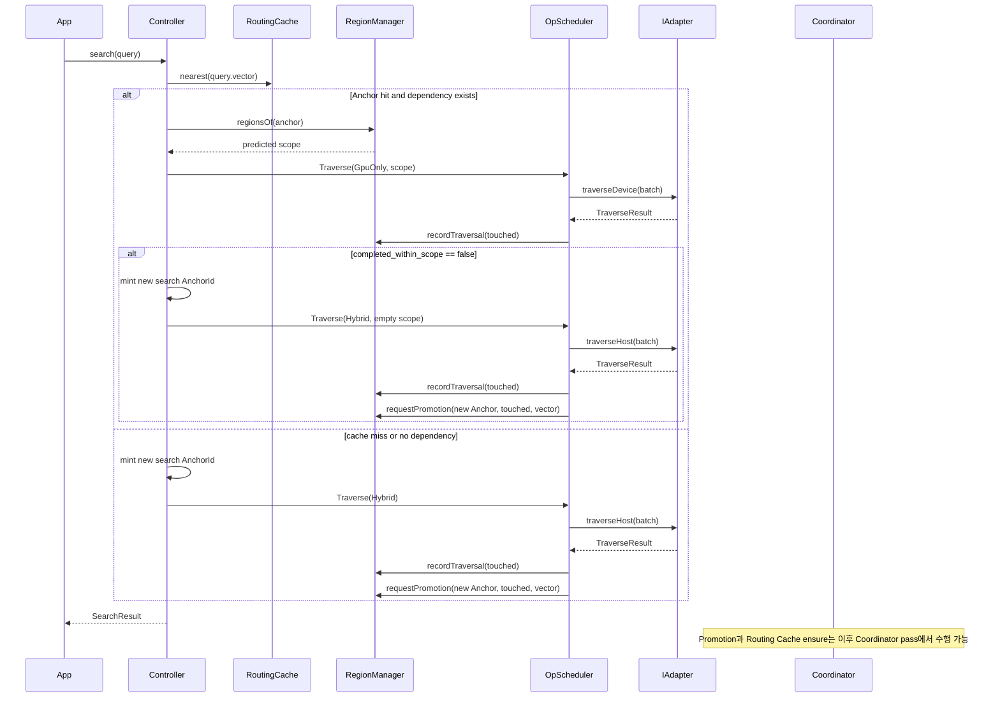

### 8.2 Routing condition

```cpp
if (auto anchor_id = routing_cache_.nearest(query.vector)) {
  std::vector<RegionId> regions =
      region_manager_.regionsOf(*anchor_id);
  if (!regions.empty()) {
    decision.gpu_only = true;
    decision.predicted_scope.regions = std::move(regions);
  }
}
```

GpuOnly route는 다음 두 조건을 모두 만족해야 한다.

```text
query가 기존 Anchor의 radius 안에 있음
AND
그 Anchor가 현재 하나 이상의 Region dependency를 가짐
```

GPU budget이나 free memory를 route 단계에서 직접 확인하지 않는다. Routing Cache hit는
이미 promotion된 Anchor identity를 찾기 위한 signal이다.

### 8.3 Search Anchor 생성

Primary path가 Hybrid이면 새 search Anchor id를 만든다.

```cpp
VectorId anchor_id =
    (plan.primary.mode == ExecutionMode::Hybrid)
        ? next_anchor_id_.fetch_add(1)
        : 0;
```

GpuOnly hit가 scope 안에서 완료되면 새 Anchor를 만들지 않는다. 기존 residency를 그대로
사용했기 때문이다.

GpuOnly attempt가 scope 안에서 완료되지 않으면 Hybrid fallback 시 새 Anchor를 만든다.

### 8.4 Dispatch completion

모든 성공한 Traverse는 같은 completion hook을 거친다.

```cpp
scheduler_.schedule(request,
  [this, promotion_anchor_id, vector](
      const TraverseResult& result) {
    region_manager_.recordTraversal(result.touched);
    if (promotion_anchor_id != 0) {
      region_manager_.requestPromotion(
          promotion_anchor_id, result.touched, vector);
    }
  });
```

따라서 `recordTraversal()`은 Hybrid뿐 아니라 GpuOnly traversal에서도 호출된다.
단, adapter call 또는 callback이 exception으로 실패한 경우에는 정상 result 기반
기록이 완료되지 않는다.

`recordTraversal()`은 Routing Cache를 갱신하지 않는다. 현재 touched Region의 dependent
Anchor를 찾아 `ReplacementPolicy::onAnchorTouched()`를 호출하는 hotness signal이다.

### 8.5 Fallback과 commit

GpuOnly adapter call이 정상 반환했고 `completed_within_scope == false`인 경우에만 Hybrid
fallback을 수행한다.

```cpp
if (plan.fallback_to_hybrid &&
    !result.completed_within_scope) {
  result = dispatch(
      TraverseRequest{query, ExecutionMode::Hybrid, {}},
      new_anchor_id);
}
```

`traverseDevice()` 자체가 exception을 던지면 Hybrid fallback으로 변환하지 않고 caller에
전파된다.

Commit은 public result를 shaping할 뿐 Routing Cache를 변경하지 않는다.

```cpp
SearchResult Controller::commitSearch(
    const TraverseResult& result,
    bool final_was_hybrid) {
  SearchResult output = result.result;
  output.served_gpu_only = !final_was_hybrid;
  return output;
}
```

Routing Cache 등록은 이후 Coordinator가 실제 Region dependency를 하나 이상 얻은
Anchor에 대해서만 수행한다.

---

## 9. Insert function call flow

### 9.1 전체 sequence

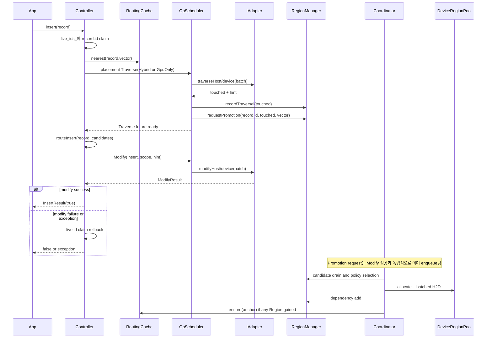

### 9.2 Duplicate id claim

```cpp
{
  std::lock_guard<std::mutex> lock(live_ids_mutex_);
  if (!live_ids_.insert(record.id).second) {
    return InsertResult{false};
  }
}
```

같은 id의 concurrent insert 중 한 caller만 진행한다. Modify가 false를 반환하거나
dispatch가 exception을 던지면 claim을 rollback한다. 성공한 id는 `remove()` 성공 시
다시 사용 가능해진다.

### 9.3 Placement Traverse

Insert는 먼저 새 vector가 어디에 들어갈지 찾는다.

```cpp
Query lookup_query{
    record.vector,
    kInsertionLookupTopK
};

RoutingDecision decision = route(lookup_query);

TraverseRequest lookup{
    lookup_query,
    decision.gpu_only
        ? ExecutionMode::GpuOnly
        : ExecutionMode::Hybrid,
    decision.predicted_scope
};

TraverseResult candidates =
    dispatch(lookup, record.id);
```

Search와 달리 insert placement의 GpuOnly result가
`completed_within_scope == false`여도 explicit Hybrid retry가 없다.

`dispatch(lookup, record.id)`이므로 insert는 placement route가 GpuOnly인지 Hybrid인지와
관계없이 항상 `record.id`를 promotion candidate로 enqueue한다.

### 9.4 Traverse에서 Modify로 전달되는 dependency

```cpp
plan.request.scope = candidates.touched;
plan.request.hint = std::move(candidates.hint);
```

한 insert 내부에서는 Modify가 Traverse result에 의존하므로 두 primitive의 순서를
바꿀 수 없다. 하지만 여러 caller의 ready operation은 scheduler가 kind/mode별로
batch할 수 있다.

### 9.5 Insert Modify mode

Modify는 기본적으로 Hybrid다.

```cpp
plan.request.mode = ExecutionMode::Hybrid;
```

그 사이 Coordinator가 `record.id`의 promotion request를 이미 처리하여 valid lease를
만들었다면 첫 promoted Region 하나를 사용해 GpuOnly로 바뀔 수 있다.

```cpp
for (RegionId region_id :
     region_manager_.regionsOf(record.id)) {
  Region region = region_manager_.regionOf(region_id);
  if (!region.lease.valid()) continue;

  plan.request.mode = ExecutionMode::GpuOnly;
  plan.request.scope.regions = {region_id};
  plan.request.lease = region.lease;
  break;
}
```

따라서 현재 insert Modify mode는 Coordinator timing에 영향을 받을 수 있다.

```text
promotion이 routeInsert 전에 완료됨  -> modifyDevice 가능
promotion이 아직 queue/policy에 있음 -> modifyHost
```

여러 Region이 promotion되어도 Modify scope는 현재 첫 valid Region 하나로 좁혀진다.
Multi-Region device insert는 아직 구현되지 않았다.

### 9.6 Commit semantics

```cpp
InsertResult Controller::commitInsert(
    const ModifyResult& result) {
  return InsertResult{result.ok};
}
```

Commit은 `result.ok`만 public result로 변환한다. Routing Cache ensure와 promotion
request는 commit에 없다.

현재 중요한 semantic은 promotion request가 Modify 성공보다 먼저 만들어진다는 점이다.
즉 Modify가 실패하더라도 이미 enqueue된 candidate는 자동 취소되지 않는다.
`live_ids_` claim은 rollback되지만 `RegionManager::releaseAnchor(record.id)`은 호출되지
않는다. 실제 adapter integration에서는 이 동작이 의도한 정책인지 재검토가 필요하다.

---

## 10. Remove function call flow

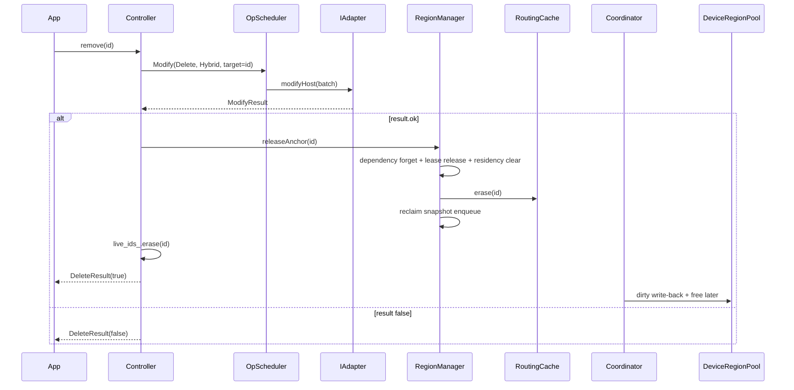

Delete에는 선행 Traverse가 없으며 현재 mode는 항상 Hybrid다.

```cpp
plan.request.op = ModifyOp::Delete;
plan.request.target = id;
plan.request.mode = ExecutionMode::Hybrid;
```

성공한 delete만 `releaseAnchor()`를 호출한다.

### 10.1 `releaseAnchor()`의 immediate/deferred split

동기적으로 수행되는 부분:

```text
Anchor dependency graph 제거
orphan Region의 logical write lease release
live Region record의 device/lease clear
ReplacementPolicy::onAnchorEvicted
Anchor epoch 증가
RoutingCache::erase
```

Coordinator로 미뤄지는 부분:

```text
dirty header gather
필요한 payload D2H write-back
old DeviceRegionHandle free
```

Dependency와 live residency state를 즉시 지우기 때문에 이후 routing은 삭제된 Anchor를
GPU-resident로 보지 않는다. Physical allocation reclaim은 caller의 delete latency에서
분리된다.

---

## 11. `recordTraversal()`과 promotion signal

### 11.1 `recordTraversal()`

```cpp
void RegionManager::recordTraversal(
    const RegionFootprint& touched) {
  std::unordered_set<VectorId> anchors;
  {
    std::lock_guard<std::mutex> lock(mutex_);
    for (RegionId region_id : touched.regions) {
      auto it = dependents_.find(region_id);
      if (it == dependents_.end()) continue;
      anchors.insert(it->second.begin(),
                     it->second.end());
    }
  }
  for (VectorId anchor_id : anchors) {
    replacement_policy_->onAnchorTouched(anchor_id);
  }
}
```

이 함수는 다음 작업을 하지 않는다.

```text
Routing Cache ensure/erase
Region promotion
Anchor dependency 추가
GPU allocation/copy
```

현재 touched Region에 이미 의존하는 Anchor를 찾아 policy에 usage signal을 보낼 뿐이다.
한 호출 안에서는 동일 Anchor가 여러 touched Region에 걸쳐 있어도 한 번만 보고한다.

현재 FIFO replacement policy는 이 signal을 무시한다.

```cpp
void FifoReplacementPolicy::onAnchorTouched(
    VectorId) {}
```

따라서 `recordTraversal()`은 향후 LRU/hotness-aware policy를 위한 wiring은 되어 있지만,
현재 eviction 순서에는 영향을 주지 않는다.

### 11.2 `requestPromotion()`

`requestPromotion()`은 policy를 직접 호출하지 않는 MPSC enqueue다.

```cpp
PromotionCandidate candidate;
candidate.anchor_id = anchor_id;
candidate.footprint = std::move(footprint);
candidate.vector_bytes = owned_copy_of(vector);

std::lock_guard<std::mutex> lock(mutex_);
candidate.epoch = currentEpochLocked(anchor_id);
pending_promotions_.push_back(std::move(candidate));
```

Coordinator가 다음 tick 또는 force wake에서 queue를 drain하여
`ReplacementPolicy::enqueueCandidate()`로 넘긴다.

`PromotionCandidate`는 다음 정보를 가진다.

```cpp
struct PromotionCandidate {
  VectorId anchor_id;
  RegionFootprint footprint;
  std::uint64_t epoch;
  std::vector<std::byte> vector_bytes;
  std::uint32_t vector_dim;
  VectorDType vector_dtype;
};
```

Owned vector copy는 asynchronous Routing Cache registration까지 caller buffer lifetime을
연장하기 위해 필요하다.

Epoch는 enqueue 이후 delete/release된 old candidate가 같은 VectorId를 다시 살리지 못하게
한다.

---

## 12. RegionManager Coordinator

### 12.1 Wake와 pass 구성

기본 trigger interval은 현재 100 ms다.

```cpp
struct CoordinatorConfig {
  std::chrono::milliseconds trigger_interval{100};
};
```

`requestPromotion()`과 `releaseAnchor()`는 Coordinator를 즉시 깨우지 않는다.

Wake source:

```text
periodic trigger_interval
waitIdle() force wake
shutdown() force wake
```

한 Coordinator pass는 다음 순서다.

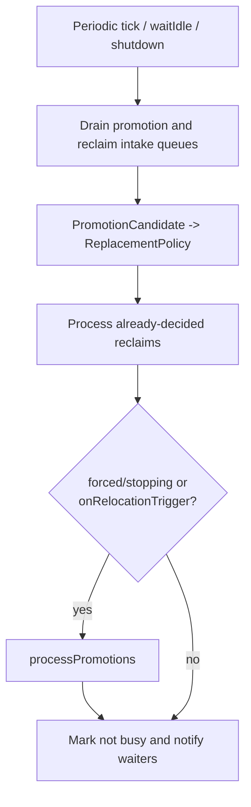

Reclaim을 promotion보다 먼저 처리하므로 같은 pass에서 반환된 capacity를 새 promotion이
사용할 수 있다.

### 12.2 `waitIdle()`

`waitIdle()`은 Coordinator를 force wake하고 다음 조건을 기다린다.

```text
Coordinator가 active processing 중이 아님
pending_promotions_ empty
pending_reclaims_ empty
ReplacementPolicy 내부 pending candidate 없음
```

Normal `search/insert/remove`는 residency completion을 기다리지 않는다. Operation result가
반환되었다는 사실과 GPU promotion/reclaim이 완료되었다는 사실은 별개다.

### 12.3 FIFO replacement policy

현재 policy는 두 queue를 관리한다.

```text
pending_candidates_: admitted, not selected
promoted_order_:     selected Anchor eviction order
```

`selectNextPromotionCandidate()`가 candidate를 반환하는 시점에 Anchor가
`promoted_order_`에 들어간다. Region promotion이 실제로 성공했는지를 알려주는 별도
confirmation callback은 없다.

`onAnchorEvicted()`는 pending candidate와 promoted order 양쪽에서 Anchor를 제거한다.

`selectNextEvictionCandidate(excluded)`는 가장 오래된 selected Anchor 중 현재 promotion
중인 `excluded` Anchor가 아닌 것을 고른다.

---

## 13. Promotion pipeline

### 13.1 전체 flow

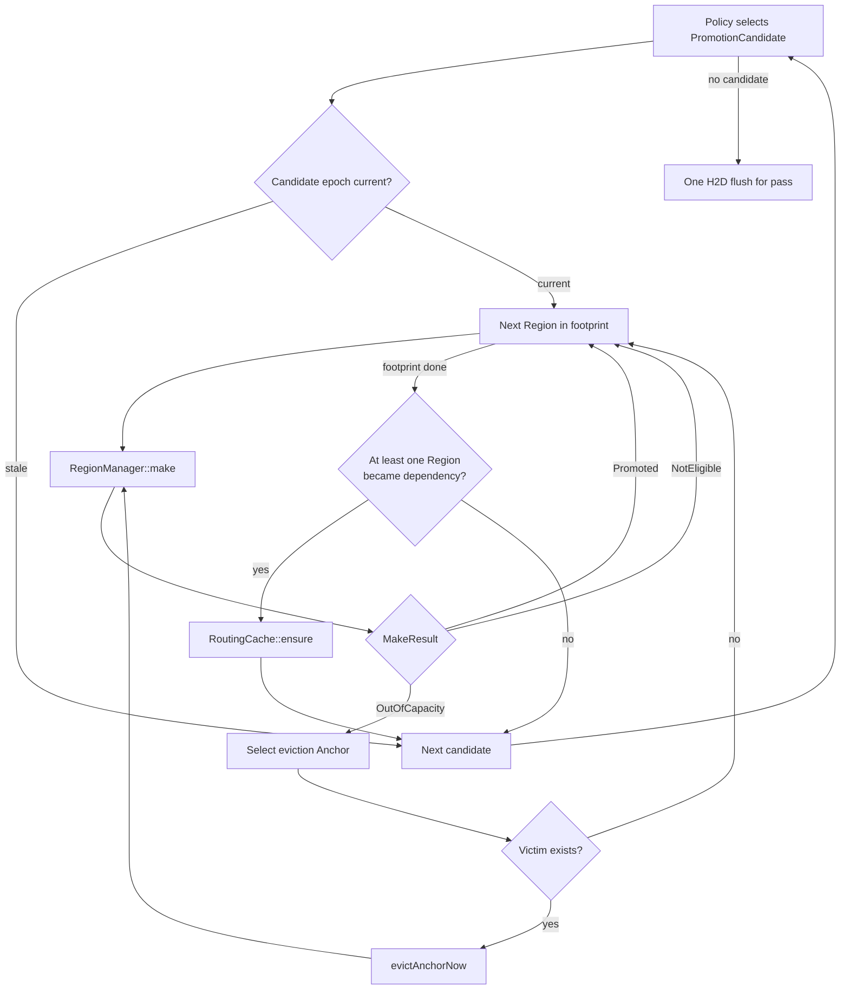

### 13.2 `make()` result

```cpp
enum class MakeResult {
  Promoted,
  NotEligible,
  OutOfCapacity,
};
```

| Result | 의미 | Eviction retry |
| --- | --- | --- |
| `Promoted` | dependency가 이미 있거나 새로 생성됨 | 불필요 |
| `NotEligible` | unregistered, unresolved, invalid logical lease | 하지 않음 |
| `OutOfCapacity` | eligible하지만 GPU allocation 공간 부족 | 수행 가능 |

### 13.3 `make(anchor, region)`

현재 순서는 다음과 같다.

```text
1. Anchor가 이미 Region에 의존하면 Promoted
2. Region registration 확인
3. live Region snapshot 조회
4. lease가 없으면 adapter.resolveRegion(region)
5. IRegion::acquireWriteLease()
6. dirty header + payload 크기로 allocation
7. zero header와 Host payload의 H2D copy enqueue
8. Region record에 DeviceRegionHandle과 LeaseHandle 저장
9. Anchor-Region dependency 추가
```

핵심 allocation/copy code는 다음 형태다.

```cpp
std::size_t header_bytes =
    gpu::DirtyHeaderBytes(
        snapshot.host.bytes,
        snapshot.host.subregion_bytes);

auto device = allocateWithCompaction(
    header_bytes + snapshot.host.bytes,
    pending);

device_region_pool_->enqueueCopyFromHost(
    *device,
    snapshot.host.ptr,
    snapshot.host.bytes,
    header_bytes,
    pending);
```

`header_bytes > 0`이면 같은 allocation의 offset 0에 zero-filled dirty header를 먼저
복사한다.

이미 다른 Anchor가 promotion한 valid lease가 있으면 새 device allocation이나 H2D
copy를 만들지 않고 dependency만 추가한다.

### 13.4 Routing Cache registration

Candidate footprint 처리 후 하나 이상의 Region이 `Promoted` 결과를 만들었을 때만:

```cpp
routing_cache_->ensure(
    candidate->anchor_id,
    candidate->vectorView(),
    kDefaultAnchorMaxDistance);
```

호출된다.

현재 radius는 fixed placeholder다.

```cpp
constexpr float kDefaultAnchorMaxDistance = 1e-3f;
```

Routing Cache registration은 operation commit 시점이 아니라 actual residency grant
시점에 맞춰져 있다.

---

## 14. Capacity, eviction, compaction

### 14.1 Capacity check

`DeviceRegionPool::tryAllocate()`는 Arachne logical budget과 실제 allocator failure를
모두 ordinary `nullopt`로 표현한다.

```text
bytesAllocated(kind) + requested <= budgetBytes(kind)
```

Budget check와 allocation은 하나의 reservation transaction은 아니다. 현재 residency
allocation은 Coordinator 하나가 수행하므로 primary path는 직렬화되어 있다.

### 14.2 Allocation with compaction

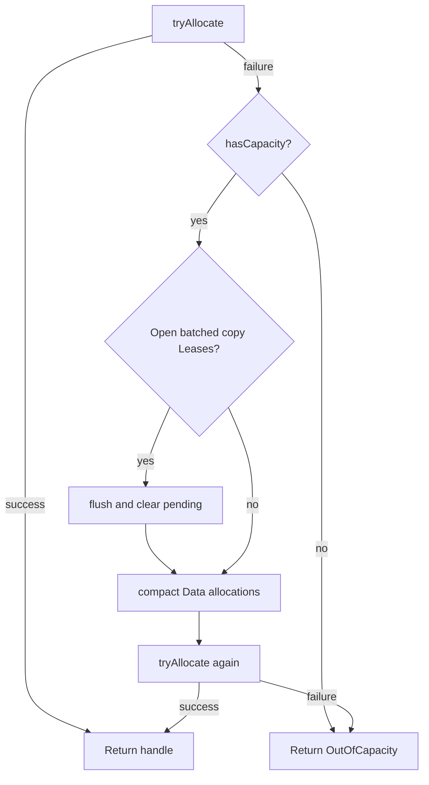

Budget 자체가 full이면 compaction은 호출하지 않는다. Compaction은 live byte를 줄이지
않기 때문이다.

### 14.3 Eviction retry

`make()`이 `OutOfCapacity`를 반환하면 policy에서 victim Anchor를 반복 선택한다.

```text
select victim
flush current promotion batch Leases
evictAnchorNow(victim)
retry make()
```

한 victim을 evict해도 충분하지 않으면 여러 Anchor를 연속으로 evict한다.

`evictAnchorNow()`는 Coordinator thread에서 실행되므로 dependency 제거, write-back,
free까지 동기적으로 끝낸 뒤 allocation을 retry할 수 있다.

### 14.4 Device compaction

Pooled mode의 `compact(kind)`는 해당 kind의 모든 live allocation을 relocate한다.

```text
snapshot candidate handle ids
for each handle:
  wait until host-side Lease count == 0
  order management stream after recorded CUDA events
  allocate fresh block
  enqueue D2D copy
sync management stream once
update handle-id -> new pointer mappings
free old blocks
```

`DeviceRegionHandle::id`는 유지되고 internal pointer만 바뀐다.

Compaction의 특성:

- Naive mode에서는 no-op이다.
- allocation count와 live byte total은 변하지 않는다.
- old/new allocation이 동시에 존재하므로 relocation 중 추가 memory가 필요하다.
- pool mutex를 전체 과정 동안 잡으므로 다른 allocate/acquire/free가 block된다.
- outstanding physical Lease가 있으면 release될 때까지 기다린다.

---

## 15. GPU memory model

### 15.1 DeviceContext

`DeviceContext`는 다음을 소유한다.

```text
CUDA device id
RAFT device_resources canonical stream
N explicit worker CUDA streams
RMM data resource
RMM metadata resource
```

Canonical RAFT stream은 management stream으로 사용된다.

```cpp
cudaStream_t managementStream() const {
  return resources_.get_stream().value();
}
```

Worker stream 수는 `SchedulingConfig::max_execution_threads`와 같다.

```text
execution worker i <-> DeviceContext::workerStream(i)
```

### 15.2 Allocation policy

| Policy | Allocation 방식 | Compaction |
| --- | --- | --- |
| `Pooled` | `rmm::mr::pool_memory_resource` suballocation | 모든 live allocation relocate |
| `Naive` | raw `cuda_memory_resource`, allocation별 cudaMalloc/free | no-op |

Pooled constructor의 data/metadata bytes는 initial reservation이면서 Arachne logical
budget으로 사용된다. Underlying RMM pool은 upstream에서 더 grow할 수 있으므로 hard
residency ceiling은 `DeviceRegionPool::hasCapacity/tryAllocate`가 강제한다.

Data와 Metadata resource는 물리적으로 분리되어 fragmentation domain을 공유하지 않는다.
현재 Region promotion은 `MemoryKind::Data`를 사용한다.

### 15.3 Device allocation layout

```text
DeviceRegionHandle
  -> Allocation { device_ptr, bytes, kind, lease/event state }

+-------------------------+------------------------------+
| dirty bitmap header     | Region payload               |
| 0 or N * 8 bytes        | HostRegionView::bytes        |
+-------------------------+------------------------------+
offset 0                  offset DirtyHeaderBytes(...)
```

`DeviceRegionHandle`은 pointer가 아닌 opaque id다.

```cpp
struct DeviceRegionHandle {
  std::uint64_t id = 0;
  bool valid() const { return id != 0; }
};
```

---

## 16. Device access와 stream ordering

### 16.1 `Controller::acquireRegion()`

```cpp
RegionAccess Controller::acquireRegion(
    RegionId region) {
  Region snapshot = region_manager_.regionOf(region);

  RegionAccess result;
  result.region = region;
  result.host = snapshot.host;

  if (snapshot.device.valid()) {
    result.on_device = true;
    cudaStream_t stream =
        g_worker_stream != nullptr
            ? g_worker_stream
            : device_.managementStream();
    result.device_lease.emplace(
        device_region_pool_.acquire(
            snapshot.device, stream));
  }
  return result;
}
```

반환값은 다음 의미다.

```cpp
struct RegionAccess {
  RegionId region;
  HostRegionView host;
  bool on_device;
  optional<DeviceRegionPool::Lease> device_lease;
};
```

- Scheduler worker에서 호출하면 해당 worker의 dedicated CUDA stream을 사용한다.
- 그 밖의 thread에서는 management stream을 사용한다.
- `on_device == false`이면 Host mapping만 사용할 수 있다.
- `on_device == true`이면 `device_lease->ptr()`와 `stream()`으로 kernel/copy를 enqueue할
  수 있다.

### 16.2 Cross-stream event chain

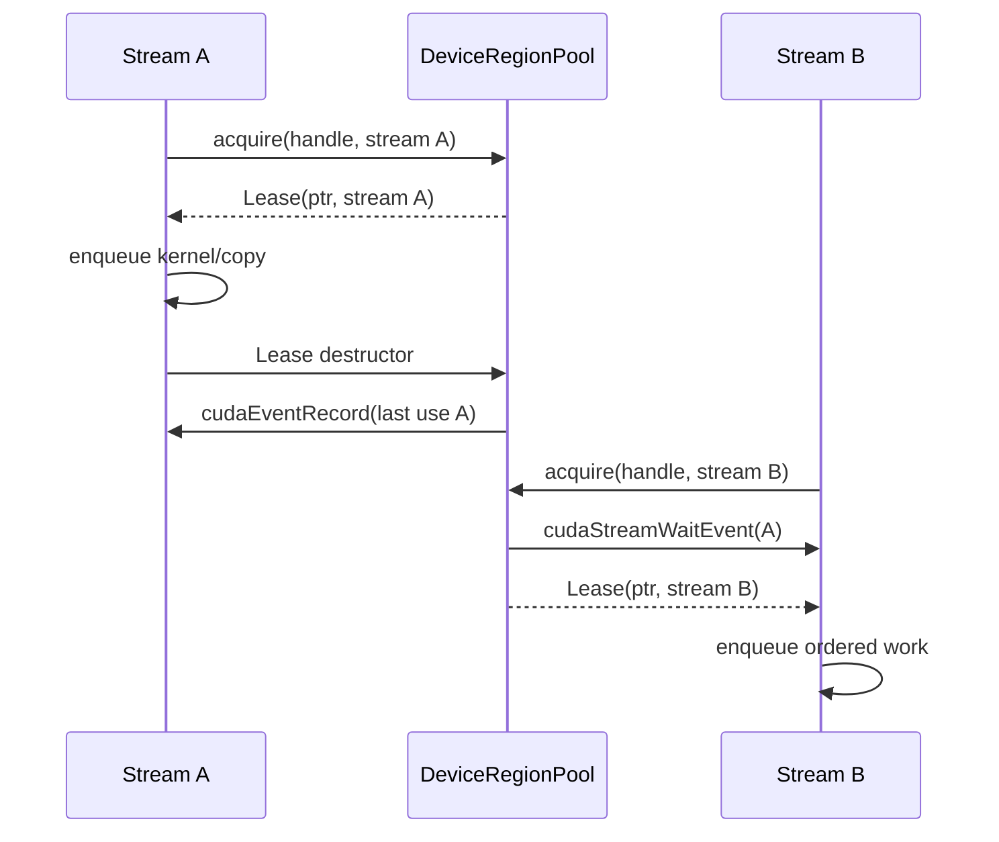

Lease destructor는 GPU completion을 host에서 기다리지 않는다. `release()`가 stream에
event를 기록한다.

다른 stream의 다음 acquire는 그 event를 GPU-side wait한다. 같은 stream은 CUDA FIFO
ordering이 이미 있으므로 별도 wait가 필요 없다.

`free()`와 `compact()`는 먼저 host-side `in_use_count == 0`을 기다린 뒤 management
stream을 모든 recorded event 뒤에 연결한다.

---

## 17. Dirty tracking과 eviction write-back

### 17.1 Dirty header

한 dirty word는 64-bit다.

```cpp
inline constexpr std::size_t
    kDirtyWordBytes = sizeof(std::uint64_t);
```

`HostRegionView::subregion_bytes`가 0이면 fine-grained tracking이 꺼진다.

```cpp
DirtyHeaderBytes(region_bytes, subregion_bytes)
```

는 Region의 subregion마다 bit 하나를 저장하는 데 필요한 64-bit word 수를 계산한다.

```cpp
DirtyBitLocation loc =
    LocateDirtyBit(offset_in_region,
                   subregion_bytes);
```

실제 write kernel은 해당 header word에 다음 형태의 atomic OR를 수행해야 한다.

```text
atomicOr(header + loc.word_index,
         1ull << loc.bit_index)
```

현재 codebase에는 실제 ANNS kernel과 공용 `__device__` dirty-mark helper가 없다.
Dirty bit 설정은 future adapter/kernel integration contract다.

### 17.2 Write-back 두 단계

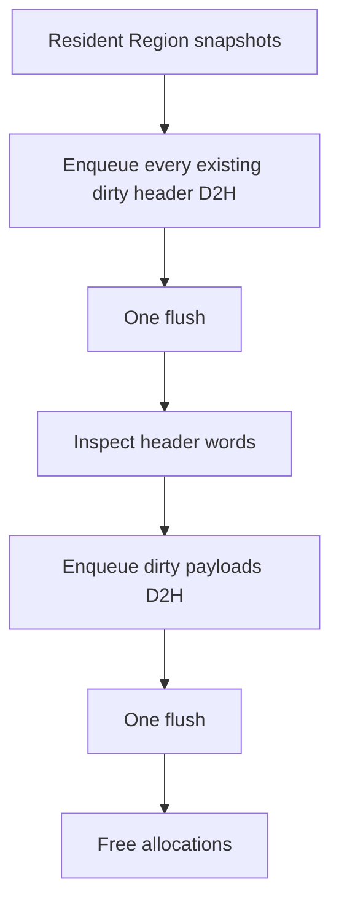

Dirty 판정:

```text
header 없음 -> 보수적으로 whole Region dirty
header 있음, any bit set -> dirty
header 있음, all zero -> clean
```

Subregion별 bit를 추적하지만 현재 D2H payload copy는 dirty subregion만이 아니라 Region
전체를 복사한다.

Write-back 후 allocation은 free되므로 header를 clear할 필요가 없다. 다음 promotion은
새 allocation의 header를 zero로 초기화한다.

---

## 18. Routing Cache

### 18.1 RoutingCache 의미

`RoutingCache`는 query에 가장 가까운 Anchor 하나를 찾고, 그 Anchor가 등록될 때 가진
개별 `max_distance` 안에 query가 들어오는지 판단한다.

```text
raw nearest Anchor 하나 선택
  -> 그 Anchor 자신의 radius 안이면 id 반환
  -> 아니면 nullopt
```

가장 가까운 Anchor의 radius 밖이면 더 멀지만 radius가 넓은 다른 Anchor를 다시 찾지
않는다.

### 18.2 Active/Shadow lifecycle

`ASRoutingCache`는 tombstone ratio가 threshold를 넘으면 background shadow rebuild를
시작한다.

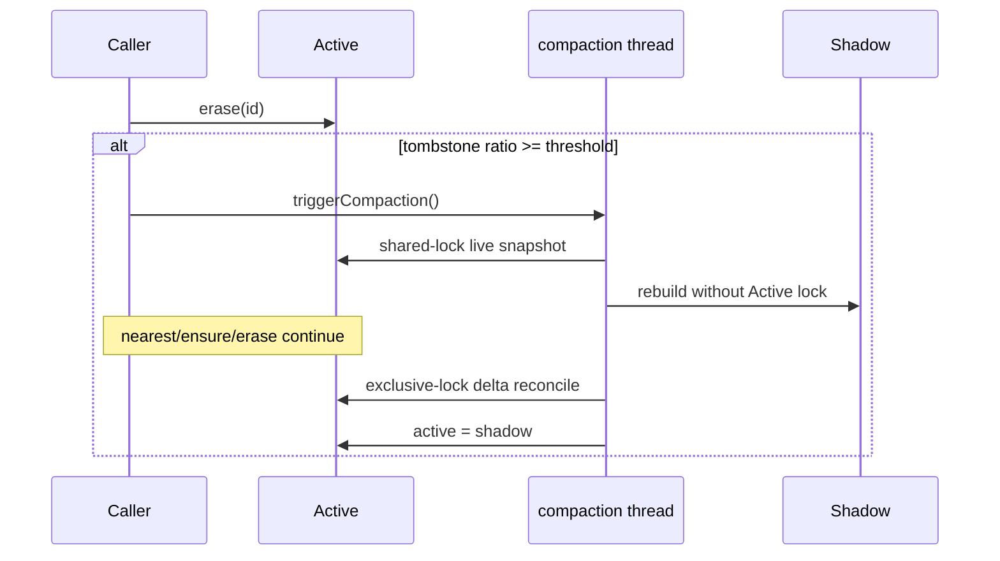

Lock mode:

| Operation | Lock |
| --- | --- |
| `nearest()` | shared |
| `ensure()` | exclusive |
| `erase()` | exclusive |
| initial compaction snapshot | shared |
| final delta reconcile/swap | exclusive |

Derived `ASRoutingCacheHnsw` destructor는 background thread가 derived virtual
`makeRefreshManager()`를 호출하는 동안 derived state가 파괴되지 않도록 먼저
`waitForCompaction()`을 호출한다.

### 18.3 HNSW RefreshManager

`ASRoutingCacheHnsw`는 다음 조합에 맞는 concrete hnswlib Space와
`HierarchicalNSW<DistT>`를 생성한다.

| Metric | Float32 | Float16 | UInt8 | Int8 |
| --- | --- | --- | --- | --- |
| L2 | 지원 | 지원 | 지원 | 지원 |
| Inner Product | 지원 | 지원 | 지원 | 지원 |
| Cosine | 지원 | 미지원 | 미지원 | 미지원 |

Cosine은 `util::Normalize()`로 Float32 vector를 정규화한 뒤
`hnswlib::InnerProductSpace`를 사용한다.

HNSW RefreshManager는 별도 live id/radius map을 유지한다.

```text
live_ids_
max_distance_[id]
tombstones_
```

HNSW capacity가 차면 `resizeIndex(max_elements_ * 2)`로 확장한다.

### 18.4 Vendored hnswlib patch

로컬 patch는 upstream hnswlib에 다음을 추가한다.

- portable binary16 conversion
- SSE4.1/AVX2/F16C runtime capability 처리
- UInt8/Int8/Half L2 space
- UInt8/Int8/Half Inner Product space
- scalar residual path
- SSE4.1, AVX2, AVX512/F16C SIMD path
- dtype distance와 HNSW self-recall correctness test

hnswlib는 `arachne_core`의 private implementation dependency다. Public Arachne header는
hnswlib type을 노출하지 않는다.

---

## 19. Adapter integration contract

### 19.1 IAdapter

모든 adapter는 Host batch entry point를 구현해야 한다.

```cpp
virtual std::vector<TraverseResult>
traverseHost(
    const std::vector<TraverseRequest>& requests) = 0;

virtual std::vector<ModifyResult>
modifyHost(
    const std::vector<ModifyRequest>& requests) = 0;
```

Device entry point의 default는 silent Host fallback이 아니라 exception이다.

```cpp
virtual std::vector<TraverseResult>
traverseDevice(...);

virtual std::vector<ModifyResult>
modifyDevice(...);
```

GpuOnly route를 지원하는 adapter는 Device methods를 override해야 한다.

Adapter는 다음 structural accessor도 제공한다.

```cpp
virtual IRegion* resolveRegion(RegionId id) = 0;
virtual std::vector<RegionId> allRegions() const = 0;
```

### 19.2 IRegion

```cpp
class IRegion {
 public:
  virtual RegionId id() const = 0;
  virtual RegionFootprint footprint() const = 0;
  virtual HostRegionView hostView() const = 0;
  virtual LeaseHandle acquireWriteLease() = 0;
  virtual void releaseWriteLease(LeaseHandle) = 0;
  virtual void applyLocalModification(
      LeaseHandle,
      const ModificationDelta&) = 0;
  virtual ReconciliationReport
      reconcileBoundary() = 0;
};
```

현재 Core가 실제로 호출하는 IRegion methods:

```text
resolveRegion()->acquireWriteLease()
resolveRegion()->releaseWriteLease()
```

현재 호출되지 않는 methods:

```text
IRegion::footprint()
IRegion::applyLocalModification()
IRegion::reconcileBoundary()
```

### 19.3 현재 GPU access seam

`Controller::acquireRegion()`은 안전한 `RegionAccess`를 제공한다. 하지만 `IAdapter`는
Controller reference/callback을 constructor나 request로 받지 않는다. `IndexImpl`도
adapter에 Controller를 역주입하지 않는다.

따라서 별도 real adapter가 `traverseDevice()/modifyDevice()` 안에서 Arachne-owned
`DeviceRegionHandle`을 `DeviceRegionPool::Lease`로 바꾸는 공식 public seam은 아직
완성되지 않았다.

현재 test는 Controller를 직접 사용하거나 `StressIndex` device entry point를 Host
implementation으로 위임하여 이 공백을 우회한다.

---

## 20. 현재 test가 표현하는 보장

| 영역 | 주요 검증 |
| --- | --- |
| Scheduler policy | kind 선택, candidate 선택, kind mismatch |
| Scheduler worker | worker별 start callback과 distinct index |
| Controller | lazy promotion, multi-victim eviction, dirty write-back, duplicate id |
| Region graph | registration, shared Region, last dependent, concurrent churn |
| Coordinator | lazy processing, force wake, immediate release/deferred reclaim |
| Candidate lifetime | owned vector copy, stale epoch discard, id reuse |
| Replacement policy | FIFO admission/eviction, excluded Anchor, purge/re-admit |
| Device allocation | Pooled/Naive, budget, Data/Metadata separation |
| Physical lease | free/compact blocking, cross-stream event ordering |
| Compaction | pointer relocation, handle/data preservation, stress churn |
| Dirty header | word count, rounding, bit location |
| Routing cache | radius, erase, resize, Active/Shadow compaction |
| Dtype routing | Int8/UInt8/Float16/Float32, L2/IP, Cosine validation |
| CPU SIMD | L2, dot, normalize, scalar tail, runtime dispatch |
| StressIndex stage 1 | dtype별 end-to-end operation correctness |
| StressIndex stage 2 | tiny GPU budget에서 promotion/eviction cycling |
| StressIndex stage 3 | concurrent insert/search/remove와 VectorId reuse |

`StressIndex`는 real ANNS가 아니라 mutex-protected flat buffer와 brute-force scan이다.

```cpp
std::vector<TraverseResult>
StressIndex::traverseDevice(
    const std::vector<TraverseRequest>& requests) {
  return traverseHost(requests);
}
```

```cpp
std::vector<ModifyResult>
StressIndex::modifyDevice(
    const std::vector<ModifyRequest>& requests) {
  return modifyHost(requests);
}
```

따라서 현재 test가 검증하는 GPU 기능은 allocation, copy, residency, Lease, CUDA event,
write-back, compaction이다. GPU-native ANN traversal/modification kernel의 correctness나
throughput을 검증하지 않는다.

---

## 21. 동시성 및 일관성

| 상태 | 보호 방식 |
| --- | --- |
| scheduler queue/dispatch queue/config | `OpScheduler::mutex_` |
| Region registry/dependency/Coordinator queues | `RegionManager::mutex_` |
| inserted live id set | `Controller::live_ids_mutex_` |
| search Anchor id mint | `std::atomic<VectorId>` |
| Routing Cache active RefreshManager | `std::shared_mutex` |
| Device allocation map | `DeviceRegionPool::mutex_` |
| allocation in-flight use | Lease count + CUDA event |
| FIFO scheduling state | planner single consumer |
| FIFO replacement state | policy internal mutex |
| RegionManager counters | relaxed atomics |

### 21.1 Operation execution과 residency의 시간 관계

```text
search/insert/remove result ready
    does not imply
promotion/eviction/reclaim complete
```

`waitIdle()`이 Coordinator checkpoint다.

### 21.2 Route snapshot

Routing Cache hit 조회, Anchor dependency snapshot, 실제 device access는 하나의 atomic
transaction이 아니다.

```text
RoutingCache::nearest
RegionManager::regionsOf
adapter device execution
Controller::acquireRegion
```

사이에 concurrent eviction/release가 일어날 수 있다. 최종 adapter는 device pointer를
bare pointer로 가정하지 않고 `RegionAccess::on_device`와 physical Lease를 확인해야 한다.

### 21.3 Host memory protection

Host buffer는 adapter 소유다. Arachne는 `HostRegionView` pointer를 기록하지만 Host
write를 memory protection으로 차단하지 않는다.

Logical `LeaseHandle` 동안 Host mutation을 어떻게 제한하거나 lazy-read로 취급할지는
현재 interface contract와 future adapter 구현에 의존한다.

---

## 22. 현재 구현의 주요 미연결/주의점

### 22.1 Real adapter의 GPU access

`Controller::acquireRegion()`을 real adapter에 주입하는 API가 없다. 이 문제가 해결되지
않으면 adapter는 promoted Region의 device pointer/stream을 공식적으로 얻을 수 없다.

### 22.2 Real Region partitioning

`StressIndex`는 flat buffer를 fixed vector-count slice로 나눈다. HNSW graph를 spatial
locality가 있는 Region으로 나누는 concrete strategy는 없다.

Upstream hnswlib는 level-0 data를 큰 contiguous block으로 저장하고 higher-level links를
별도 allocation으로 관리하므로 Arachne Region boundary가 자연스럽게 제공되지 않는다.

### 22.3 Insert failure와 promotion candidate

Insert promotion request는 placement Traverse completion에서 enqueue된다. Modify가
실패하면 live id claim은 rollback되지만 candidate/Anchor는 release되지 않는다.

### 22.4 Insert GpuOnly lookup fallback

Search는 `completed_within_scope == false`일 때 Hybrid retry를 수행하지만 insert placement
Traverse는 동일한 retry를 하지 않는다.

### 22.5 Verification

`Controller::verify()`는 GpuOnly/Hybrid neighbor id sequence를 비교하고 mismatch 시
`releaseAnchor()`를 호출하도록 구현되어 있다. 그러나 `search()`에서 호출되지 않는다.

### 22.6 Dirty marking

Dirty bitmap allocation과 write-back 판정은 구현되어 있지만 실제 device kernel이 bit를
mark하는 integration은 없다.

### 22.7 Reconciliation callbacks

`applyLocalModification()`과 `reconcileBoundary()`는 현재 Core에서 호출되지 않는다.
Byte mirror consistency와 index structural consistency 사이의 최종 contract가 아직
완성되지 않았다.

### 22.8 Telemetry

현재 public stats는 residency counters만 제공한다.

```text
gpu_bytes_allocated
regions_promoted_total
regions_evicted_total
regions_written_back_total
anchor_evictions_total
compactions_total
```

아직 없는 측정:

```text
queue wait latency
adapter execution latency
GpuOnly hit/miss/fallback rate
Anchor/Region별 access frequency
transfer latency/bytes histogram
verification match/mismatch count
```

`TraverseTask/ModifyTask::enqueued_at`과 `recordTraversal()` hook은 future telemetry/policy의
출발점이지만 현재 FIFO policy는 사용하지 않는다.

### 22.9 Anchor identity namespace

Search Anchor id는 `next_anchor_id_`가 1부터 만들고 insert Anchor는 application의
`Record::id`를 그대로 사용한다. 두 id source가 같은 `VectorId` namespace를 공유하지만
충돌 방지 규칙이 없다.

### 22.10 Routing Cache dedup return

`RoutingCache::ensure(id, vector, radius)`는 가까운 기존 Anchor가 있으면 새 `id`가 아니라
기존 id를 반환할 수 있다.

`RegionManager::processPromotions()`은 현재 이 반환값을 사용하지 않는다.

```cpp
routing_cache_->ensure(candidate->anchor_id, ...);
```

반면 dependency는 `candidate->anchor_id`에 기록된다. Cache가 기존 Anchor로 deduplicate한
경우 Routing Cache identity와 RegionManager dependency key가 달라질 수 있다.

### 22.11 Multi-GPU와 partial write-back

현재 device id는 0으로 고정되고 Controller당 `DeviceContext` 하나다. Multi-GPU
placement/sharding은 없다.

Dirty bitmap은 subregion granularity지만 payload write-back은 whole Region 단위다.

---

## 23. Build structure

```text
CMake minimum          3.26
C++ standard           C++20
CUDA standard          CUDA C++20
default architectures  SM100, SM120
test default            ARACHNE_BUILD_TESTS=ON
```

| Dependency | 용도 |
| --- | --- |
| CUDA / RAFT / RMM | device context, stream, memory resources |
| fmt | Arachne log formatting |
| Threads | scheduler, Coordinator, routing compaction |
| Google Highway | CPU runtime SIMD |
| vendored hnswlib | concrete Routing Cache |
| GTest | unit/stress test executable |

GPU/RAFT는 optional path가 아니라 `arachne_core`의 unconditional dependency다.

기본 architecture는 Blackwell 계열이며 다른 GPU는 다음 CMake option으로 override해야
한다.

```text
-DCMAKE_CUDA_ARCHITECTURES=...
```

모든 Arachne test source는 `arachne_tests` executable 하나로 구성되고
`gtest_discover_tests()`로 등록된다.

---

## 24. 빠른 function call reference

### 24.1 Construction

```text
IndexImpl::IndexImpl
  -> own IAdapter
  -> own RoutingCache
  -> Controller::Controller
     -> DeviceContext
        -> cudaSetDevice(0)
        -> management stream/resources
        -> worker CUDA streams
        -> Data/Metadata resources
     -> DeviceRegionPool
     -> RegionManager
     -> OpScheduler
     -> OpScheduler::start
     -> RegionManager::start
```

### 24.2 Search

```text
IndexImpl::search
  -> Controller::search
     -> routeSearch
        -> route
           -> RoutingCache::nearest
           -> RegionManager::regionsOf
     -> optional search Anchor id mint
     -> dispatch(TraverseRequest)
        -> OpScheduler::schedule
        -> plannerLoop
        -> workerLoop
        -> IAdapter::traverseHost or traverseDevice
        -> on_complete
           -> RegionManager::recordTraversal
           -> optional RegionManager::requestPromotion
     -> optional Hybrid fallback
     -> commitSearch
```

### 24.3 Insert

```text
IndexImpl::insert
  -> Controller::insert
     -> duplicate id claim
     -> route(record lookup)
     -> dispatch(TraverseRequest, record.id)
        -> IAdapter::traverseHost or traverseDevice
        -> RegionManager::recordTraversal
        -> RegionManager::requestPromotion(record.id, touched, vector)
     -> routeInsert(record, candidates)
        -> scope = candidates.touched
        -> hint = candidates.hint
        -> optional GpuOnly lease selection
     -> dispatch(ModifyRequest::Insert)
        -> IAdapter::modifyHost or modifyDevice
     -> commitInsert
     -> failure이면 live id rollback
```

### 24.4 Remove

```text
IndexImpl::remove
  -> Controller::remove
     -> routeRemove
     -> dispatch(ModifyRequest::Delete, Hybrid)
        -> IAdapter::modifyHost
     -> commitRemove
        -> success이면 RegionManager::releaseAnchor
           -> forget dependency
           -> IRegion::releaseWriteLease
           -> clear live residency
           -> RoutingCache::erase
           -> enqueue physical reclaim
     -> success이면 live id erase
```

### 24.5 Coordinator

```text
RegionManager::coordinatorLoop
  -> drain pending_promotions_
  -> ReplacementPolicy::enqueueCandidate
  -> drain pending_reclaims_
  -> reclaimRegions
     -> writeBackDirtyRegions
     -> DeviceRegionPool::free
  -> onRelocationTrigger
  -> processPromotions
     -> selectNextPromotionCandidate
     -> epoch check
     -> make for each Region
        -> IRegion::acquireWriteLease
        -> allocateWithCompaction
           -> DeviceRegionPool::tryAllocate
           -> optional DeviceRegionPool::compact
        -> enqueueCopyFromHost
        -> addDependency
     -> capacity 부족 시 selectNextEvictionCandidate
        -> evictAnchorNow
     -> any promoted이면 RoutingCache::ensure
  -> DeviceRegionPool::flush
```

---

## 25. 현재 상태 한 문장 요약

Arachne의 현재 C++ 구현은 `Traverse`/`Modify` 기반 index-agnostic operation scheduler와
Anchor-driven asynchronous GPU residency substrate를 연결한 상태이며, 다음 핵심 단계는
real ANNS adapter가 Arachne-owned Region device memory에 접근하는 seam, 실제 GPU
kernel, Region partitioning, dirty/reconciliation contract, identity/telemetry policy를
완성하는 것이다.
