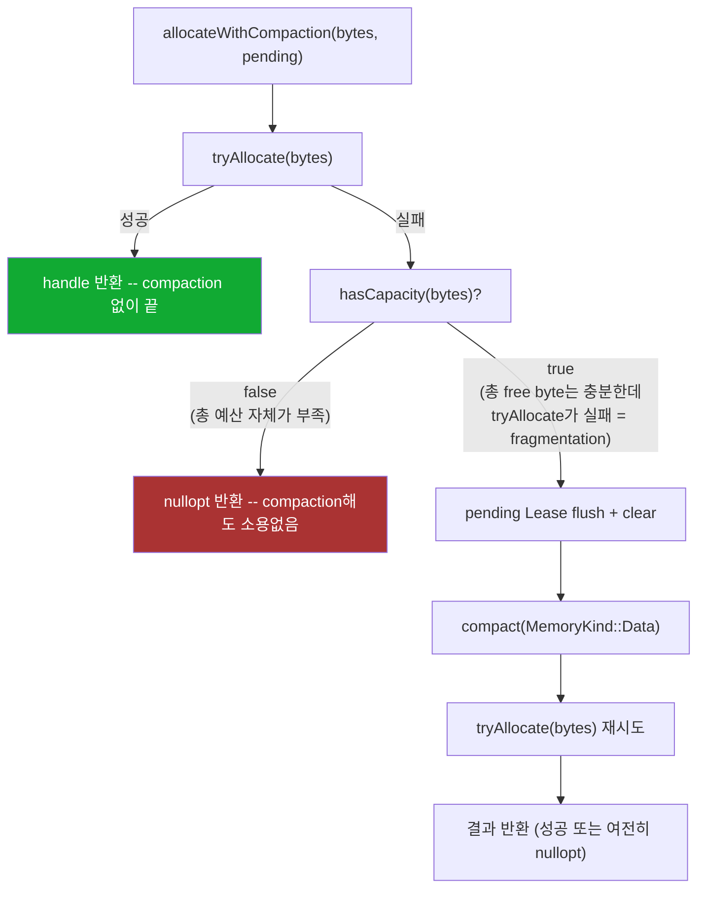
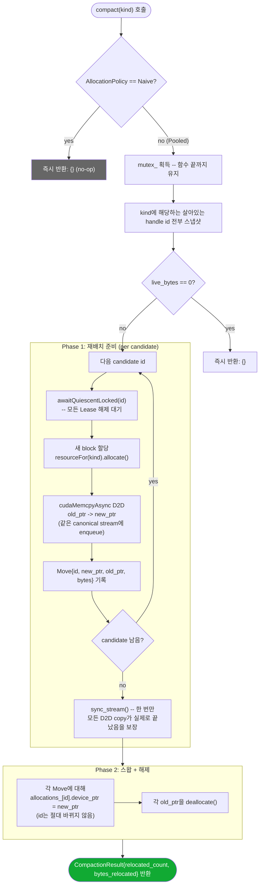

# GPU Region Pool Compaction

`gpu::DeviceRegionPool::compact()` (`cpp/src/gpu/device_region_pool.cpp`)가 실제로 어떻게 동작하는지에
대한 상세 설명. 트리거 조건(`RegionManager::allocateWithCompaction()`), 내부 알고리즘 2-phase 구조, 메모리
레이아웃, 동시성/안전성 보장을 코드 기준으로 정리한다.

---

## 1. 왜 필요한가

`DeviceRegionPool`은 `AllocationPolicy::Pooled`일 때 `DeviceContext`가 미리 예약해둔 하나의 큰 arena
(`rmm::mr::pool_memory_resource`)에서 가변 크기 Region들을 suballocate한다. Promotion과 Eviction이
반복되면 이 arena 안에서 "사용 중인 블록 - 빈 구멍 - 사용 중인 블록" 패턴의 **외부 단편화
(external fragmentation)**가 생긴다: 전체 free byte 합계는 충분한데, 그 어떤 연속 구간도 새로 요청한
크기만큼 이어져 있지 않은 상태.

Compaction은 이 상황에서 살아있는 모든 allocation을 device-to-device(D2D) copy로 다시 촘촘하게
재배치해서, 다음 promotion의 `tryAllocate()`가 성공할 수 있는 연속 공간을 만들어주는 절차다.

DynaSOAr(github.com/prg-titech/dynasoar)의 `parallel_defrag`에서 아이디어를 가져왔지만, DynaSOAr는
object block/bitmap 구조를 스캔해서 점유율이 낮은 block만 골라 relocate하는 반면, Arachne의
allocation은 opaque한 가변 크기 byte 범위이고 `cuda::mr::any_resource`로 type-erase되어 있어 내부
free-list를 들여다볼 수 없다. 그래서 Arachne의 `compact()`는 "점유율이 낮은 것만 선택"이 아니라
**해당 `MemoryKind`의 살아있는 allocation 전부를 무조건 relocate**한다.

---

## 2. 언제 호출되는가 -- 트리거는 오직 fragmentation

`compact()` 자체는 "언제 실행되어야 하는가"에 대해 아무 의견이 없다 (주기적 실행도, occupancy 기반
트리거도 아니다). 유일한 호출 지점은 `RegionManager::allocateWithCompaction()`
(`cpp/src/core/region_manager.cpp`)이고, 그 호출도 조건부다.



즉 compaction은 **"일반 할당이 실패했는데, 총량 계산상으로는 들어가야 정상인" 순수 fragmentation
케이스에서만** 실행되는 fallback이다. 빈 공간이 처음부터 부족한 진짜 OOM 상황에서는 절대 호출되지
않는다 (`hasCapacity()`가 먼저 걸러낸다).

`pending`을 먼저 flush+clear하는 이유: 같은 Coordinator pass 안에서 이미 promote된 Region이 아직
`pending` 벡터 안에 열린 `Lease`를 들고 있을 수 있는데, `compact()`는 그 Region까지 포함해 **모든
살아있는 allocation**을 대상으로 하므로, 그 Lease가 풀리기 전에 `compact()`의 내부 대기
(`awaitQuiescentLocked()`)가 자기 자신을 기다리며 deadlock에 빠진다. flush+clear로 미리 풀어주는 것이
안전조건이다.

---

## 3. `compact()` 내부 알고리즘 -- Phase 1 / Phase 2



핵심 포인트:

- **Phase 1에서 예외가 나면** (`resourceFor(kind).allocate()`가 실패하는 등), 그때까지 이미 새로
  할당해둔 block들을 전부 되돌려 해제(`deallocate`)하고 예외를 다시 던진다. 이 시점에는 아직 원본
  block들을 하나도 건드리지 않았으므로 안전하게 되돌릴 수 있다.
- **모든 D2D copy는 같은 stream(`device_.resources().get_stream()`, canonical/management stream)에
  enqueue**되므로 enqueue 순서대로 실행되고, `sync_stream()` 한 번으로 전부 끝났음을 확인할 수 있다 --
  candidate마다 개별 sync를 걸지 않는다.
- **Phase 2는 순수 host-side 포인터 교체**다. `allocations_` 맵의 key(`id`, 즉 `DeviceRegionHandle::id`)는
  절대 바뀌지 않고, value 안의 `device_ptr` 필드만 새 주소로 갱신된다. 이 부분이 4절에서 다시 다룰
  "handle identity는 안정적, 포인터만 이동" 원칙의 실제 구현이다.

### 3.1 안전성: `awaitQuiescentLocked()`가 보장하는 것

`compact()`는 `free()`와 정확히 같은 대기 메커니즘을 candidate마다 재사용한다
(`DeviceRegionPool::awaitQuiescentLocked()`):

1. 해당 allocation의 `in_use_count`가 0이 될 때까지 조건변수로 대기 (그 사이 `mutex_`는 풀렸다가
   다시 잡힌다).
2. 0이 되면, 그 allocation에 대해 기록되어 있던 모든 `last_used_events`(다른 stream에서의 마지막
   접근을 나타내는 `cudaEvent_t`)에 대해 canonical stream 위에 `cudaStreamWaitEvent`를 걸고 이벤트
   객체를 파괴한다.

즉 D2D copy를 enqueue하기 전에 "이 allocation에 대해 아직 GPU에서 진행 중인 이전 작업(다른 worker
stream에서의 kernel/copy 포함)이 전부 끝났다는 보장"을 GPU-side wait로 확보한다. 이것 때문에 D2D
copy가 옛날 데이터를 읽거나, 아직 쓰는 중인 메모리를 읽는 race가 발생하지 않는다.

### 3.2 비용

- **동시성**: `mutex_`를 함수 시작부터 끝까지(대기 포함) 보유하므로, compaction이 진행되는 동안 같은
  `DeviceRegionPool`에 대한 다른 모든 `allocate()`/`acquire()`/`free()`/`compact()` 호출은 블록된다 --
  즉 compaction은 사실상 이 pool 전체에 대한 stop-the-world 구간이다.
- **메모리**: 모든 old block과 new block이 동시에 잠깐 존재하므로, 재배치되는 `kind`의 현재 live
  byte 총량만큼의 여유 공간이 추가로 더 필요하다.
- **Naive policy에서는 완전 no-op**: `AllocationPolicy::Naive`는 Region마다 독립적인 `cudaMalloc`을
  쓰므로 공유 arena 자체가 없고, 재배치할 대상이 없다.

---

## 4. 메모리 레이아웃

### 4.1 Fragmentation -> Compaction 전/후 (하나의 `Data` pool arena)

```text
[Compaction 이전 -- 단편화된 상태]

  0x0000                                                          0x2000
  |--- A (id=1) ---|--- free ---|--- B (id=3) ---|--- free ---|--- C (id=5) ---|
  |     512B       |    128B    |     512B        |    64B     |     256B       |

  새 요청: 300B 짜리 allocation 필요
  -> 개별 free 구간(128B, 64B)은 300B에 못 미침 -> tryAllocate() 실패
  -> free 구간 합계(192B)조차 300B에 못 미치는지는 hasCapacity()가 별도로 판단
     (여기서는 논의를 위해 "합계로는 충분" 케이스를 가정하지 않고, 실제로는
      hasCapacity()가 pool 전체의 예산 여유를 보는 것이지 free 구간 합계를
      스캔하는 것이 아니다 -- pool_memory_resource가 조각난 free 구간을 이미
      coalescing하지 못했을 때만 compact()가 의미 있다)

                          compact(MemoryKind::Data)
                                    |
                                    v

[Compaction 이후 -- 재배치 완료]

  0x0000                                          0x1500
  |--- A (id=1) ---|--- B (id=3) ---|--- C (id=5) ---|------- free (연속) -------|
  |     512B       |     512B       |     256B        |         나머지 전부       |

  이제 300B 요청은 뒤쪽의 연속된 free 구간에서 바로 tryAllocate() 성공
```

### 4.2 Handle identity vs 물리 포인터 -- compaction 전후 비교

`DeviceRegionHandle{id}`는 `DeviceRegionPool` 내부 `allocations_` 맵의 key이고, `RegionManager`가
`Region::device` 필드에 그대로 들고 있는 값이다. Compaction은 이 key를 절대 재발급하지 않고, key가
가리키는 `device_ptr` 값만 바꾼다.

```text
                     compact() 이전                    compact() 이후
                 +-------------------+           +-------------------+
  id=1 (Region   | device_ptr: 0x1000|           | device_ptr: 0x1800|  <- 이동함
  RegionId=101   | bytes:      512   |   ==D2D==>| bytes:      512   |
  이 참조)       +-------------------+           +-------------------+
                          ^                                ^
                          |                                |
                  RegionManager::regions_[101].device == DeviceRegionHandle{1}
                  (compact() 전후로 이 값 자체는 단 1비트도 바뀌지 않는다)
```

`RegionId`(adapter가 아는 안정적 identity, 예: `101`)와 `DeviceRegionHandle::id`(pool 내부 전용
identity, 예: `1`)는 서로 다른 두 개의 id 공간이다. `RegionManager`는 compaction이 일어났다는 사실
자체를 알 필요가 없다 -- 다음에 같은 `DeviceRegionHandle`로 `acquire()`를 호출하면 `DeviceRegionPool`
내부에서 이미 갱신된 `device_ptr`을 투명하게 돌려주기 때문이다. Adapter는 이 레이어를 아예 보지
못한다 (`RegionId`로만 접근).

### 4.3 하나의 allocation 내부 레이아웃 (참고)

Compaction은 아래 블록 전체를 통째로 D2D copy한다 -- header와 payload를 분리해서 다루지 않는다.

```text
allocation bytes (compact()가 D2D copy하는 단위):
+----------------------+-------------------------------+
| dirty bitmap header  | Region payload                |
| 0 or N * 8 bytes      | HostRegionView::bytes         |
+----------------------+-------------------------------+
offset 0                offset DirtyHeaderBytes(...)
```

(`subregion_bytes == 0`인 Region은 header가 0바이트 -- 이 경우 allocation 전체가 payload뿐이다.)

---

## 5. 요약

| 질문 | 답 |
|---|---|
| 언제 실행되는가 | `tryAllocate()` 실패 **and** `hasCapacity()`가 "들어가야 정상"이라고 판단할 때만 (순수 fragmentation) |
| 무엇을 옮기는가 | 해당 `MemoryKind`의 살아있는 allocation **전부** (선택적 relocate 아님) |
| 어떻게 옮기는가 | 새 block 할당 -> 같은 stream에 D2D copy 전부 enqueue -> 한 번 sync -> 포인터 스왑 -> 이전 block 해제 |
| `DeviceRegionHandle::id`가 바뀌는가 | 아니오. Key는 고정, `device_ptr` 값만 바뀐다 |
| `RegionId`가 바뀌는가 | 아니오. RegionManager/adapter는 이 레이어를 아예 인지하지 못한다 |
| 동시성 비용 | 함수 전체 동안 `DeviceRegionPool` mutex 보유 (사실상 이 pool에 대한 stop-the-world) |
| 메모리 비용 | 재배치 대상 `kind`의 현재 live bytes만큼 일시적으로 추가 필요 |
| Naive policy에서는 | 완전 no-op (공유 arena 자체가 없음) |
