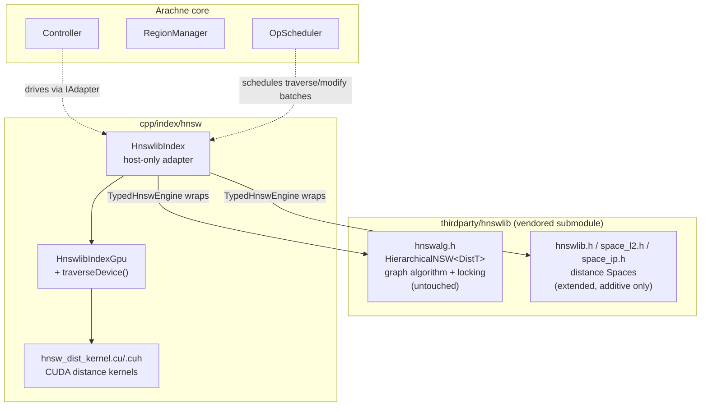
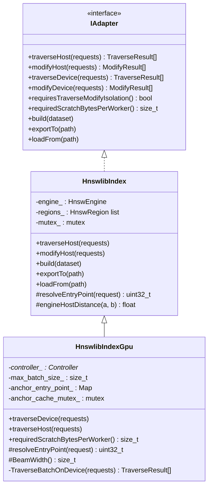
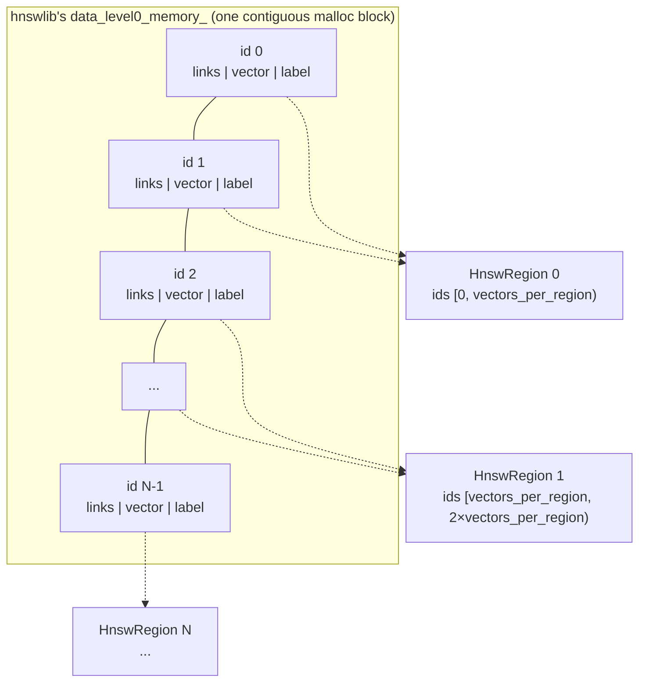
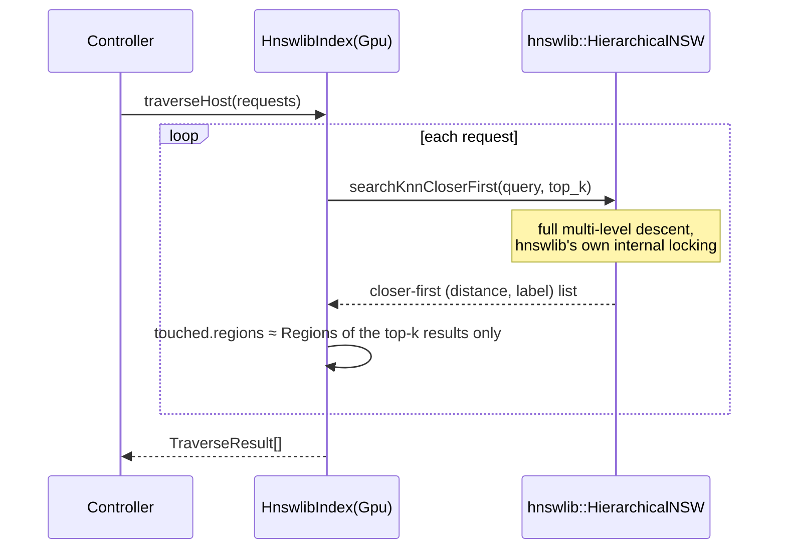
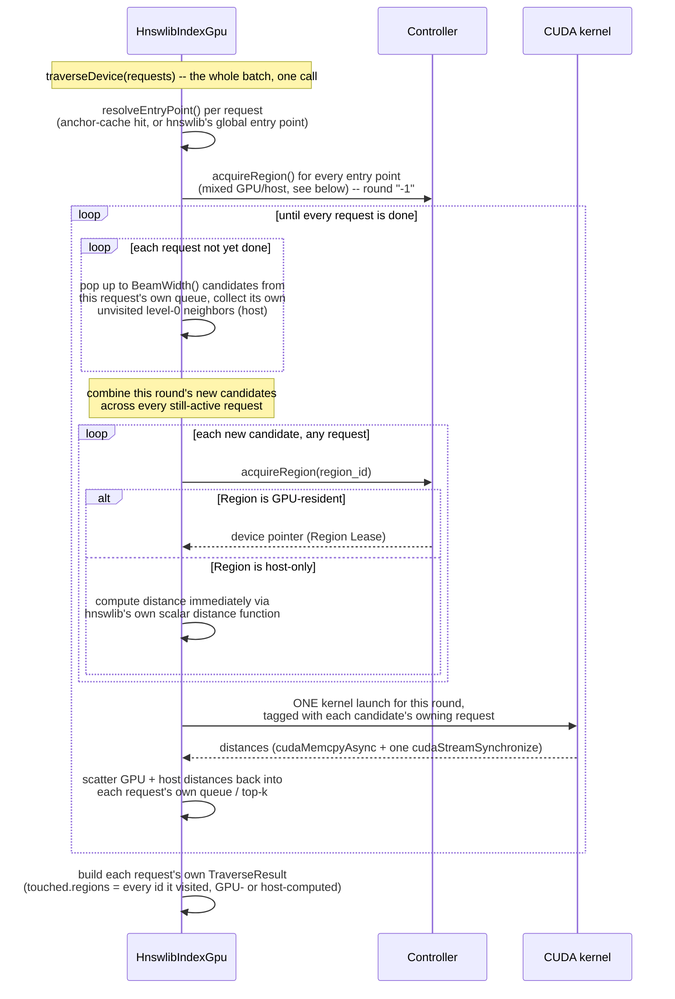
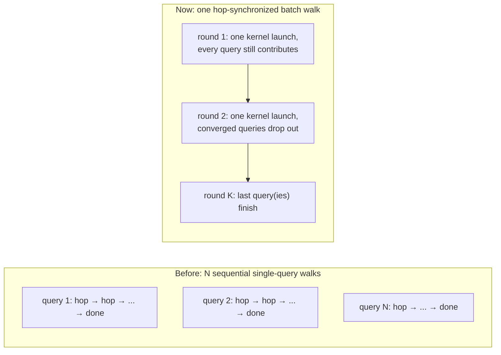
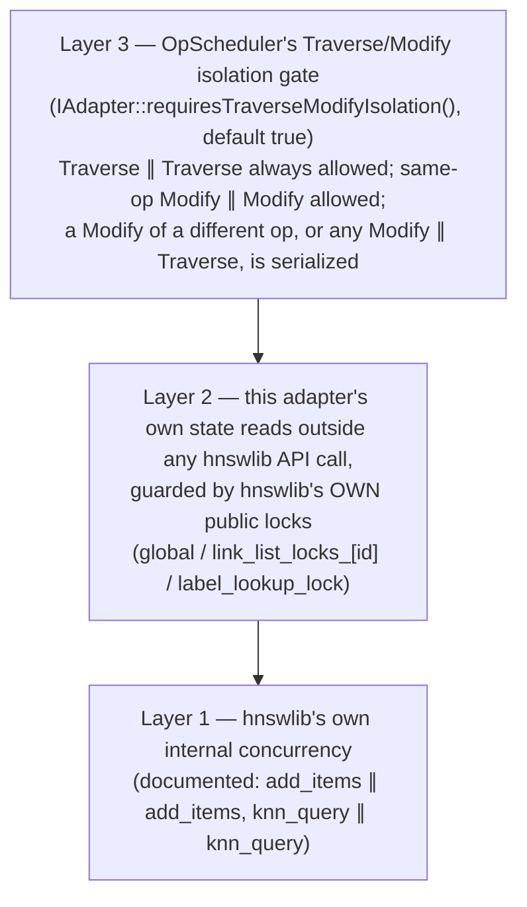
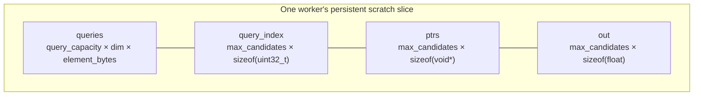

# HNSW Adapter (`cpp/index/hnsw`)

This directory is Arachne's `IAdapter` implementation over
[hnswlib](https://github.com/nmslib/hnswlib) — the concrete index Arachne's
control plane (`Controller` / `RegionManager` / `OpScheduler`, see the
[top-level README](../../../README.md)) drives. It answers two separate
questions: how hnswlib's data gets sliced into Arachne `Region`s, and how
(and how much of) hnswlib's search algorithm can be offloaded to the GPU.

If you haven't read the top-level README yet, do that first — this document
assumes familiarity with Arachne's `Region`/`Anchor`/`IAdapter` vocabulary
and only re-explains it in passing.

## Table of contents

- [Quick facts](#quick-facts)
- [Directory layout](#directory-layout)
- [hnswlib, recapped](#hnswlib-recapped)
- [Two adapter classes](#two-adapter-classes)
- [Mapping hnswlib onto Arachne's Region model](#mapping-hnswlib-onto-arachnes-region-model)
- [Request flow](#request-flow)
- [Concurrency model](#concurrency-model)
- [GPU offload internals](#gpu-offload-internals)
- [What differs from vanilla hnswlib](#what-differs-from-vanilla-hnswlib)
- [Current limitations](#current-limitations)
- [Building and testing](#building-and-testing)

## Quick facts

| | |
| --- | --- |
| Wraps | hnswlib, vendored at `cpp/thirdparty/hnswlib` (git submodule) |
| Host-only class | `HnswlibIndex` — hnswlib used exactly as upstream ships it |
| GPU-offload class | `HnswlibIndexGpu` — adds `traverseDevice()`, extends `HnswlibIndex` |
| GPU coverage | Level-0 graph only. Upper levels (`level > 0`) are never sliced into Regions and never touched by the device path |
| dtype × metric coverage | `{Float32, Float16, UInt8, Int8} × {L2, InnerProduct}` (8 combinations) on both paths; Cosine is not supported (hnswlib has no native Cosine space) |
| Insert / Delete | Host-only by design. `modifyDevice()` is never overridden; it stays at `IAdapter`'s default, which throws |
| hnswlib source changes | Purely additive (new dtype support), see [What differs from vanilla hnswlib](#what-differs-from-vanilla-hnswlib) — the graph algorithm and its locking (`hnswalg.h`) are untouched |

## Directory layout

```
cpp/index/hnsw/
  CMakeLists.txt          arachne_index_hnsw library target
  hnswlib_index.hpp/.cpp        HnswlibIndex    -- host-only adapter (hnswlib as-is)
  hnswlib_index_gpu.hpp/.cpp    HnswlibIndexGpu -- + traverseDevice() (GPU distance offload)
  hnsw_dist_kernel.cuh/.cu      CUDA distance kernels + host-callable launcher
```



## hnswlib, recapped

A short recap of the parts of hnswlib this adapter's design depends on
(everything below refers to `thirdparty/hnswlib/hnswlib/hnswalg.h`'s
`HierarchicalNSW<DistT>`, unless noted):

- **Level-0 storage**: `data_level0_memory_` is *one contiguous `malloc`
  block*, `max_elements_ * size_data_per_element_` bytes. Every element
  (internal id) owns one fixed-size record inside it, laid out as
  `[level-0 link list][raw vector bytes][external label]`.
- **Upper-level storage**: `linkLists_` is a `char**` — one *separately
  `malloc`'d* block per element that has a level above 0 (most elements
  don't; whether an element gets an upper level is decided by an
  exponential-distribution coin flip at insert time). Not a contiguous
  array, and structurally nothing like `data_level0_memory_`.
- **Concurrency**: hnswlib ships its own fine-grained locking — a
  `std::mutex` per element (`link_list_locks_`) taken by both the owning
  element and, during insertion, every neighbor `mutuallyConnectNewElement()`
  rewires; a single `global` mutex serializing entry-point/max-level
  updates; a `label_lookup_lock` guarding the external-id → internal-id map.
  hnswlib's own documentation states `add_items` is safe concurrently with
  other `add_items`, and `knn_query` is safe concurrently with other
  `knn_query` — it says nothing about the two running together.
- **Search**: greedy best-first graph walk — pop the closest unvisited
  candidate from a priority queue, compute its neighbors' distances, push
  them back, repeat until the stopping condition is met. Each step depends
  on the previous one's outcome, so this loop is inherently sequential —
  there is no obvious way to parallelize the walk *itself* across an entire
  query's execution the way, say, a batch matrix multiply parallelizes.
- **Insert**: `addPoint()` descends through upper levels to find a good
  entry point, then calls `mutuallyConnectNewElement()`, which writes the
  new node's own link list *and* rewires the link lists of the neighbors it
  picked — an insert's write footprint is not confined to the new node.
- **Delete**: `markDelete()` only flips a tombstone bit inside the target's
  own record header. No graph rewiring happens — a deleted node stays a
  fully traversable hop (so the graph doesn't fragment), it's simply
  excluded from a search's returned results.

hnswlib is a host-only library — `std::priority_queue`, `std::mutex`, plain
`malloc`, and a function-pointer-dispatched scalar/SIMD distance function.
None of that runs on a GPU as-is, so "porting" unavoidably means
*re-implementing* the parts that need to run on-device rather than
recompiling hnswlib's own source for CUDA. This adapter's answer to that,
described below, is to keep hnswlib entirely authoritative for the graph
itself and its host-side algorithm, and to re-implement only a narrow,
from-scratch device-side search loop that calls back into hnswlib's own data
whenever it needs ground truth.

## Two adapter classes



### `HnswlibIndex` — the host path

`HnswlibIndex` is concrete (not abstract) and, on its own, is the *plain*
hnswlib adapter: `traverseHost()` calls hnswlib's own
`searchKnnCloserFirst()` wholesale, `modifyHost()` calls `addPoint()` /
`markDelete()` wholesale, `exportTo()`/`loadFrom()` call `saveIndex()` /
`loadIndex()` wholesale. It never overrides `traverseDevice()`, so a
`HnswlibIndex` used by itself only ever answers requests on the host,
through hnswlib's unmodified algorithm — full upper-level descent, `ef`
exactly as hnswlib itself would run it.

hnswlib itself is accessed through a small internal type-erasure layer
(`HnswEngine` / `TypedHnswEngine<SpaceT, ElemT, DistT>`, defined in
`hnswlib_index.cpp`, never exposed in the public header) that picks the
right concrete `hnswlib::HierarchicalNSW<DistT>` instantiation for a given
`(VectorDType, DistanceMetric)` pair — the same problem
`ASRoutingCacheHnsw` already solves for the routing cache's own small
Anchor index, solved the same way here for the full dataset.

### `HnswlibIndexGpu` — the GPU path

`HnswlibIndexGpu` extends `HnswlibIndex` with `traverseDevice()`. It has two
independent responsibilities, both switched on by default:

1. **Distance offload, genuinely batched across requests.** `traverseDevice()`
   receives the whole batch `OpScheduler` collected in one call and runs
   every request's search concurrently, hop-synchronized: each request keeps
   its own independent candidate queue/top-k/visited state, but every round,
   whichever requests still have work combine their new candidates into
   **one** CUDA kernel launch. Graph control flow (candidate queue, visited
   set, stopping condition, which neighbors to expand next) always runs on
   the host. See [GPU offload internals](#gpu-offload-internals) for the
   full design.
2. **Entry-point caching.** Rather than always starting the level-0 walk at
   hnswlib's raw global entry point, `resolveEntryPoint()` is overridden to
   consult a cache keyed by `TraverseRequest::anchor_id`: if an earlier
   `traverseHost()` call for the same Anchor already landed somewhere, that
   internal id is reused as the device walk's starting point instead. A
   cache miss (no `anchor_id`, or this Anchor's first-ever GPU attempt)
   falls back to the same global entry point `HnswlibIndex` would use — so
   this is a strict improvement, never a regression.

Neither responsibility touches `traverseHost()`'s actual search behavior:
`HnswlibIndexGpu::traverseHost()` still calls hnswlib's own
`searchKnnCloserFirst()` unmodified (through the inherited path), and is
overridden only to *populate* the entry-point cache as a side effect once a
result comes back — never to change what that result is.

`HnswlibIndexGpu`'s constructor takes one parameter beyond `HnswlibIndex`'s
own: `max_batch_size` (default `1`), a scratch-sizing hint — see
[Worker-affine GPU scratch](#worker-affine-gpu-scratch) for what it controls
and what happens when an actual batch exceeds it.

`modifyDevice()` is not overridden by either class; it stays at
`IAdapter`'s default, which throws `std::logic_error`. Insertion and
deletion are host-only in this port by design (see
[Current limitations](#current-limitations)).

## Mapping hnswlib onto Arachne's Region model

Arachne's `Region` model expects an adapter to be able to slice its own
state into independently promotable/evictable byte ranges. hnswlib's
`data_level0_memory_` already being one contiguous block makes this
straightforward for the level-0 graph — `HnswlibIndex::BuildRegions()`
slices it into equal id-range spans of `vectors_per_region` records each,
one `HnswRegion` per span:



Each `HnswRegion`'s `subregion_bytes` is set to one record's size
(`size_data_per_element_`), which activates Arachne's dirty-bitmap tracking
(`gpu/dirty_header.hpp`) at per-record granularity for this adapter.

Two structural facts fall out of this choice and are worth being explicit
about:

- **Only the level-0 graph is Region-managed.** hnswlib's upper-level
  `linkLists_` are never sliced into `HnswRegion`s at all — there is no
  Region concept for them, so they are always accessed on the host, through
  hnswlib's own code, regardless of GPU residency state. This is not a
  currently-disabled feature; there is no code path that would promote an
  upper level to the GPU even in principle today.
- **hnswlib's internal ids are insertion-order, not spatially ordered.**
  `addPoint()` assigns internal ids sequentially as vectors arrive
  (`cur_c = cur_element_count++`), with no relationship to where a vector
  sits in the graph. An id-contiguous `HnswRegion` is therefore not
  guaranteed to correspond to a graph-local neighborhood — vectors that are
  graph-neighbors can land in different Regions, and vectors that share a
  Region can be graph-unrelated. `capacity_` is fixed at construction and
  `resizeIndex()` is deliberately never called (its `realloc()` would
  invalidate any host pointer already promoted to GPU), so this ordering
  is also stable for the adapter's lifetime, for better or worse.

## Request flow

**Host path** (`traverseHost()`) — hnswlib's own algorithm end to end,
including the full upper-level descent. `TraverseResult::touched` is
approximated as only the top-k results' own Regions, because
`searchKnnCloserFirst()` doesn't expose the full visited-node set through
its public API:



**Device path** (`traverseDevice()`, `HnswlibIndexGpu` only) — a from-scratch
level-0-only greedy search, structurally the same shape as hnswlib's own
(bounded candidate queue + bounded top-k + visited set), run **for every
request in the batch at once**, hop-synchronized: each request keeps fully
independent search state, but every round's distance computation — across
however many requests are still active, mixed with per-candidate GPU/host
residency — is issued as one combined step:



A request that converges (its own stop condition trips, or its candidate
queue empties) simply stops contributing candidates to later rounds — it
costs nothing further, not even an idle GPU lane, since a round's combined
candidate list is built by omitting finished requests, not by padding a
fixed shape:



A batch of exactly one request is the degenerate case of this same loop:
every round has exactly one contributor, so the trace is bit-for-bit
identical to looping `traverseDevice()` once per request — this is what the
parameterized `HnswlibIndexGpuTest` suite (every dtype × metric combination)
exercises, and `HnswlibIndexGpuBatchTest` separately proves for batches of
several requests (see [Building and testing](#building-and-testing)).

## Concurrency model

`OpScheduler` may call `traverseHost()` / `modifyHost()` / `traverseDevice()`
concurrently from as many worker threads as configured. This adapter's
safety under that rests on three independent layers:



- **Layer 1** is hnswlib itself — search-with-search and insert-with-insert
  are safe by hnswlib's own design and documentation, with no help needed
  from this adapter.
- **Layer 2** covers the handful of places this adapter reads hnswlib state
  *directly*, outside of any call that would already lock it internally
  (the global entry point, a node's level-0 neighbor list, the external-id
  lookup table). Each of those reads takes the *same* public mutex
  hnswlib's own internal code takes for the equivalent access
  (`TypedHnswEngine`, `hnswlib_index.cpp`) — no new locks of this adapter's
  own are introduced. `HnswlibIndex::mutex_` itself is reserved for
  lifecycle/persistence calls only (`build()` / `exportTo()` / `loadFrom()`
  / `liveCount()`) and is never held during `traverseHost()` /
  `modifyHost()` / `traverseDevice()`.
- **Layer 3** covers what hnswlib's own documentation doesn't promise:
  Insert running concurrently with Search, or Insert concurrently with
  Delete. `OpScheduler`'s admission gate serializes exactly that
  combination on the adapter's behalf, at the planner stage (before a batch
  is even built) rather than by blocking a worker thread that already
  popped work — see the top-level `OpScheduler` documentation for the exact
  admission rule.

## GPU offload internals

### Why a from-scratch search loop

hnswlib's own `searchBaseLayerST()` calls its distance function inline,
with no seam to substitute a GPU-batched step without patching hnswlib
itself — a change this project deliberately avoids for the graph algorithm
(see [What differs from vanilla hnswlib](#what-differs-from-vanilla-hnswlib)).
`TraverseBatchOnDevice()` (`hnswlib_index_gpu.cpp`) is therefore a
from-scratch re-implementation of hnswlib's bare-bone level-0 greedy search,
built entirely on `HnswlibIndex`'s already-available protected surface
(`engineLevel0Neighbors()`, `engineDataPointerFor()`,
`engineIsMarkedDeleted()`, `engineExternalLabel()`, `resolveRegion()`, ...)
rather than touching hnswlib internals a second time. Graph control flow —
which node to visit next — always stays on the host; only the distance
*computation* for a round's candidates is offloaded. This never descends
through levels above 0: it starts directly at `resolveEntryPoint()`'s result
and walks level 0 only.

### Multi-query batching

`traverseDevice()` doesn't loop `TraverseBatchOnDevice()` once per request —
that whole function runs *once* per call, over every request in the batch
together (see the [device-path sequence diagram](#request-flow) above). Each
request gets its own local `candidate_set`/`top_candidates`/`visited[]` (a
plain local struct, one instance per request, not shared state), so requests
never interfere with each other's search *results* — only their distance
*computation* is fused. `hnsw_dist_kernel.cuh`'s `LaunchDistanceKernel()`
reflects this directly: alongside the usual candidate-pointer array, it now
also takes a `candidate_query_index` device array (one entry per candidate,
saying which request's query vector that candidate's distance is against),
and indexes into a batch of query vectors instead of assuming a single
shared one. A batch of exactly one request makes every entry of that array
zero — the single-query case is not a separate code path, just this one's
degenerate input.

### Worker-affine GPU scratch

Every round needs a small, short-lived device buffer (the batch's query
vectors, an array of candidate device pointers, a matching array of
per-candidate query indices, an array of output distances). Rather than
`cudaMalloc`/`cudaFree` on every round, `HnswlibIndexGpu` declares its
scratch need up front via `IAdapter::requiredScratchBytesPerWorker()`.
`Controller` queries this once per adapter, before any worker thread
starts, and reserves one `cudaMalloc` sliced per `OpScheduler` worker
(`gpu::DeviceContext::reserveWorkerScratch()` / `workerScratch()`) — the
same pattern already used for each worker's own CUDA stream
(`workerStream()`). A worker's slice is laid out as:



`query_capacity = max_batch_size` (the constructor parameter — see
[`HnswlibIndexGpu` — the GPU path](#hnswlibindexgpu--the-gpu-path)), and
`max_candidates = max_batch_size × BeamWidth() × (M × 2)` — `M × 2` is
hnswlib's own `maxM0_`, the fixed level-0 max-degree invariant set once at
construction and never changed afterward, so given `max_batch_size` this is
a real upper bound on one round's *combined* candidate count across the
whole batch, not a heuristic guess. The same layout arithmetic
(`ComputeScratchLayout()`) is shared between the sizing call and the actual
per-round buffer use, so the two can't drift apart. A call whose actual
batch exceeds `max_batch_size`, or a round that (unexpectedly) exceeds
`max_candidates`, falls back to a one-off `cudaMalloc`/`cudaFree` for just
the buffer(s) that didn't fit, with a warning logged for the latter case — a
safety net, not the intended path; correctness never depends on
`max_batch_size` being set accurately, only the fast path's availability
does.

### Partial residency: mixed GPU/host distance computation

Every candidate a round needs — across every request contributing to that
round — is resolved through `Controller::acquireRegion()` before its
distance is computed, individually, not once for the whole round. A
candidate whose Region is GPU-resident is batched into that round's single
kernel launch (tagged with its owning request via `candidate_query_index`,
above); a candidate whose Region isn't resident has its distance computed
immediately on the host instead, against *its own* request's query vector,
via `HnswlibIndex::engineHostDistance()`, which calls hnswlib's *own*
already-selected scalar distance function (`fstdistfunc_`) directly rather
than re-deriving the formula — this is what guarantees a host-computed
distance matches `traverseHost()` exactly, including whichever SIMD tier
hnswlib's own runtime CPU-capability detection picked. Results are scattered
back into each candidate's own request before that request's walk
continues.

This means no request's walk ever aborts for residency reasons: each always
runs to completion, mixing GPU and host computation candidate-by-candidate
as needed, independent of every other request sharing its batch. Each
request's own `TraverseResult::touched.regions` is populated with every
internal id whose distance was actually computed during *that request's*
walk — GPU- or host-computed alike, not just the final top-k — which is
what feeds `RegionManager`'s promotion/eviction hotness signal
(`Controller::search()`'s completion hook) for a device-served query.

### Performance characteristics of batching

Batching several requests together amortizes the host↔device round-trip
(kernel launch + `cudaMemcpyAsync`/`cudaStreamSynchronize`) across however
many requests are still active in a given round — the actual bottleneck
this design targets. That benefit is concentrated in the rounds where
multiple requests are still active together: once a batch's convergence
depth is uneven (some requests finish in a few hops, others need many more),
the later rounds increasingly cover just the stragglers, and those rounds
pay the same per-round host↔device round-trip cost a single-request call
would have paid on its own. A batch of exactly one request is simply the
extreme case of this — see [Request flow](#request-flow) above for the
before/after picture.

### Entry-point caching

Described under [`HnswlibIndexGpu`](#hnswlibindexgpu--the-gpu-path) above.
Worth repeating here: the cache (`anchor_entry_point_`, a plain
`unordered_map<VectorId, uint32_t>` guarded by its own dedicated mutex,
deliberately separate from `HnswlibIndex::mutex_`) is populated only as a
side effect of a completed `traverseHost()` call, never by
`traverseDevice()` itself — a repeated device-only query stream with no
interleaved host traversal never grows or benefits from this cache beyond
whatever was already there.

## What differs from vanilla hnswlib

| Aspect | Vanilla hnswlib | This adapter |
| --- | --- | --- |
| Graph algorithm & locking (`hnswalg.h`) | — | **Unmodified.** Never patched or forked. |
| Distance functions / dtype coverage (`hnswlib.h`, `space_l2.h`, `space_ip.h`) | Float32 and (via community forks) a narrower dtype set | **Extended, additively.** New `Space` implementations for Int8/UInt8/Float16, a half-float codec, and CPU-capability probes (F16C/SSE4.1/AVX2) were added; zero existing lines were changed or removed. |
| Search | Multi-level descent + level-0 greedy walk, single algorithm, one query at a time | **Two paths.** `traverseHost()` is that same algorithm, unchanged, one request at a time. `traverseDevice()` is a separate, from-scratch level-0-only walk with GPU-offloaded distance computation, run hop-synchronized across every request in the batch at once — a different code path, not a modification of hnswlib's own search. |
| Memory ownership | One process's private heap | **Sliced into `Region`s.** The level-0 block is partitioned into id-range spans Arachne can independently promote to/evict from the GPU. Upper levels are not Region-managed at all. |
| Insert / Delete | In-process, single algorithm (`addPoint()` / `markDelete()`) | **Host-only.** `modifyHost()` wraps `addPoint()`/`markDelete()` unchanged; there is no device-native insert/delete path (`modifyDevice()` is unimplemented by design). |
| Entry point selection | Always hnswlib's own global entry point, walked down from | **Optionally cached**, device path only. `HnswlibIndexGpu` can start a walk from a previously-cached Anchor-specific internal id instead, when one is available. |
| Concurrency | Own internal locking (documented for same-kind ops only) | **Reused as-is** for the handful of extra reads this adapter needs, **plus** an additional cross-kind (Traverse-vs-Modify) admission gate at the Arachne scheduler level that hnswlib itself has no equivalent of. |

## Current limitations

- **GPU-resident Regions can go stale after a host-side Insert/Delete.** A
  host Insert's write footprint is the new node's own Region plus every
  immediate level-0 neighbor's Region (a conservative over-approximation of
  `mutuallyConnectNewElement()`'s actual rewiring); a Delete's footprint is
  just the target's own Region (a tombstone-bit flip only). Neither
  currently triggers any invalidation of an already-GPU-resident copy of
  the Region it touches — there is no completion hook wired for Modify
  requests the way there is for Traverse requests. This is tracked by (and
  currently reproduces in) the
  `HnswlibIndexInsertAfterPromotionTest.DeviceSearchReflectsPostPromotionInsertsOrExplainsWhyNot`
  test.
- **`ef` is fixed to `top_k`** on the device path — hnswlib's own
  configurable `ef_` (typically set larger than `k` to improve recall) has
  no equivalent here. Not a correctness bug, but device-path recall at a
  given `k` may be lower than hnswlib's own default configuration would
  give.
- **No upper-level descent on the device path.** `traverseDevice()` starts
  directly at whatever `resolveEntryPoint()` returns and never consults
  `linkLists_` — this is a structural property of the device path, not a
  gap expected to close without a larger redesign (see
  [Mapping hnswlib onto Arachne's Region model](#mapping-hnswlib-onto-arachnes-region-model)).
- **Id-contiguous Regions are not graph-locality-aware.** Because internal
  ids are assigned in insertion order, an `HnswRegion` is not guaranteed to
  correspond to an actual graph neighborhood. How much this costs in
  practice (promotion "hit rate" per Region) has not been measured.
- **The entry-point cache never shrinks.** `anchor_entry_point_` grows
  without bound and is never evicted, including for Anchors the Controller
  side has already released.
- **`build()` is a temporary bulk-load path** — a single-threaded loop over
  hnswlib's own `addPoint()`, not yet routed through `modifyHost()`'s own
  Insert path.
- **Not validated at production scale.** Existing tests run at dimensions
  and dataset sizes chosen for fast, deterministic CI, not at the vector
  counts or dimensionality a production deployment would use.

## Building and testing

This directory builds as its own static library, `arachne_index_hnsw`
(CMake target alias `arachne::index_hnsw`), gated by the top-level
`ARACHNE_BUILD_HNSW_INDEX` option (default `ON`). See the
[top-level README](../../../README.md#building) for the full build
sequence; from a configured build directory:

```bash
cmake --build cpp/build --target arachne_index_hnsw
cmake --build cpp/build --target arachne_tests
./cpp/build/test/unittest/arachne_tests --gtest_filter="*Hnswlib*"
```

Test files (`cpp/test/unittest/hnsw/`):

- `hnswlib_index_test.cpp` — `HnswlibIndex` correctness: build, search,
  insert, delete, export/load round-trip, parameterized over every
  supported dtype.
- `hnswlib_index_gpu_test.cpp` — `HnswlibIndexGpu::traverseDevice()`
  correctness against `traverseHost()` ground truth, parameterized over
  every (dtype, metric) combination, plus dedicated tests for the
  partial-residency and zero-residency cases described under
  [GPU offload internals](#gpu-offload-internals), plus an
  `HnswlibIndexGpuBatchTest` suite covering
  [multi-query batching](#multi-query-batching) specifically: a batch's
  per-request results are checked bit-for-bit identical to calling
  `traverseDevice()` once per request, a multi-request batch is checked
  against `traverseHost()` ground truth, a batch larger than
  `max_batch_size` is checked to still produce correct results through the
  one-off-allocation fallback, and `requiredScratchBytesPerWorker()` is
  checked to actually scale with `max_batch_size`.
- `hnswlib_index_promotion_eviction_stress_test.cpp` — concurrent
  promotion/eviction churn under an undersized GPU budget, concurrent
  Insert during churn, and a targeted concurrent-Insert stress test for the
  fine-grained hnswlib locks described under
  [Concurrency model](#concurrency-model).
