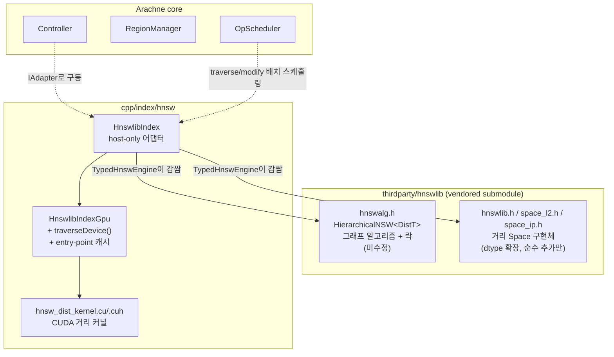
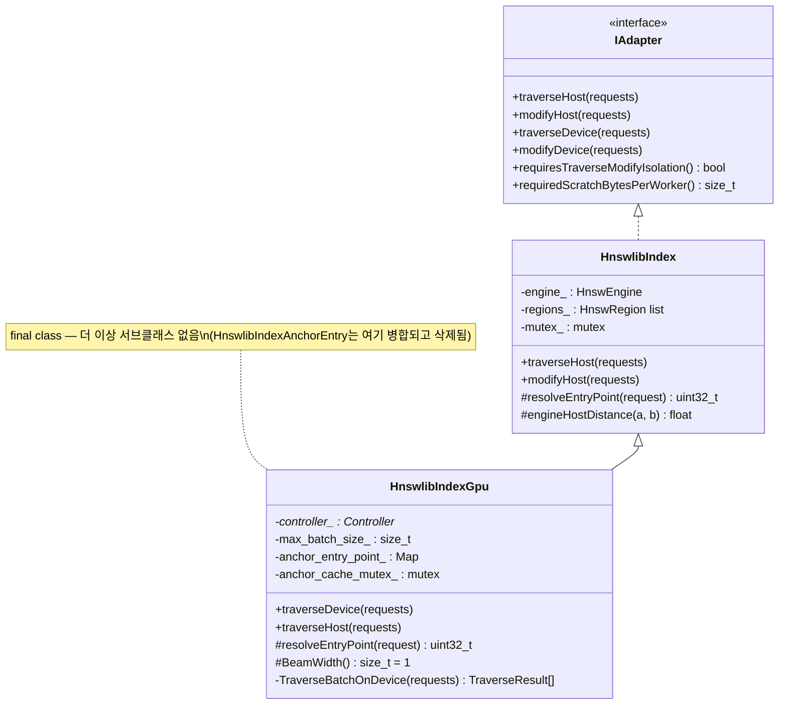
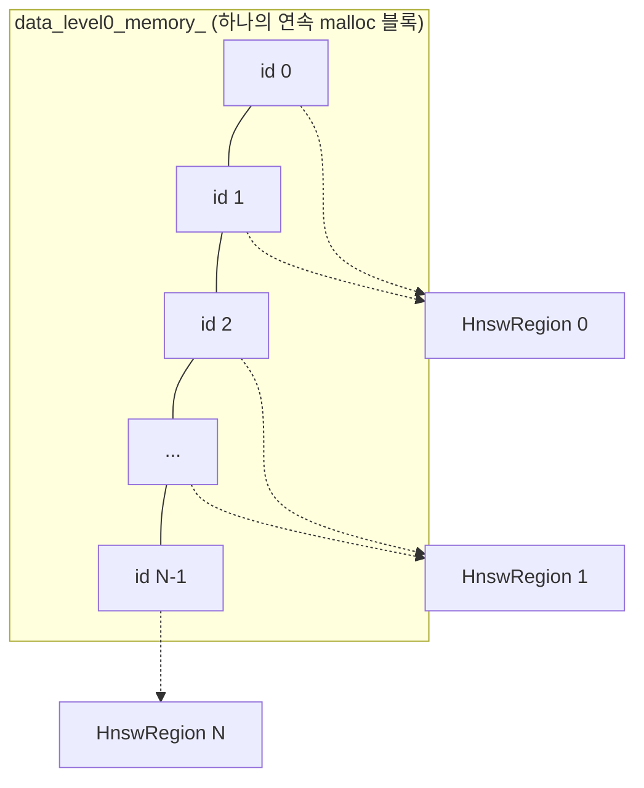
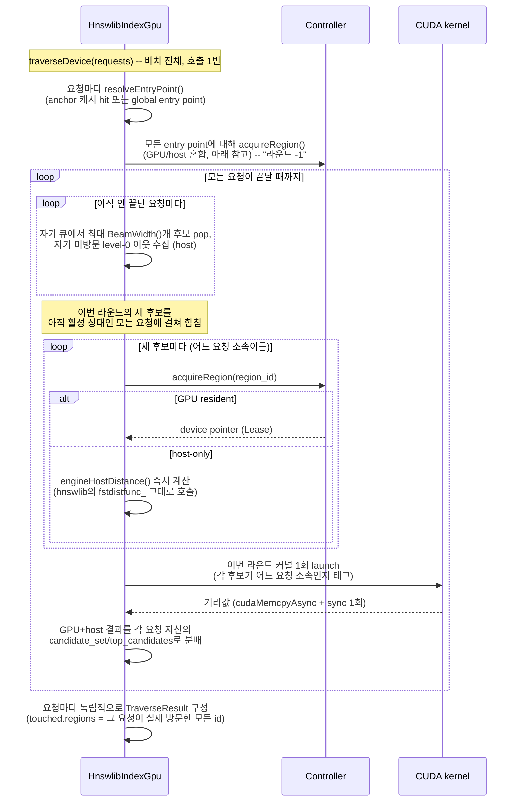
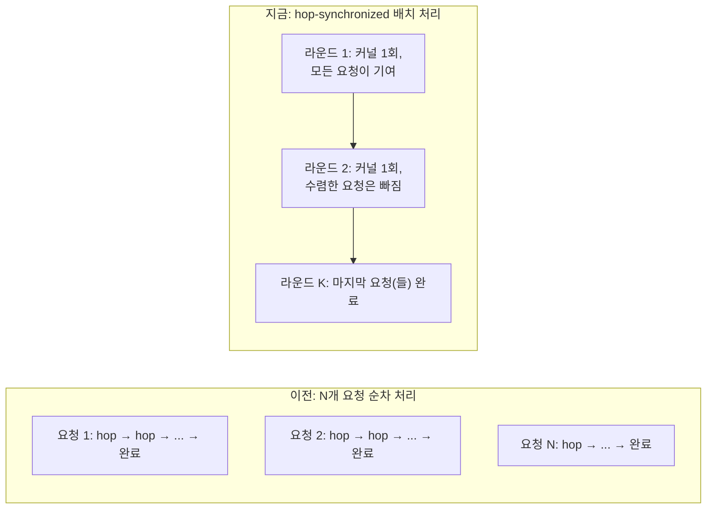

# HNSW 어댑터 개발 노트 (`cpp/index/hnsw`)

> **이 문서는 기존 `report.md`/`report-hnsw-dist.md`(초기 조사 + 중간 구현 현황 리포트)를
> 대체한다.** 두 파일은 이 문서 작성 직전 삭제되었고(git 히스토리에는 남아있음 —
> `git show HEAD~1:cpp/index/hnsw/report.md` 등으로 복구 가능), 그 안의 결정 히스토리 중
> 지금도 유효한 내용은 아래 §4에 요약·흡수했다. 이 문서는 "지금 코드가 실제로 어떻게 동작하는가"를
> 최우선으로 하고, 그 다음에 "왜 이렇게 됐는가"를 붙이는 순서로 구성했다 — 최신 상태를 빠르게
> 확인하고 싶을 땐 §1만 보면 되고, 설계 배경이 궁금할 때만 §4 이후를 읽으면 된다.
>
> 대상 독자: 이 코드베이스를 계속 작업할 본인(그리고 팀). Release용 문서는 같은 디렉터리의
> `README-EN.md` (영문, 외부 공개 저장소 대상) 참고.

## 목차

- [1. 현재 상태 한눈에 보기](#1-현재-상태-한눈에-보기)
- [2. 구조 다이어그램](#2-구조-다이어그램)
- [3. hnswlib 원본 구조 복습](#3-hnswlib-원본-구조-복습)
- [4. 설계 결정의 역사](#4-설계-결정의-역사)
- [5. 동시성 모델 — mutex_ narrowing 작업](#5-동시성-모델--mutex_-narrowing-작업)
- [6. GPU offload 세부 구현](#6-gpu-offload-세부-구현)
- [7. 최근 리팩터링: AnchorEntry 병합 + 클래스 이름 변경](#7-최근-리팩터링-anchorentry-병합--클래스-이름-변경)
- [8. 알려진 버그 / 한계](#8-알려진-버그--한계)
- [9. 미착수 작업 (TODO)](#9-미착수-작업-todo)
- [10. 테스트 인벤토리](#10-테스트-인벤토리)

---

## 1. 현재 상태 한눈에 보기

| 항목 | 상태 |
| --- | --- |
| hnswlib 소스 수정 여부 | `hnswalg.h`(그래프 알고리즘 + 락) **미수정**. `hnswlib.h`/`space_l2.h`/`space_ip.h`는 dtype 확장을 위해 **순수 추가만**(998줄 추가, 0줄 삭제/변경 — `git -C cpp/thirdparty/hnswlib diff --stat`로 확인 가능) |
| 클래스 구조 | `HnswlibIndex`(host-only) → `HnswlibIndexGpu`(+ `traverseDevice()`, entry-point 캐시, 다중 쿼리 배치 처리 내장). `HnswlibIndexAnchorEntry`는 `HnswlibIndexGpu`로 완전히 병합·삭제됨 (§7 참고) |
| dtype × metric 커버리지 | Float32/Float16/UInt8/Int8 × L2/InnerProduct = 8종, host/device 경로 모두 지원. Cosine은 hnswlib에 native Space가 없어 미지원 |
| Insert/Delete | Host 전용(`modifyHost()`). `modifyDevice()`는 구현 안 함(IAdapter 기본값인 throw 그대로) — 의도된 설계 |
| 동시성 | hnswlib 자체 락(레벨1) + 이 어댑터가 hnswlib 공개 락을 재사용하는 4곳(레벨2) + OpScheduler의 Traverse/Modify 격리 게이트(레벨3) — 3계층. Insert-vs-Insert 동시성까지 실제 stress test로 검증됨(§5) |
| GPU offload 범위 | Level-0 그래프 거리 계산만. 상위 레벨(`linkLists_`)은 Region으로 노출조차 안 됨 — "아직 GPU 안 올림"이 아니라 애초에 그 경로 자체가 없음 |
| 배치 처리 | `traverseDevice()`가 배치 안 모든 요청을 hop-synchronized 방식으로 동시에 처리 — 매 라운드 여러 요청의 새 후보를 하나로 묶어 GPU 커널 한 번으로 계산(§6.2). 배치 크기 1은 이전의 요청별 순차 처리와 bit-for-bit 동일한 결과를 낸다 |
| Partial residency | 라운드 안에서 후보 단위로 resident/non-resident 혼합 계산. **더 이상 all-or-nothing bail 없음** — `completed_within_scope`는 무조건 `true` |
| 알려진 버그 | Region staleness(§8-1) — host insert/delete가 이미 GPU에 상주 중인 Region을 무효화하지 않음. `HnswlibIndexInsertAfterPromotionTest.DeviceSearchReflectsPostPromotionInsertsOrExplainsWhyNot`로 추적 중, 현재 실패 상태(의도적으로 남겨둠) |
| 테스트 현황 | 전체 스위트 355개 중 354개 통과. 실패 1개는 위 region staleness 건 하나뿐 (§10) |
| 미착수 | 10M 스케일 테스트, float32 정규화 테스트 데이터, region staleness 수정, anchor 캐시 unbounded growth 해결, region-scoped gate narrowing, `allow_replace_deleted_`(사용자가 명시적으로 보류 지시) |

---

## 2. 구조 다이어그램

### 2.1 컴포넌트 맵



### 2.2 클래스 다이어그램



### 2.3 Region 분할



상위 레벨(`linkLists_`)은 이 다이어그램에 아예 없다 — Region으로 슬라이스하는 코드 자체가
존재하지 않기 때문이다(§3, §8-3 참고).

### 2.4 traverseDevice() 시퀀스 — 배치 전체를 hop-synchronized로 처리

`traverseDevice(requests)`는 요청마다 반복 호출되는 게 아니라 **한 번만** 실행되고, 그
안에서 배치의 모든 요청을 동시에(hop-synchronized) 진행시킨다. 각 요청은 자기만의
`candidate_set`/`top_candidates`/`visited[]`를 독립적으로 갖지만, 매 라운드마다 아직 안
끝난 모든 요청의 새 후보를 하나로 묶어서 GPU 커널을 **한 번만** 실행한다.



수렴한 요청(자기 stop 조건 충족, 또는 candidate queue가 빔)은 이후 라운드에 아무 후보도
안 보태고 그냥 빠진다 — GPU 레인 하나 노는 것조차 없다. 라운드의 합쳐진 후보 리스트가
"끝난 요청을 아예 빼고" 구성되지, 고정된 모양에 padding을 채우는 방식이 아니기 때문이다.



배치 크기가 정확히 1이면 이 루프의 퇴화 케이스일 뿐이다 — 매 라운드 기여자가 정확히
하나뿐이므로, 요청 하나씩 `traverseDevice()`를 반복 호출한 것과 trace가 완전히 동일하다
(bit-for-bit). `HnswlibIndexGpuTest`(dtype×metric 파라미터화 8종)가 이 배치=1 케이스를
계속 검증하고, `HnswlibIndexGpuBatchTest`가 진짜 여러 요청 배치를 별도로 검증한다(§10).

---

## 3. hnswlib 원본 구조 복습

| 구성요소 | 위치 | 요약 |
| --- | --- | --- |
| `data_level0_memory_` | `hnswalg.h` | `max_elements_ * size_data_per_element_` bytes, 하나의 연속 malloc. 레코드 = `[level0 링크리스트][벡터][label]` |
| `linkLists_` | `hnswalg.h` | 상위 레벨 전용, **원소마다 별도 malloc**. 연속 배열 아님 |
| `link_list_locks_` | `hnswalg.h` | 원소당 mutex 1개. Insert 시 새 노드뿐 아니라 **선택된 이웃들의 락도 잡고 그 링크리스트를 수정**(`mutuallyConnectNewElement`) |
| `global` | `hnswalg.h` | entry point/max level 갱신 직렬화용 단일 mutex |
| `label_lookup_lock` | `hnswalg.h` | external id → internal id 맵(`label_lookup_`) 보호 |
| 탐색 (`searchBaseLayer*`) | `hnswalg.h` | Greedy best-first. 다음 방문 노드가 현재 스텝 결과에 의존하는 순차 루프 — 구조적으로 병렬화하기 어려움 |
| Delete (`markDeletedInternal`) | `hnswalg.h` | 레코드 헤더의 tombstone bit만 플립. 그래프 재배선 없음, lock도 없음 — 삭제된 노드도 계속 hop으로는 순회됨(그래프 단절 방지), `top_candidates`에서만 제외 |

hnswlib은 host-only 라이브러리다(`std::priority_queue`, `std::mutex`, `malloc`, 함수 포인터
기반 `DISTFUNC`). 소스를 그대로 device에서 컴파일할 수 없으므로 "포팅"은 항상 GPU에서 돌
부분의 재구현을 의미한다 — 이건 초기 조사(구 `report.md` §0/§4) 단계부터 확정된 전제였고,
지금도 유효하다.

---

## 4. 설계 결정의 역사

구 `report.md`의 결정 1~6, §5~10을 지금 유효한 결론 위주로 압축했다. 전체 대안 비교표(기각된
안 포함)가 필요하면 git 히스토리에서 원본을 복구해서 보면 된다.

### 4.1 hnswlib을 그대로 쓸지, 새로 짤지 (구 결정 1)

**A(그대로 wrap) 채택.** hnswlib을 host baseline으로 그대로 쓰고, GPU 전용 자료구조를 새로
만드는 대신 — **host 그래프를 유일한 진실로 두고, device 경로는 그 그래프를 읽기 전용으로
재순회하는 별도 알고리즘**으로 최종 정착했다. B(fork/patch)와 C(전면 재작성)는 유지보수
비용/검증 부담 때문에, D(hnswlib 포기하고 CAGRA 등 GPU-native 인덱스로 교체)는 §4.2에서
설명할 SVFusion 조사 결과 때문에 기각.

**SVFusion 조사 요약** (VLDB 논문 + `references/svfusion` 소스 코드 근거): SVFusion의 실제
엔진은 CAGRA를 대폭 수정한 것이지 hnswlib이 아니다. 이 프로젝트가 스스로 만든 "HNSW(GPU)"는
비교 baseline일 뿐이고, 논문 자체가 "GPU-accelerated baselines... perform 5.4-7.2× **slower**
than their CPU counterparts when datasets exceed GPU memory capacity"라고 보고한다. 즉
hnswlib의 그래프 control flow 자체를 GPU로 옮긴 선례는 이 레퍼런스 안에 없다 — 우리가 택한
"거리 계산만 얕게 오프로드" 접근이 실전에서 느려질 수 있다는 경고 신호로 참고할 가치는
있지만, "hnswlib을 GPU에 올리는 것 자체가 불가능하다"는 근거는 아니다(SVFusion은 CAGRA로
갈아탄 것이지, hnswlib GPU화를 시도하다 실패한 게 아니다).

### 4.2 Region 분할 단위 (구 결정 2)

Level-0 레코드를 id-range로 슬라이스하는 안(C, "상위 레벨은 host 전용")을 채택했고 지금도
그대로다. 상위 레벨을 Region화하는 A/B안(고정 슬롯 예약 / 별도 풀)은 **구현되지 않았다** —
"보류 중"이 아니라 "아직 그 방향으로 코드가 한 줄도 없는" 상태로 이해하는 게 정확하다.

id 연속 구간이 그래프 지역성과 무관하다는 문제(구 §10.3)도 여전히 유효하다 — insertion
order로 배정되는 internal id가 공간적 인접성을 보장하지 않으므로, 하나의 `HnswRegion`에
서로 무관한 노드들이 섞여 있을 수 있다. 삽입 순서를 클러스터링/공간 정렬로 통제하는 해법은
설계만 되고 구현되지 않았다(§9 TODO).

### 4.3 Traverse/Modify 분해 — 이중 탐색 절충

hnswlib의 `addPoint()`는 내부적으로 "상위 레벨 하강 → `searchBaseLayer`(읽기 전용, 검색과
동일 함수) → `mutuallyConnectNewElement`(쓰기)"로 이미 나뉘어 있지만, **API 단위로는 안
나뉜다**. 이 프로젝트는 hnswlib 소스를 건드리지 않는 절충을 택했다: Traverse 단계에서
`searchKnn()`류를 형식적으로 한 번 부르고, Modify 단계에서 `addPoint()`를 통짜로 호출 —
결과적으로 insert 1건당 탐색이 두 번(형식적 1회 + `addPoint()` 내부 1회) 일어나는 비효율을
감수한다. 이건 지금도 그대로다 — `addPoint()`를 진짜 두 함수로 쪼개는 작업(구 §7.4 Phase 3)은
미착수.

### 4.4 GPU 커널의 cross-region(non-resident 이웃) 처리 — 계획과 실제 구현이 갈라진 지점

이 부분이 설계 문서와 최종 구현이 가장 크게 달라진 곳이라 기록해둘 가치가 있다.

**원래 계획**(구 `report.md` §9.2)은 두 가지 안을 저울질했다:

- (A) 매 hop마다 GPU-resident/non-resident를 즉시 병합 — recall은 확실하지만 "매 hop마다
  host 개입 → 배치 처리 시 stall 커짐"이 우려됐다.
- (B) **채택된 안**: GPU가 resident 데이터만으로 여러 hop을 끝까지 돈 뒤, "놓친 노드 목록"을
  배치 전체에 대해 **한 번만** 병합. 처리량 관점에서 우려를 피하는 선택이었고, 개선안으로
  "놓친 노드에서 짧게(1~2 hop) 이어서 host가 재탐색 후 병합"까지 제안됐었다.

**실제로 최종 구현된 것은 (A)/(B) 둘 다 아니다 — 더 단순한 세 번째 형태다.** 이 시점에
`compute_distances()` 람다(지금은 배치 재설계를 거쳐 `compute_distances_batch()`로
이름이 바뀌었다, §6.2)는 매 라운드마다 후보 단위로 resident 여부를 즉시 판정해서,
resident면 그 라운드의 GPU 배치에 넣고 non-resident면 **그 자리에서** host
`fstdistfunc_` 한 번을 호출해 값을 채운다 — "놓친 노드 목록을 모아뒀다 나중에 처리"하는
remainder 개념 자체가 없고, host가 이어서 걸어보는 재탐색도 없다.

이게 왜 (A)가 우려했던 "stall"을 실제로는 유발하지 않는지가 핵심 통찰이다: 애초에 이
shallow-offload 설계는 **매 라운드마다 host↔device 왕복이 이미 발생한다**(resident 후보만
있어도 그렇다 — 커널 launch + `cudaMemcpyAsync` + `cudaStreamSynchronize`가 라운드마다
이미 있다). non-resident 후보의 host 계산은 그 커널을 **launch하기 전**, 순수 CPU 루프
안에서 끝나는 일이라 GPU를 기다리게 만들지 않는다 — 새로운 동기화 지점을 추가하는 게
아니라, 이미 CPU가 하고 있던 순회 루프(각 후보의 Region을 찾고 Lease를 얻는 작업) 중간에
계산 하나를 더 끼워넣는 것뿐이다. (B)를 선택하게 만든 전제("host 개입 = 추가 stall")가 이
구체적 구현 형태에서는 성립하지 않았던 셈이다.

부수 효과로 `completed_within_scope`가 **항상 true**가 됐다 — 이전에는(구현 초기 버전)
"resident 후보가 하나라도 부족하면 즉시 walk 전체 포기 → `Controller`가 `traverseHost()`로
전체 재시도"였는데, 지금은 그 실패 모드 자체가 없다. Zero-residency(GPU에 아무것도 없는
상태)에서도 device 경로가 정확한 답을 낸다는 걸
`HnswlibIndexGpuPartialResidencyTest.StaysAccurateWithZeroResidency` 테스트로 확인했다.

### 4.5 Entry point 캐싱 — 시행착오

구 `report.md` §10의 기록:

1. **1차 시도(기각)**: hnswlib entry point 자체를 유일한 Anchor로 등록 → `RegionManager`의
   축출 단위가 Anchor라서, 모든 쿼리가 같은 Anchor 밑에 쌓이면 그 Anchor를 축출하는 순간
   전체 데이터가 한꺼번에 축출되는 것과 같아짐. 기각.
2. **2차 시도(기각)**: Region을 키로 쓰는 `RegionId → 진입 노드` 캐시 → hnswlib의 internal
   id가 삽입 순서라 공간적 의미가 없다는 문제(§4.2)가 여기서 다시 발목을 잡음 — 한 Region
   안에 서로 무관한 여러 지역이 섞여 있으면 "Region당 진입점 하나"가 의미가 약해짐.
3. **최종 채택**: Anchor id → internal id 1:1 캐시. `TraverseRequest`에 `anchor_id`
   필드를 추가하는 작은 core 변경이 필요했고(승인받아 진행), 이후 실제 `Controller`로
   end-to-end 테스트하다가 **캐시가 한 번도 안 채워지는 구조적 버그**를 발견 — RoutingCache가
   해당 locality를 처음 등록하는 바로 그 Hybrid 호출에서는 `decision.anchor_id`가 아직
   비어있어서 캐시를 채울 기회 자체가 없었다. `Controller::search()`/`insert()`가 이번에
   새로 발급하는 anchor id를 `TraverseRequest::anchor_id`에도 즉시 실어 보내도록 고쳐서
   해결.

지금 코드에서 이 캐시는 `HnswlibIndexGpu`에 내장돼 있다(§7 참고 — 예전엔
`HnswlibIndexAnchorEntry`라는 별도 클래스였다).

---

## 5. 동시성 모델 — mutex_ narrowing 작업

이번 세션 초반에 한 작업. hnswlib 원본이 `link_list_locks_`(원소별) / `global` /
`label_lookup_lock`을 이미 public 멤버로 노출한다는 걸 확인하고(패치 없이 그대로 재사용
가능), `HnswlibIndex::mutex_`의 책임을 다음과 같이 좁혔다:

- **narrowing 전**: `traverseHost()`/`modifyHost()`/`TraverseOneOnDevice()`가 통째로
  `mutex_`를 잡아서 사실상 전체 직렬화.
- **narrowing 후**: `mutex_`는 `build()`/`exportTo()`/`loadFrom()`/`liveCount()`(lifecycle/
  persistence)만 보호. `TypedHnswEngine`의 4개 지점(`globalEntryPoint()` →
  `index_.global`, `level0Neighbors()` → `index_.link_list_locks_[id]`, `internalIdFor()`/
  `insertOne()`의 label 조회 → `index_.label_lookup_lock`)이 hnswlib 자신의 락을 직접
  가져다 쓴다.

이렇게 좁힌 뒤 실제로 안전한지 **직접 stress test로 검증**했다 —
`ConcurrentSameOpInsertNeverCorruptsTheGraph`: hub 4개, 스레드 8개(하나의 hub를 2개
스레드가 공유하도록 배치해 실제 lock contention을 극대화), 스레드마다 60개씩 총 480개를
hub 근방에 jitter를 줘서 동시 삽입 — 삽입된 모든 벡터가 그래프 손상 없이 100% self-recall로
검색되는지 확인. 8회 이상 반복 실행해도 안정적으로 통과.

Insert-vs-Traverse, Insert-vs-Delete처럼 hnswlib 자신이 안전을 보장하지 않는 조합은
`OpScheduler`의 Traverse/Modify 격리 게이트(`IAdapter::requiresTraverseModifyIsolation()`,
기본 `true`)가 planner 단계에서 admission으로 막는다 — worker thread를 블로킹하는 방식이
아니라, 아직 안전하게 실행 못 하는 배치를 planner가 아예 만들지 않는 방식이라 유효하지 않은
배치가 worker에서 대기하며 자원을 묶어두지 않는다.

---

## 6. GPU offload 세부 구현

### 6.1 Worker-affine scratch buffer

매 라운드마다 필요한 작은 device 버퍼(배치의 query 벡터들, 후보 포인터 배열, 후보별 소속
요청 인덱스 배열, 결과 배열)를 매번 `cudaMalloc`/`cudaFree`하는 대신,
`IAdapter::requiredScratchBytesPerWorker()`로 필요량을 선언하면 `Controller`가 시작
시점에 `OpScheduler` worker 개수만큼 한 번에 `cudaMalloc`해서 슬라이스로
나눠준다(`gpu::DeviceContext::reserveWorkerScratch()`/`workerScratch()`, 기존
`workerStream()`과 같은 패턴). 레이아웃은 `[queries][query_index][ptrs][out]`.

`query_capacity = max_batch_size`(생성자 파라미터, 기본값 1 — §6.2),
`max_candidates = max_batch_size * BeamWidth() * (M * 2)` — `M*2`는 hnswlib 자신의
`maxM0_`(생성 시점에 고정, 이후 절대 안 바뀜)라서 `max_batch_size`가 주어지면 실제 상한이지
추정치가 아니다. 실제 배치가 `max_batch_size`를 넘거나, 라운드가 `max_candidates`를
넘으면 그 버퍼만 1회성 `cudaMalloc`/`cudaFree`로 폴백(후자는 경고 로그 남김) — 안전망일
뿐 정상 경로가 아니고, `max_batch_size`를 부정확하게 잡아도 정확성엔 영향이 없다(fast
path만 못 탈 뿐).

### 6.2 다중 쿼리 배치 처리

`traverseDevice()`는 배치를 요청 단위로 순회하며 `TraverseBatchOnDevice()`를 반복 호출하지
않는다 — 이 함수 자체가 배치 전체를 받아 한 번만 실행되고, 그 내부에서 §2.4의
hop-synchronized 루프를 돈다. 각 요청은 그 함수 안의 지역 struct(한 요청당 하나) 형태로
독립적인 `candidate_set`/`top_candidates`/`visited[]`를 갖는다 — 서로 공유되는 상태가
없으므로 요청끼리 탐색 *결과*를 간섭하지 않는다. 融합되는 건 오직 거리 *계산*뿐이다.

`hnsw_dist_kernel.cuh`의 `LaunchDistanceKernel()`이 이걸 그대로 반영한다 — 기존의
후보 포인터 배열에 더해 `candidate_query_index`라는 device 배열(후보 하나당 항목 하나,
"이 후보의 거리가 배치 중 몇 번째 요청의 쿼리 벡터를 대상으로 하는지")을 추가로 받고,
쿼리 하나를 고정 가정하는 대신 쿼리 벡터 배치 안에서 인덱싱한다. 배치 크기가 1이면 이
배열의 모든 항목이 0이 될 뿐 — 단일 쿼리 케이스가 별도 코드 경로인 게 아니라, 이 구조의
퇴화 입력값일 뿐이다.

### 6.3 Partial residency 재설계 — 버그 발견/수정 스토리

§4.4에서 설계 배경을 설명했다. 구현 과정에서 실제로 있었던 일:

1. `compute_distances()`를 `std::optional<vector<float>>`(실패 가능) →
   `std::vector<float>`(항상 성공)로 전면 재작성 — resident 후보는 GPU 배치, non-resident는
   `engineHostDistance()`(hnswlib의 `fstdistfunc_` 그대로 호출 — 공식을 다시 유도하지 않고
   원본 함수를 그대로 불러서 `traverseHost()`와 bit-exact 일치를 보장) 개별 계산.
2. Entry point 처리도 이 함수로 통합 — 예전엔 entry point가 resident인지 먼저 체크해서
   `stream`을 얻어와야 했는데, `Controller::workerStream()`(신규 추가, `workerScratch()`와
   동일 패턴)으로 residency와 무관하게 먼저 stream을 확보하도록 바꿔서 특수 케이스 블록이
   통째로 사라졌다.
3. `touched.regions`를 이번 walk가 실제로 방문한 모든 id(GPU든 host든)로 채우도록 변경 —
   이전엔 device 경로가 `touched`를 아예 안 채워서, GPU로 서빙된 쿼리가 `RegionManager`의
   hotness 신호에 전혀 기여하지 못하고 있었다.
4. 검증용 신규 테스트 3개 추가(`HnswlibIndexGpuPartialResidencyTest`) — 강제로 일부만
   resident인 상태, 완전히 zero-resident인 상태, `touched.regions` 채워짐을 각각 확인.
5. **테스트 코드에서 실제 크래시 발견**: `TraverseDevicePopulatesTouchedRegions`가 약 75%
   확률로 SIGSEGV. `gdb -batch -ex run -ex bt`로 정확히 짚어보니 프로덕션 코드가 아니라
   테스트 코드 자체(`TestBody()`) 안, `std::unordered_set` 생성 지점이었다. 원인:
   ```cpp
   // 버그: allRegions()를 두 번 호출 → 서로 다른 임시 벡터에서 begin/end를 가져옴 (UB)
   std::unordered_set<RegionId> known_regions(index.allRegions().begin(), index.allRegions().end());
   ```
   `allRegions()`가 `vector`를 값으로 리턴하는데 `.begin()`/`.end()`를 각각 호출하면 서로
   다른 임시 객체에서 반복자를 얻어 범위 자체가 무효(고전적인 C++ UB 패턴) — 임시 객체가
   우연히 호환되는 메모리에 잡히면 안 죽고, 아니면 죽는 식으로 확률적으로 재현됐다. 벡터를
   변수에 먼저 담는 것으로 수정, 20회 연속 무크래시 + 전체 스위트 3회 반복으로 재확인.
   같은 패턴이 이번 세션에서 건드린 다른 파일에 더 없는지 grep으로도 확인했다.

---

## 7. 최근 리팩터링: AnchorEntry 병합 + 클래스 이름 변경

가장 최근에 수행한 작업(§4.5에서 설명한 entry-point 캐싱 기능의 최종 정착지).

**변경 전**: `HnswIndex` → `HnswIndexDist`(naive GPU offload, 고정 global entry, beam
width=1) → `HnswIndexAnchorEntry`(anchor 캐시 + beam width>1로 override하는 별도 서브클래스,
3단 상속).

**변경 후**: `HnswlibIndex`(host-only) → `HnswlibIndexGpu`(`final`) 2단 구조.
`HnswIndexAnchorEntry`의 entry-point 캐싱 로직(`anchor_entry_point_` 맵, `traverseHost()`/
`resolveEntryPoint()` override)을 `HnswlibIndexGpu`에 흡수시키고 별도 클래스는 완전히
삭제했다. 캐시 miss 시 동작이 병합 전 `HnswIndexDist`와 정확히 동일(global entry point
그대로 fallback)하므로 순수 strict improvement — 병합 자체가 어떤 기존 동작도 퇴화시키지
않는다.

**Beam width는 이번 병합 범위 밖으로 남겨뒀다** — `BeamWidth()`는 여전히 기본값 1
(예전 `HnswIndexAnchorEntry`가 쓰던 4가 아님), 이제 서브클래스가 없으므로 virtual도 뗐다.
필요해지면 별도로 논의 후 결정.

이름도 함께 바꿨다: `HnswIndex` → `HnswlibIndex`, `HnswIndexDist` → `HnswlibIndexGpu`
("hnswlib 원본과 동일"이라는 의미와 "GPU를 실제로 쓴다"는 의미를 각각 명확히 하기 위함).
파일명도 `hnsw_index.hpp/.cpp` → `hnswlib_index.hpp/.cpp`,
`hnsw_index_dist.hpp/.cpp` → `hnswlib_index_gpu.hpp/.cpp`로 `git mv`(히스토리 보존),
`hnsw_index_anchor_entry.*`는 삭제. 테스트 파일 3개도 동일하게 rename, AnchorEntry 전용
테스트(`hnsw_index_anchor_entry_dist_test.cpp` 전체 + `hnsw_index_test.cpp`의
`HnswIndexAnchorEntryTest`)는 요청대로 제거하고 재작성하지 않았다. 리네임 이후 전체
344→342개(제거된 테스트 2개만큼 감소)로 빌드/테스트 재검증 완료, 회귀 없음.

---

## 8. 알려진 버그 / 한계

### 8-1. Region staleness (미해결, 추적 중)

호스트에서 Insert/Delete가 일어난 뒤, 그 대상이 **이미 GPU에 상주 중인 Region**이면 device
쪽 사본이 무효화되지 않는다.

- Insert의 쓰기 범위: 새 노드 자신의 Region + 그 노드의 모든 level-0 이웃의 Region
  (`mutuallyConnectNewElement()`의 실제 재배선 범위에 대한 보수적 과대추정).
- Delete의 쓰기 범위: 대상 자신의 Region 하나뿐(tombstone bit만 플립).
- `Controller::dispatch(const ModifyRequest&)`에는 `TraverseRequest` 오버로드에 있는
  `on_complete` 훅이 없어서, Modify가 끝난 뒤 `RegionManager::clearResidency()`를 호출하는
  코드 경로가 아예 없다.

`HnswlibIndexInsertAfterPromotionTest.DeviceSearchReflectsPostPromotionInsertsOrExplainsWhyNot`가
이 상황을 정확히 재현하도록 만든 테스트이고, 지금 실패 상태로 **의도적으로** 남겨져 있다
(고쳐질 때까지 회귀 감시용). 설계된 해법(구 `report.md` §7.1, "Phase 0")은 있으나 구현되지
않았다 — `modifyHost()`가 반환한 `ModifyResult::modified`의 각 Region이 현재 Resident면
write-back 없이 강제로 HostOnly로 되돌리는 `RegionManager` 메서드를 추가하고
`Controller::dispatch(ModifyRequest)`에서 호출하면 된다는 방향까지만 정해져 있다.

### 8-2. Entry point 캐시가 무한정 커짐

`anchor_entry_point_`는 evict되지 않는다 — Controller 쪽에서 Anchor가 releaes돼도 이
어댑터 캐시엔 알림이 안 온다. 실험 단계에서는 허용, production화하려면 해결 필요.

### 8-3. 상위 레벨은 애초에 GPU 대상이 아님

"아직 최적화 안 함"이 아니라 **Region 개념 자체가 없다** — `linkLists_`를 슬라이스하는 코드가
없으므로 상위 레벨 접근은 항상 host, 항상 hnswlib 원본 코드를 통해서만 일어난다.

### 8-4. `ef` 파라미터 없음

Device 경로는 `ef = top_k`로 고정. hnswlib 원본은 `ef_`를 `top_k`보다 크게 잡아 recall을
올리는데, 그 여유가 없다. 정확성 버그는 아니고 알려진 단순화.

### 8-5. Region 분할이 그래프 지역성과 무관

§4.2 참고 — internal id가 삽입 순서라, id-contiguous Region이 실제 그래프 이웃과 일치한다는
보장이 없다. 측정된 적 없음.

### 8-6. `allow_replace_deleted_` 미구현 (의도적 보류)

hnswlib의 삭제-슬롯-재사용 기능. 기본값 `false`, 이 어댑터의 생성자 호출도 이 옵션을 켜지
않는다. 사용자가 명시적으로 "복잡도가 너무 올라가니 구현하지 말자"고 지시해서 보류 중 —
필요해지면 별도 논의.

### 8-7. `build()`는 임시 구현

hnswlib `addPoint()`를 단일 스레드 루프로 도는 placeholder. `modifyHost()`의 Insert 경로를
재사용하도록 바꾸는 건 아직 안 함.

---

## 9. 미착수 작업 (TODO)

우선순위 순은 아님 — 사용자가 명시적으로 요청하기 전까지 착수하지 않는다.

1. **Region staleness 수정** (§8-1) — 설계는 돼 있음, 구현만 남음.
2. **10M 스케일 + multi-thread 하드 스트레스 테스트** — 지금 테스트는 최대 수천 벡터,
   dim=16 규모. 실제 배포 규모에서의 검증 없음.
3. **Float32 정규화 테스트 데이터** — `GenerateVectors()`에 정규화 로직 없음.
4. **Entry point 캐시 eviction** (§8-2) — Controller의 Anchor 해제와 연동.
5. **Region-scoped gate narrowing** — 지금 OpScheduler 게이트는 op 종류 단위로만 격리;
   같은 종류라도 다른 Region을 건드리면 굳이 막을 필요가 없다는 세분화는 아직 없음. 낮은
   우선순위.
6. **Insert/Delete 독립 batch_size 분리** — 지금은 Modify 배치가 op 구분 없이 같은
   batch_size 설정을 공유. 낮은 우선순위.
7. **Scratch fallback 회귀 테스트** — 1회성 `cudaMalloc` 폴백 경로가 "절대 안 트리거되는지"를
   직접 확인하는 전용 테스트는 아직 없음(권장 사항으로만 논의됨).
8. **상위 레벨 Region화** (§4.2/§8-3) — 방향 자체가 아직 미결정. 하려면 고정 슬롯 예약 vs
   별도 풀 중 선택부터 다시 논의해야 함.
9. **삽입 순서 전처리** (§4.2/§8-5) — 클러스터링/공간 정렬로 id 연속성과 그래프 지역성을
   맞추는 방안. 설계 방향만 있고 미착수.

**명시적으로 하지 않기로 한 것**: `allow_replace_deleted_`(§8-6, 사용자 지시).

---

## 10. 테스트 인벤토리

`cpp/test/unittest/hnsw/`:

| 파일 | 대상 | 비고 |
| --- | --- | --- |
| `hnswlib_index_test.cpp` | `HnswlibIndex` host 경로 | build/search/insert/delete/export-load, 4개 dtype 파라미터화 |
| `hnswlib_index_gpu_test.cpp` | `HnswlibIndexGpu::traverseDevice()` | 8개 (dtype×metric) 파라미터화 + `HnswlibIndexGpuPartialResidencyTest`(mixed/zero residency, touched.regions) + `HnswlibIndexGpuBatchTest`(4개, §6.2 배치 처리 전용 — 아래) |
| `hnswlib_index_promotion_eviction_stress_test.cpp` | promotion/eviction churn, concurrent insert, hnswlib 락 stress | 4개 테스트 — `SurvivesHeavyConcurrentChurnAndStaysAccurate`, `ConcurrentInsertDuringChurnDoesNotCorruptOrCrash`, `ConcurrentSameOpInsertNeverCorruptsTheGraph`, `HnswlibIndexInsertAfterPromotionTest`(§8-1 추적용, 현재 실패) |

`HnswlibIndexGpuBatchTest` 4개:

| 테스트 | 검증 내용 |
| --- | --- |
| `BatchMatchesSequentialSingleCalls` | 요청 8개짜리 배치 결과가 요청을 하나씩 개별 호출한 것과 완전히 동일함(id·순서·거리 모두 bit-for-bit) |
| `BatchOfMultipleQueriesMatchesTraverseHostGroundTruth` | 요청 12개짜리 배치가 `traverseHost()` 정답과 일치함 |
| `BatchLargerThanMaxBatchSizeFallsBackCorrectly` | `max_batch_size`보다 큰 배치가 1회성 `cudaMalloc` 폴백 경로를 타면서도 여전히 정확함 |
| `RequiredScratchBytesScalesWithMaxBatchSize` | `requiredScratchBytesPerWorker()`가 `max_batch_size`에 비례해 실제로 커짐 |

실행:

```bash
./cpp/build/test/unittest/arachne_tests --gtest_filter="*Hnswlib*"
```

전체 스위트 기준(hnsw 무관 코드 포함) 355개 중 354개 통과 — 실패 1개는 §1/§8-1에 정리된
known issue(region staleness) 하나뿐이고, 이번 문서가 다루는 범위 안에서 새로 생긴 회귀는
없다.
